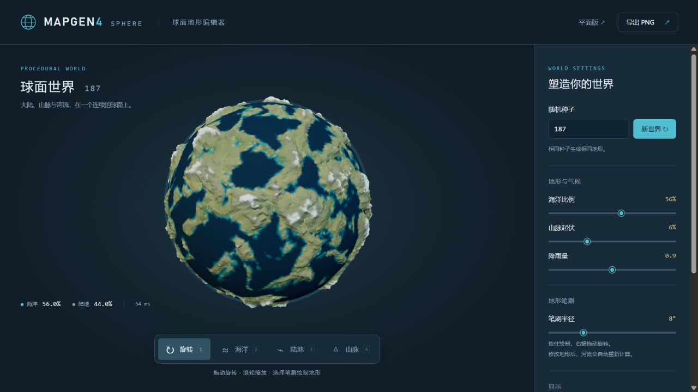

# Mapgen4 Sphere

An editable procedural planet, forked from [Red Blob Games' Mapgen4](https://github.com/redblobgames/mapgen4).



## Run locally

Requires Node.js 22.18 or newer. From this directory:

```sh
npm install
npm run dev
```

Open **http://127.0.0.1:8000/**. The development server binds only to localhost. To use a different port, set `PORT` before starting it. With pnpm, `pnpm install --frozen-lockfile` uses the included lockfile.

```sh
npm test
npm run typecheck
npm run build
```

The build creates the globe bundle, worker and styles in `build/`, as well as the original planar demo and point data. Serve the repository with a static HTTP server after building; opening `index.html` as a `file://` URL will not work. `npm run dev` watches source files; reload the browser after edits. No global esbuild or Unix shell is required.

## Editing the planet

- **1 / Rotate**: drag to orbit; scroll or pinch to zoom.
- **2 / Ocean**, **3 / Land**, **4 / Mountains**: drag or hold to paint on the sphere. Right drag rotates while a brush is selected. Multi-touch suspends painting until all fingers are lifted.
- **Seed / New world**: generate a reproducible planet. Changing the seed clears brush edits.
- **Ocean coverage**: set the generated world's ocean fraction. Existing brush overrides persist, so actual coverage can differ after painting.
- **Relief**: exaggerate mountain heights without regenerating terrain.
- **Rainfall**: adjust climate colors and river flow.
- **Reset terrain**: discard brush edits and regenerate with the current seed and settings.
- **Reset view**: restore the camera. River, graticule and auto-rotation switches are under Display.
- **Export PNG**: download the current globe view with a transparent background. It does not save an editable project.

The original Mapgen4 remains available at **/embed.html**.

## How it works

`planet/mesh.ts` creates a welded icosphere with 40,962 vertices and 81,920 triangles. Its topology has no date-line seam, duplicated pole or exterior ghost region. The level is shared by the UI and worker via `SPHERE_LEVEL`.

`planet/terrain.ts` uses deterministic 3D simplex noise for continents and mountain ridges, iterative moisture transport in latitude bands, and priority-flood drainage with downstream flow accumulation. Depression breaching makes rivers descend to water. Entirely dry planets drain to the lowest vertex instead of hanging. Brushing uses angular distance in 3D, so it crosses longitude wrap and works at the poles.

`planet/session.ts` retains brush edits in a Web Worker. `planet/main.ts` coalesces generation requests while preserving queued strokes. `planet/renderer.ts` uses Three.js for displaced geometry, biome colors, river ribbons, globe controls and ray picking. Assets and dependencies are bundled locally; no external map service or API key is needed.

This is an artistic generator, not a physical climate/tectonics simulation. Rivers use mesh edges, and the renderer does not reproduce every outline effect of the original planar Mapgen4. Editing is held in memory; reload discards it. Higher relief intentionally exaggerates the planet's terrain. Performance depends on the device and GPU; WebGL2 is required.

## Tests and attribution

`tests/planet.test.ts` checks closed/outward manifold geometry, seeded reproducibility, ocean coverage, terminating downhill drainage including all-land/all-ocean inputs, spherical brushing, reset/order behavior, multi-touch cancellation and BFCache resource lifecycle. See [verification notes](docs/verification.md) for browser checks.

Mapgen4 and this derivative retain the **Apache-2.0** license; copyright and original documentation remain in [LICENSE](LICENSE) and [README.org](README.org). The globe renderer uses Three.js (MIT), simplex-noise (MIT) and flatqueue (ISC). The original planar demo's dependencies retain their respective licenses listed in README.org.

Related primary references: [sphere geometry](https://www.redblobgames.com/x/1842-delaunay-voronoi-sphere/) and [Red Blob Games' planet experiment](https://www.redblobgames.com/x/1843-planet-generation/).
