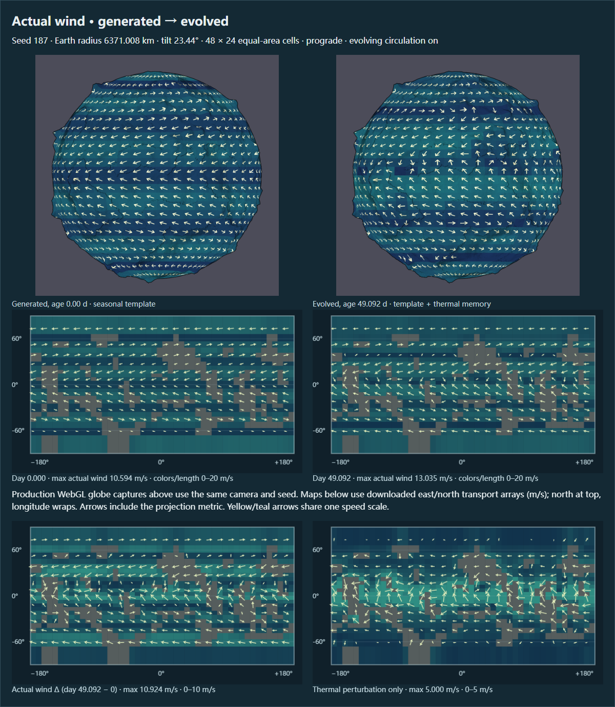
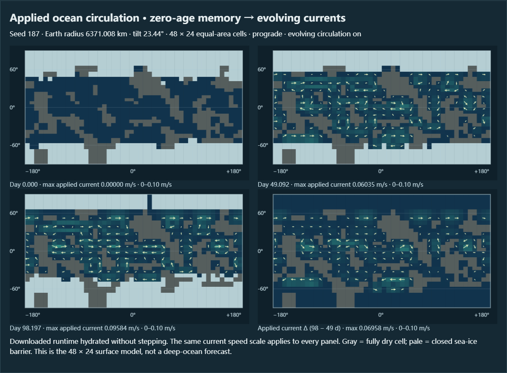
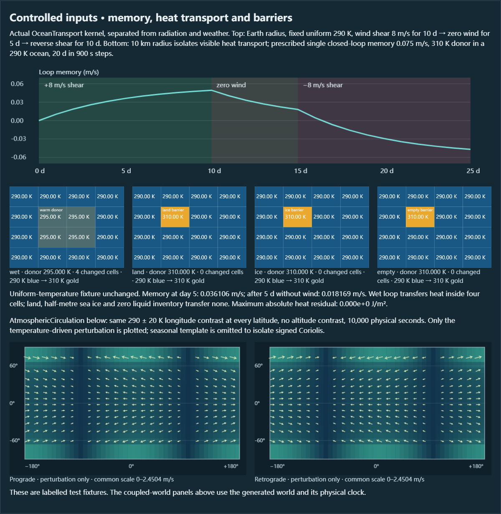

# 第四阶段专项复验：大气风场与风驱表层海流

日期：2026-10-09（Asia/Shanghai）。基线为 `ab8daf702a2887616d656bd2d01087d1cf8f2f15`；物理与投影修复提交为 `6a70096425d85a3e0659f42f23d064615f4656db`，最终采集脚本提交为 `7461fcb4c2d95729bcf1bfff1ad896d2be8d3287`。本轮复验既有第四阶段，不扩展第五阶段。第二阶段水循环与第三阶段焓、冰川、水库校验继续保留。

本轮修复三项可复现缺陷。数值、实际 GPU 箭头、保存恢复和最终串行浏览器验收通过；**此前偶发的微小 PNG 差异仍是未闭合的渲染稳定性问题**。失败原图、完整状态及调查记录保留，不能把最后一次通过解读为已证实根因或已根治。

## 实际修复与独立复审

1. **无液态海水仍输运热量。** `OceanTransport` 原先只检查陆地和海冰，未检查共享液态水库。零初始海深、零蒸发的实际运行时演化 320 步后，水库为零而显示约 0.05415 m/s 海流。现在经典与动态模式均阻断实际流速和热通量；动态风驱记忆保留，有水时重新开放。
2. **暂停／恢复显示未应用供体限制的流速。** 在半径 1,000 m、风为零、无混合扩散、有效保存记忆的受控输入中，零步诊断可显示实际稳定步约 3.178 倍的流速。现在零步诊断使用下一稳定物理步相同的共享供体限制，不推进记忆；暂停和恢复后的矢量与实际输运相符。默认 Earth 稳定步并不触发此极端限制，未夸大其日常影响。
3. **箭头忽略地图投影的物理尺度。** Globe 原先直接旋转 east/−north，在高纬及非默认网格会偏离表面切向方向；比较面板也未补偿纬度。Globe 现在从纹理获取网格尺寸，按等面积坐标度量转换方向；比较面板按等距圆柱度量转换。速度仍按物理 m/s 计算。

新增回归先在旧实现失败，再在修复后通过。GPU 夹具调用生产 `planet_fragment`，以独立球面切向几何构造检验点，覆盖箭杆与箭头、四象限、轴向／静风、高纬、赤道、经线接缝和 48×24／8×4 两种纹理。旧实现 528 次检查中 352 次失败，修复后 528/528 通过。应用存档仍只接受默认气候分辨率，8×4 是隔离 shader 夹具。

独立只读复审确认三项修复、测试及采集链，无新增生产代码问题；复审明确不支持把微小像素差归因于 DITHER。没有为此猜测修改生产渲染器。

## 实际下载世界与视觉观察

种子 187；Earth 半径 6,371.0084 km；倾角 23.44°；顺行；48×24 等面积气候网格；动态环流启用；相机设置、地形及物理参数相同，时刻随演化变化。初始生成不按 Play：温度、冻水覆盖、植被及季节风模板已就绪，风扰动和海流记忆为零。演化使用真实物理时钟，没有额外地质时间倍率。

| 年龄 | 物理步数 | 最大实际风速 m/s | 最大应用海流 m/s | 水残差 mm | 焓残差 J/m² |
|---|---:|---:|---:|---:|---:|
| 0 d | 0 | 10.594235 | 0 | 0 | 0 |
| 49.092209 d | 3,832 | 13.034680 | 0.060353 | −5.820766×10⁻⁹ | 1.266599×10⁻⁶ |
| 98.197229 d | 7,665 | 13.063869 | 0.095836 | −2.101297×10⁻⁷ | 6.720424×10⁻⁶ |

原水与焓阈值仍为 10⁻⁶ mm／10⁻⁴ J/m²，没有放宽。实际风为季节模板加温度梯度驱动扰动；49 天最大扰动约 5 m/s。总风差包含季节变化及扰动，不能全归因于一个过程。



上方两张是普通原生 rAF 浏览器加载实际下载文件后的生产 Wind 图；截图后再次真实下载，完整 `runtime` 与 `terrain`（含相机、时刻和渲染设置）均严格等于源文件，只有所选显示层为 Wind。下方地图直接读取下载状态中的实际 east/north 数组，再分别显示实际风差与扰动：初始／49 天实际风共用 0–20 m/s，实际风差为 0–10 m/s，扰动为 0–5 m/s，各图标注自己的范围；超出范围的颜色与长度饱和。

亲自打开最终归档图后可见：初始为较规则的季节风带，49 天低纬与陆海周边方向和强度发生变化；扰动图明确区别于模板。Globe 风分量的纹理编码约 0.79 m/s/byte，因此较弱变化可能量化消失；数值地图保留浮点矢量，不能把每个小箭头当作精确分量读数。



海流图从下载状态恢复派生诊断，不推进模型。四幅均采用 0–0.10 m/s 范围；灰色为全陆地，浅色为闭合海冰障碍。初始流速为零，49／98 天开放海洋内出现持续响应；南北极冰障碍保留，未画出穿越障碍的实际海流。比较采样逐点核对来自实际应用的 `eastMps/northMps`，不是另绘的风驱示意箭头。它是四格闭合表层环路的叠加，不代表真实世界的大洋环流预测。

## 明确标注的受控内核实验



此图也是最终归档后亲自打开确认的实际计算结果，与上方耦合世界分开标注。

- Earth 半径、均匀 290 K：8 m/s 风切变保持 10 天，停风 5 天，再反向 10 天。记忆以五天时间常数渐变：第 5 天 0.036106 m/s；停风五天后仍为 0.018169 m/s；反向一天仍为正，两天后转负；均温场不产生虚假热变化。
- 为使局部热输运可见，受控半径为 **10 km**，单环路初始记忆 0.075 m/s，供体 310 K、其余 290 K，20 天／900 s 步。开放四格最终均为 295 K；单个陆地、半米海冰或空液态水库使供体保持 310 K，零格改变。四个实验全局热残差均为 0。这不是 Earth 20 天的预测。
- 大气实验在各纬度施加同一 290±20 K 经度周期温差，运行 10,000 s，只画扰动。顺／逆行的东向响应相同，北向响应反号；数值测试另核对南北半球反向、经线平移等价、陆地更快的拖曳衰减、静风及零步记忆不变。

## 严格像素调查与未闭合项

第三阶段曾记录一次没有保留原图的环流 PNG 失败。本轮重新出现失败时立即保留原图和状态，继续调查，没有修改严格比较门槛。

| 保留案例 | 完整状态 | PNG 解码差异 | 调查结果 |
|---|---|---|---|
| 98 天续演 | uninterrupted/resumed 完整文件精确一致 | 25 个像素、27 个通道，最大差 1/255 | GPU-only copy 探针也复现；drape 纹理散列不同，因此不只是 PNG 编码差 |
| 49 天恢复（额外全层原生重绘实验） | saved/restored runtime 精确一致 | 21 个通道，最大差 1/255 | 失败保留；额外重绘没有证明能解决该微差 |
| 最终提交 `7461fcb` 串行验收 | 49 天 runtime、98 天完整文件精确一致 | 49／98／Original 全部 0 个通道差，PNG 字节相等 | 当前运行通过，不能证明以后永不复现 |

环境是 Windows Chrome，ANGLE／NVIDIA GeForce RTX 5090／Direct3D11。独立三个边界探针记录 CPU 上传缓冲、纹理、uniform 及精确格式的 land／river／depth／surface／drape：这些探针均通过、输入与纹理一致，**未在失败发生时取得完整上游边界数据**，因此未确定首个分叉的根因。同步 CPU 读回和禁用 DITHER 的对照曾通过，但普通 DITHER 开启控制也通过，不足以认定 DITHER。最终方案不更改 GPU 精度、DITHER 或 PNG 阈值。

另一个独立问题是 fake-rAF 测试首次 Wind 截图会保留前一 Surface 图，尽管记录到 mode=8；原生 rAF 同操作首次即正确。GL finish 和把 fake 重绘搬入原生帧均不足以可靠修复采集，所以最终证据使用独立原生页面加载存档，并通过下载比对保证世界未变化。此采集修正不等于上表微差的根因解释。

[失败样本和状态归档](evidence/circulation-stage4-20261009/pixel-investigation/98-states.zip)、[98天失败报告](evidence/circulation-stage4-20261009/pixel-investigation/98-failure.json)、[drape 散列诊断](evidence/circulation-stage4-20261009/pixel-investigation/98-drape-pixel-checks.json)、[49天失败报告](evidence/circulation-stage4-20261009/pixel-investigation/49-failure.json)、[49天状态](evidence/circulation-stage4-20261009/pixel-investigation/49-states.zip)及三个 boundary 报告均已提交。失败报告里的 sourceCommit 是当时 HEAD `ab8daf7`，当时存在尚未提交的修复，不能把它当作该失败源码完整标识；状态、原图、探针源码和当前经过验证的代码提交提供了可复查的证据范围。

## 验证、归档与复跑

151/151 Node 测试、typecheck、build、diff 检查通过。七套既有浏览器回归共 42 组：climate 6、simulation 7、glacier 4、terrain-water 5、weather 5、environment 7、planet 8；最终 circulation 4 组，总共 46 组。原水库、焓、保存、冰川和地形行为未回退。Planet 组还通过 radial 648、outline 771 采样、silhouette 30、insolation 87 检查；本轮新增 Wind GPU 528。默认 Live 夹具 13 项通过，实际首页也确认自动播放和全部耦合开关启用，另保留 [默认画面](evidence/circulation-stage4-20261009/live-default.png)。

物理回归在与 `6a70096` 相同的生产代码上运行，后续 `7461fcb` 只修改两份采集脚本；最终环流、原生 Wind 图、GPU Wind 和 Live 报告均重新在 `7461fcb` 生成。报告为 [专项测量](evidence/circulation-stage4-20261009/recheck-report.json)、[严格浏览器验收](evidence/circulation-stage4-20261009/report.json)、[既有回归](evidence/circulation-stage4-20261009/regressions.json)、[GPU Wind](evidence/circulation-stage4-20261009/gpu-wind-report.json)、[Live](evidence/circulation-stage4-20261009/live-report.json)。[耦合原件](evidence/circulation-stage4-20261009/coupled-states.zip)保存初始、49 天和98天状态；[归档 manifest](evidence/circulation-stage4-20261009/manifest.json)记录文件散列；[全部调查运行](evidence/circulation-stage4-20261009/pixel-investigation/run-matrix.json)同时记录通过与失败。

```powershell
$env:PLAYWRIGHT_MODULE='file:///C:/Users/helio/.cache/codex-runtimes/codex-primary-runtime/dependencies/node/node_modules/playwright/index.mjs'
$env:BASE_URL='http://localhost:8002'
$env:CIRCULATION_FOLDER='build/validation/circulation-stage4-replay'
npm test
npm run typecheck
npm run build
# 先在另一终端 npm start，设置所用端口，再依次运行，避免并行浏览器干扰
node scripts/circulation-browser-check.mjs
node scripts/circulation-gpu-check.mjs
node scripts/circulation-recheck.mjs
```

模型仍是 48×24 表层实验：温度诊断势代替预报气压，没有空气质量／动量平流、三维大气、盐度、深海翻转或机械能账本；热扩散和风／洋流系数是示例参数。闭合声明针对水量及显热加潜热的焓账本，不扩展为完整 GCM 的真实性声明。第二、第三阶段交接目录原样保留。
