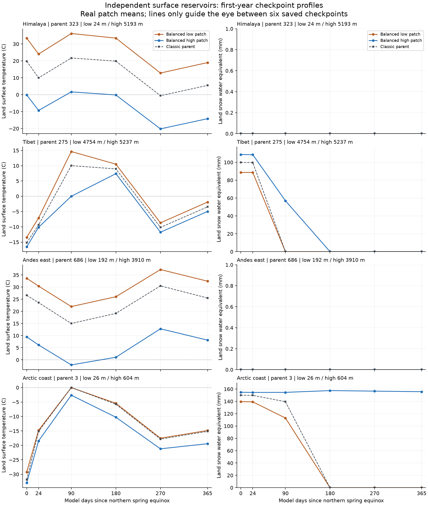
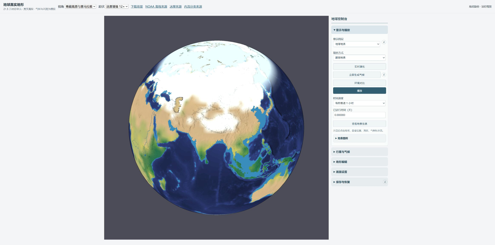
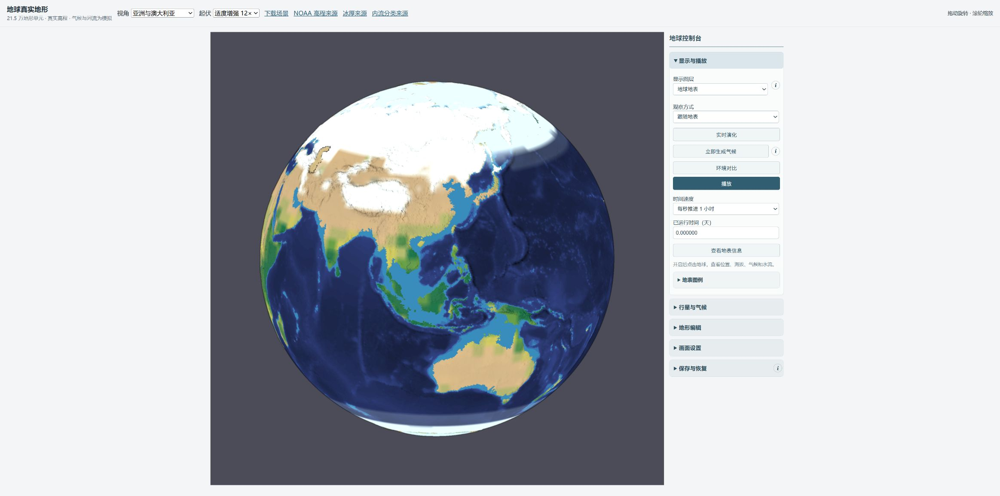
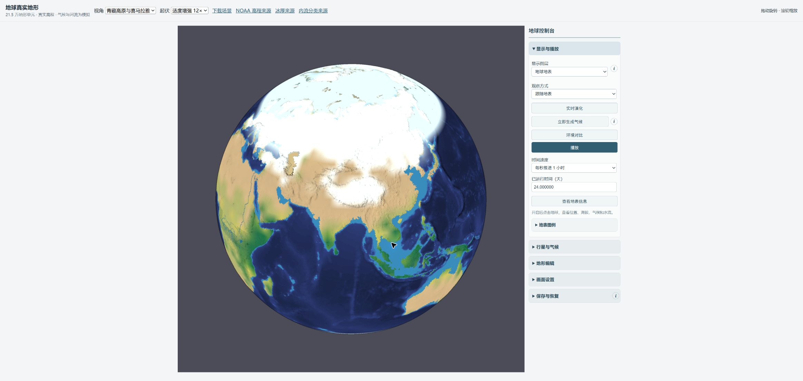

# 地球真实性第5部分：局部热量、雪冰和水储层

2026-10-11。结论是：同一粗格内的高地、低地与海岸现在能够保持独立温度和水库，全年守恒与存档继续运行有实证；**balanced/high保持实验选项，正式地球默认仍为classic第0天场景**。喜马拉雅缺少供水、澳洲沿岸降水不足、海冰增长和明显片界仍未通过区域拟真验收。

## 机制与数据边界

原96×49细图使用父格温度异常和库存推算局部显示。新机制保留48×24、1152个等面积父气柱与215348个地形三角形水路，按高差、混合海岸和极区触发局部片。balanced为8922片，high为29418片，分别提供最高4×4/8×8细分；父空气、水汽和水平冰流仍然较粗。局部陆/海温度、雪、海冰、陆冰、冰架、土壤和地表液水是真实持续库存；辐射、换热、蒸发、雨雪分配及相变替换相应粗表面过程，聚合粗字段作为兼容视图。

`land/sea`是每父面积上的有效片面积，经过条件校准使片合计严格等于原父陆海mask，不能把每片面积都当成简单的1/q²。库存单位为kg/父m²，已经包含面积权重；当地SWE/土壤mm须除以陆地面积权重，物理冰厚另除917kg/m³。全局总账只加一次局部库存、共享空气和全球海洋。地形水路按实际三角形面积协调局部增量，准备候选时不安装partition，稳定步长拒绝保持原状态。首次湿纯湖迁移采用陆地+确认湖泊carrier，合成测试保住10kg/父m²；实际地球166个确认湖三角形初态均无路由液水，不能冒称已迁移实测湖水位。

GFZ GDEMM2024冰厚/掩膜、96×49冰种子、NOAA ETOPO冰面高程与正式存档相对工作基线均未改。ETOPO本身已含冰盖表面，不能再次加冰厚；细分旧种子不等于获得新冰厚观测。季节雪SWE、grounded冰厚、浮冰架和季节海冰分开解释。持续积雪压实为冰需要多年质量收支，山谷冰川还需要运动与地形约束。[NSIDC冰川科学](https://nsidc.org/learn/parts-cryosphere/glaciers/science-glaciers)

地形编辑改变陆海热容量时，重映射按地理覆盖搬移库存，并用全局共同的正温度比例保持显热；它是编辑操作的保守映射，不是山脉生成过程的热力学模拟，也不代表只影响编辑点。新地形需要更短稳定步长或映射温度超过500K时明确拒绝并保持原运行状态，需要显式重置后才能采用。精度切换保持父格陆海比例及条件均温；地形分类面积仍校准到旧父mask，因此细海岸并非新增观测面积。

## 连续积分与独立预算

[独立脚本](evidence-review.mjs)直接读取最终JSON数组，以补偿求和重算质量、显热和焓，未调用模型预算函数；残差仍参考存档初始库存和累积净辐射计数器，不是独立验证太阳强迫。最终动力bundle、checkpoint、源码审阅manifest、性能输入和恢复审计均绑定SHA；[完整结果](evidence-review.json)保留实际经纬度、片高、三类温度和水库单位。classic→balanced/high第0天质量、显热、焓差均为0。粗库存与片合计差低于10⁻⁹kg/父m²。

| 连续模型天数 | classic/balanced真实步数 | classic水残差mm | balanced水残差mm | balanced焓残差J/m² |
|---|---:|---:|---:|---:|
|0|0 / 0|1.16e−10|1.16e−10|−1.70e−4|
|24|1152 / 1152|−1.59e−8|2.81e−8|−1.78e−4|
|90|4320 / 4320|−2.72e−8|−6.43e−8|−1.97e−4|
|180|8640 / 8640|−7.71e−8|1.30e−8|−1.93e−4|
|270|12960 / 12960|−1.01e−7|2.33e−7|−2.19e−4|
|365|17520 / 17520|−1.10e−7|3.26e−7|−2.51e−4|

步长保持1800s。high仅完成24天、1152步，水/焓残差为−2.78e−7mm/−1.80e−4J/m²，尚无high全年拟真结论。day0接近北方春分，day90接近北方夏季；模型天数不能替代真实日历或季节滑块参考。两种全年路径的海冰全球当量从177.27mm增至classic1121.65/balanced1098.33mm，明显尚未形成周期气候；长期守恒不等于季节校准。

[恢复审计](restore-audit.json)覆盖classic/balanced各6份和high两份，共14份严格来源附接、完整snapshot恢复、下一步逐值相等检查，输入SHA全部匹配；96×49、192×97、384×193比较baseline保存/解码也一致。独立代码审阅及边界探针见[CODE-REVIEW.md](CODE-REVIEW.md)。

## 实际高度剖面与仍失败的区域

以下低/高片来自同一父格的真实有陆地片均高，不能把名称当成峰顶或沿同纬度观测。

| 同父格区域 | 低/高片均高m | day24陆表温度°C | day90低/高SWE mm |
|---|---:|---:|---:|
|喜马拉雅323|24 / 5193|24.05 / −9.28|0 / 0|
|青藏275|4754 / 5237|−7.07 / −10.13|0 / 56.95|
|安第斯东部686|192 / 3910|30.41 / 6.15|0 / 0|
|澳洲东岸860|59 / 504|21.02 / 18.11|0 / 0|
|格陵兰西岸17|377 / 2677|−7.11 / −25.51|0 / 0|
|南极边缘1130|1394 / 3426|−15.95 / −28.79|0 / 0|
|北极海岸3|26 / 604|−14.76 / −18.43|112.97 / 154.59|

青藏高片day90保雪而classic父雪已消，北极高片day180仍157.48mm而低片/classic为0，证明局部差异融化。青藏day180及365两片均无雪；喜马拉雅控制片全部保存时点SWE为0，父降水不足仍在，不能称多年雪线/冰川已修复。格陵兰与南极高片保留独立厚陆冰，与上表“雪为0”并不矛盾。

图由[绘图脚本](plot-profiles.py)生成；只有六个checkpoint，连线用于阅读，不是逐日轨迹。classic虚线为单一父陆库，balanced两线为真实低/高片。

`Andes crest`的12°S、73°W实际片均高仅422.62m，同父最高片3910.54m在约13.86°S、72.19°W，不能拿前者验雪峰。官方MODIS研究指出8—23°S热带安第斯雪主要受限于5000m以上；当前控制片没有覆盖这种峰高，既不能要求3910m恒白，也不能据其无雪宣布真实山地冰川通过。[MODIS安第斯雪气候论文](https://modis.gsfc.nasa.gov/sci_team/pubs/abstract_new.php?id=25110)

澳洲海岸/坡地/内陆控制点day24/90/180土壤水和最后一步雨量均为0，湿润沿岸改进没有得到证实。瞬时0雨不等于全年0雨，本次未保存逐片年累计降雨。细片只分配父格已有总降水，不能创造湿气或逐坡耗水；安第斯雨影涉及东来湿气抬升，澳洲则还受海洋水汽、高压脊和天气系统控制。[NASA安第斯雨影](https://science.nasa.gov/earth/earth-observatory/salt-flats-mountains-and-moisture-144826/)、[BoM降水常年值](https://www.bom.gov.au/climate/maps/averages/rainfall/)、[BoM天气图解释](https://www.bom.gov.au/australia/charts/Interpreting_MSLP.shtml)

科学对照须对齐季节、地理范围、空间平均与变量：MODIS月雪覆盖比例不是SWE，地表温度不是近地空气温度；云/极夜缺测与雪冰混合也须保留。BoM常年雨量是1991—2020统计，不能与单步mm/day直接比较。当前未进行遥感重投影、逐月累计、覆盖率误差或冰川质量平衡验证，以上来源用于限定解释。[NASA MODIS雪覆盖与地表温度](https://science.nasa.gov/earth/earth-observatory/global-maps/snow-cover-land-surface-temperature/)

## 真实截图与成本

截图未经编辑。day24两路径统一到青藏预设、缩放0.26并暂停，balanced出现矩形/水平雪界；day0和365参考的相机预设不同，不作像素差验收。365极区宽白海冰带与南极浅色放射扇区仍可见，不能用白色面积证明雪线或冰缘拟真。

| 状态 | classic | balanced |
|---|---|---|
|day0|||
|day24|||
|day365参考|未提供同镜头旧图||

[格陵兰365天](balanced-greenland-day365.jpg)、[南极365天](balanced-antarctica-day365.jpg)、[澳洲365天](balanced-australia-day365.jpg)保留更多最终状态。独立审阅详见[EVIDENCE-REVIEW.md](EVIDENCE-REVIEW.md)。

最终Node CPU在长积分结束后按classic→balanced→high单进程顺序测量，无其它模拟/测试重负载；每档仅2步预热+5步。sync+映射中位为24.67/64.58/83.31ms，含水路几何合计为100.53/118.81/139.57ms。短样本/GC波动明显，这些数值不是浏览器FPS。balanced/high局部持久状态+拓扑约1.25/4.12MB，另有route索引和显示数组；这些typed-array字节数不代表总RAM或JS堆。含比较baseline最大保存12.04/14.71/21.79MB均低于32MiB。

## 实际浏览器与最终检查

在真实Chrome页面 http://localhost:8002/scenes/earth-land-sea/index.html 检查了正常文件导入、播放/暂停、旋转、气温/降水/土壤/水流图层、实际球面点查询、192×97基准对384×193当前地图的同地点悬停比较。默认旋转模式会阻止地表点击查询，切换绘制模式并开启查看即可查询，查看模式阻止绘制。安第斯实际点击点4622m显示父空气21.5°C、当地空气1.9°C、当地陆表−1.8°C，证明查询区分三种状态；该点不是整条山脉的观测代表。

下表是同机原生浏览器视口、每秒1小时速度的单次2.5秒requestAnimationFrame采样。它反映页面回调节奏和卡顿，**不是GPU实际完成帧率**，不构成长期或移动端性能验收。

| 状态 | 有效帧间隔数 | P50 ms | P95 ms | 最大ms | 超50ms次数 |
|---|---:|---:|---:|---:|---:|
|classic播放|130|16.7|16.9|116.9|5|
|balanced播放|109|16.7|100.0|166.7|6|
|high播放|50|16.7|283.2|350.0|6|
|balanced暂停|149|16.7|16.8|17.0|0|
|high暂停|150|16.7|16.8|16.8|0|

播放实际推进了时钟和求解器，暂停后的两次采样起止时间逐字相同。high切换和保守重建可能阻塞数秒；精细档播放卡顿明显，不能宣传流畅。测试用的浏览器导出截取仅观察正常下载Blob，正常保存流程未替换；重新加载正式页面后移除了这些临时开发探针。

从balanced第365天经UI切为high、点击立即生成气候后，时间、水量与冰雪总库存保持；正常下载带192×97对比基准的17.26MB完整文件，再从正常载入入口恢复成功。[浏览器存档复核](browser-restore-audit.json)再次严格附接真实地形来源，snapshot及下一步逐值一致，并成功保存384×193基准的22.08MB文件。完整交互记录见[browser-audit.json](browser-audit.json)，临时大存档在忽略的build/refinement下，不加入仓库。

最终213项测试通过，typecheck、build、正式Earth来源/存档验证和git diff --check通过。新增测试覆盖同父独立温雪、海岸相界、局部换热、接缝/极点、真实有限湖迁移、改mask/精度热水守恒、篡改来源拒绝、极端高差及保存预算；独立探针另验证缩步拒绝原子性。两份独立审阅及修复记录均保留，初审失败结果明确标为修复前历史。源码、真实截图、年度checkpoint与最终检验文件的SHA见manifest.json。正式数据及默认设置保持原基线；实验功能不等于区域气候拟真完成。

最终重新载入正式页面，确认第0天暂停、classic、共享水汽关闭、顶光60、轮廓/水面轮廓3、12×起伏；控制台无错误或警告。[正式默认实拍](formal-default-day0.jpg)保留交付状态。发布路径为codex/earth-climate-refinement提交、main快进合并、仅正常推送origin；最终Git提交和远端一致性由交付答复给出。
