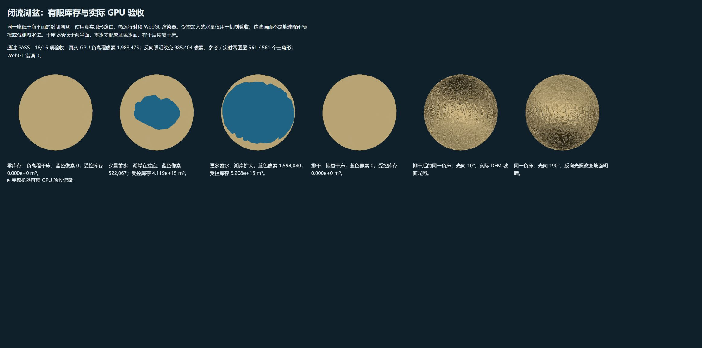

# 独立证据审阅：地球闭流河网与有限内湖

本次实测支持三个结论：来源标注的闭流参考河网在内部终止；被可信湖体 / 陆地内环确认的负高程湖床进入有限地表库存；干床、蓄水湖岸和再次排干的真实 GPU 显示与库存状态一致。可复核的通过证据如下。尚未标定的现实湖水位、河流流量及湖冰过程不在这些结论内。

## 来源与分类核对

完整版本、许可、URL、各下载包 SHA-256、WGS84 投影和采样规则见 [DATA-SOURCES.md](DATA-SOURCES.md) 与 `scenes/earth-land-sea/drainage-source.json`。HydroBASINS 标准 v1.c level 4 的 `ENDO=1/2` 由真实 `NEXT_SINK` 聚类；`ENDO=2` 指定优先终点。等级表示分级流域，不等于当前网格或源 DEM 像元分辨率。闭流终点上的虚拟 `NEXT_DOWN` 不能当真实海洋出口。原始 SHP 未作为独立 GIS 产品发布，保留版权与许可通知的应用派生三角形样本随本应用使用。

原始 HydroBASINS 对里海采用 coast 例外，伏尔加 `ENDO=0` 不能用作外流证据。Natural Earth 50m Lakes 不包含里海，而 [Natural Earth 官方 Coastline 说明](https://www.naturalearthdata.com/downloads/50m-physical-vectors/50m-coastline/) 明确将这个湖列入海岸数据。脚本通用扫描非水库湖体与 Land 内环，并核对完整负高程网格连通分量；当前只确认 166 个里海三角形。算法没有使用地名或地区坐标条件，也没有仅把非最大海洋的小分量当湖。Natural Earth 数据为 [公共领域](https://www.naturalearthdata.com/about/terms-of-use/)。

样本长度 215,348，与固定 mesh identity 匹配；采样不剔除负高程三角形。当前 11,050 个 HydroBASINS 闭流三角形、193 个已解析组都具有终点样本。来源复核与 `sample-drainage.py --check` 的逐字节再生检查已通过。没有把闭流 DEM 填平、加墙或人为注入现实湖水初值。

## 实际地球路由与连续守恒复现

独立运行已保存的 [audit.ts](audit.ts)，仅把输出改至忽略目录 `build/endorheic/independent`，没有覆盖正式审计结果。重新产生的 JSON 与 [audit.json](audit.json) 完全逐字节相同，SHA-256 均为 `ce2ac1f5575a0da6d3b9b1e6c3161615a4f4c983ac35aae7127292473d8e27f5`；记录于 [audit-reproduction.json](audit-reproduction.json)。本地可执行的独立入口是 `build/endorheic/audit-independent-runner.mjs`，新克隆可直接编译受版本控制的 `audit.ts` 再运行。审计从现有 `earth-simulation.json` 加载原物理状态，与基线 `fdf4b6b` 对比 DEM、偏移、地形约束和初始运行时，均保持一致；未启用实验水汽方案。

| 查询点 | 实测参考终点 | 结论的边界 |
|---|---|---|
| 伏尔加 54°N, 45°E | triangle 193872，38.6084°N, 50.6960°E，里海内部，床 −935.340 m；路径 101 步 | 该上游查询点沿参考树终止于内湖，不证明真实河道每一段的地理位置 |
| 里海 42°N, 51°E | 同一内部根；查询点床 −567.680 m、`inlandLakeId=1` | 床高程不是观测湖面或初始水深 |
| 咸海 | 45.0784°N, 59.9298°E，床 27.800 m | 源组 107；没有恢复灌溉改变的历史湖体 |
| 塔里木 | 40.2317°N, 90.5257°E，床 785.900 m | 源组 106；参考终点邻近罗布泊，不证明现代湖水存在 |
| 乍得 | 13.0204°N, 14.8900°E，床 280.710 m | 源组 1；没有现代湖面积观测初值 |
| 图尔卡纳 | 3.8712°N, 36.1026°E，床 362.000 m | 源组 8；没有独立地下水或盐预算 |
| Kati Thanda–Lake Eyre | 28.7049°S, 137.3281°E，床 +1.000 m | 源组 152；旧海岸符号约定已把此负高程陆地压到 +1 m，当前绝对盆底不能宣称真实 |
| 亚马孙、刚果控制点 | 均到外洋三角形 | 验证仍有外洋出口；没有确认其粗网格路线或出口坐标符合真实河道 |

路由秩检查覆盖全部参考边，无环；10,778 条闭流参考边未越出来源组。物理库存路由仍按真实相邻边的床面、鞍部和水头交换，来源标签并未制造物理封闭墙；单元测试验证水头超过真实 sill 后仍可溢流。

| 连续时间 | 步数 | 全局水量残差 mm | 总焓残差 J/m² | 细粗地表分配残差 m³ |
|---|---:|---:|---:|---:|
| day 0 | 0 | 1.1641532183e−10 | 0 | −5.6138087530e−6 |
| day 2 | 96 | 1.5133991838e−9 | −1.5232851729e−4 | 1.9582103903e−5 |
| day 24 | 1152 | −1.6065314412e−8 | −1.7466396093e−4 | 1.0561680915e−4 |

这些是模型实际连续积分的有限账本残差，不是把显示用年均流量加到水库存后计算的结果。保存 / 严格解码检查亦通过。参考终点的点库存不等于整个湖或流域的总库存；不能从一个根单元的零库存声称整个现实流域干涸。24 天末里海根单元约 9.931e8 m³、均值水头约 −934.845 m，仍是原始无观测水位模型的有限水，而不是现代里海湖面。

显示控制单独改变几何：默认 2,242、较细 2,242、主要河流 232、关闭 0 个三角形；全部流量 SHA 相同，且每次显示切换后的完整水检查点相同。这证明显示阈值、线宽和开关没有改写真实水量或路径。

## 真实 Chrome / WebGL 受控验收

验收页 [tests/endorheic-render.html](../../../tests/endorheic-render.html) 使用生产 `Renderer`、`ThermalRuntime`、`terrainWaterView` 和路由网络。240 个球面区域 / 476 个三角形组成全负床的受控内湖盆；每个顶点和三角形均已分类，以免三角中心分类的混合符号边缘混入海色。库存与诊断通量的人工设置只用于机制与容量压力验收，不能作为真实降雨、流量或湖水位证据。

最终 [gpu-after.json](gpu-after.json) 的 **16/16** 项通过，实际读取 GPU framebuffer，而非仅检查 shader 字符串：

| 状态 | 人工细网格库存 m³ | 实际 GPU 蓝色像素 |
|---|---:|---:|
| 零库存 | 0 | 0 |
| 少量蓄水 | 4.1191656845e15 | 522,067 |
| 更多蓄水 | 5.2076269903e16 | 1,594,040 |
| 排干 | 0 | 0 |

R16F 高程通道有 **1,983,475** 个负值像素，最低归一化高程 **−0.230712890625**；模型床最低 **−2307.826 m**。低 overhead、相反方向的受控光照改变 **985,404** 个负床像素，单独验证干负床坡面照明。CPU 拾取顶点使用同源静态内湖 mask：内湖、切到普通海面、再切回内湖三阶段的最大半径误差分别为 **2.042e−5 / 2.314e−5 / 2.042e−5** 场景单位。

显示门槛为 0 时，四个零通量状态都产生 **0** 个河流三角形。双图层压力状态分别生成参考 **561** 和实时诊断 **561** 个三角形；真实 GPU 上传 **94,248 B**，buffer 容量 **239,904 B**，WebGL 错误 **0**。这里的实时诊断通量是人为压力输入；真实地球通量与守恒来自上面的连续审计。每次渲染均逐项检查细库存、粗地表库存与外洋库存未变。

原始 [gpu-before.json](gpu-before.json) 保存修复前负床高程 / 坡面照明失败：GPU 负像素 0、照明变化 0。它使用混合符号旧 fixture，并出现边缘海色，因此前后蓝色像素不作严格同条件对照；最终全覆盖 fixture 自己验证了干 / 湿 / 排干。

同一次最终编译后的额外 Chrome 回归全部通过：[海面光照 20 项](gpu-surface-lighting.json)、[原地表水受控页](gpu-terrain-water.json)、[球面径向投影 648 项](gpu-radial.json)（最大误差 0.000267968）。海面与海冰不使用海床坡面，原陆地 / 积雪坡面仍有照明响应。`npm run typecheck` 和独立 `terrain-water.test.ts` 的 **20 项**单元测试通过，包含闭流内部终止、真实溢流鞍部、负床有限库存、蒸发排干无外洋补水及检查点复现。

## 物理与采样限制

当前河宽参考结合年均气候、土壤湿度、雨雪融水；其中示意径流系数未校准。它只估算河线宽度，不是质量守恒账本，也不证明真实日流量。实时物理交换 overlay 与它分开上传，守恒验证以有限库存和真实交换为准。

内湖降雨与蒸发已进入有限 `surfaceKgM2`，蒸发受这个库存约束，外洋蒸发面积扣除内湖份额；干内湖不会凭分类从全球外洋取得蒸发水。但是湖面与陆地仍共享粗热格子的地表水池和温度分配：湖水温度、潜热与热容量仍属于原来海洋热部分，**没有独立湖水热库，也没有独立湖冰预报**。这次闭流修复不能宣称完成所有湖泊能量与相变过程。

物理水头使用 `bed + volume / area` 的单元均值；显示湖岸则对原线性三角床做分片体积积分。当前湖面是实际库存驱动的岸线 / 水色覆盖，未重建独立浮水面几何、浅水波动或亚网格岸线。画面水岸能随库存变化，不意味着水动力与三维水面已精细求解。

本场景 ETOPO 的 15 arcsec 地形已降采到约 0.1°，当前球面三角形平均等效尺度约 49 km；HydroBASINS 来源 HydroSHEDS 是另一套 DEM。小鞍部、狭窄海峡、改道、湖面、河口均可能解析不足；湖体分类仅保守确认完整负分量与来源几何，未尝试按每个湖名修正 DEM。正高程湖泊主要由闭流流域标签与实际库存控制，未套用固定湖面。没有盐分、独立地下水、人类引水、观测现代湖水位或湖面积初值。

在这些限制内，来源、内部参考终点、有限库存守恒、负床几何 / 拾取一致性和实际 GPU 干湿转换均具可复现证据。本审阅不批准“现代真实湖面已经恢复”“参考蓝线就是真实流量”或“独立湖泊热冰模型已经完成”的宣称。

## 提交前最终核对

已审阅 [REPORT.md](REPORT.md)、实际下载文件及 [browser-roundtrip.json](browser-roundtrip.json)，并再次执行 `browser-roundtrip.mjs` 的严格解码与比较：两次文件的完整 runtime、terrain/drainage 和 view 相同，472 步模型时间为 9.833333 天，外层时钟 9.844067 天；水残差 −3.376044333e−9 mm、焓残差 −2.054274082e−4 J/m²，与报告一致。两份文件 SHA 不同，报告没有宣称字节相同。恢复通过场景已有的同源 fetch → File/DataTransfer → `terrain-load` 入口完成；这证明实际下载内容可经正常应用解析恢复，不等同于完成浏览器文件选择器上传，也未扩大扩展文件网址权限。

另外只重建第 0 天初态，确认全部 166 个里海内湖单元库存均为 0，而非只检查内部根点；没有重复 24 天积分。完整测试日志末尾为 199 项通过、0 失败。最终报告明确区分未校准参考河线与真实瞬时交换、受控库存画面与现实湖水位，并保留粗地形、+1 m 低岸约定、湖水共享热分额及未实现独立湖冰的边界；未发现需要阻止提交的证据宣称。

提交前来源限制文案已明确：Lake Eyre 与里海低岸陆地尚未解析，已有负里海床保留。正式样本 SHA 仍为 `1c7274c9a78232942f14de319bb9ddb4ec15756a1f38a812134c537d6daa70d2`，受审计记录的七个物理 / 渲染源文件 SHA 均未变。原 `audit-reproduction.json` 没有 sampler 或来源元数据 SHA，因此没有失效的旧值需要替换；当前修正文案元数据 SHA 为 `219a13887c6ab66ba1ee8ec311ea853b7a43df3cde38a609880bd3ca24dbfe8c`。以上文案订正不改变采样、运行结果或既有守恒复现结论。
