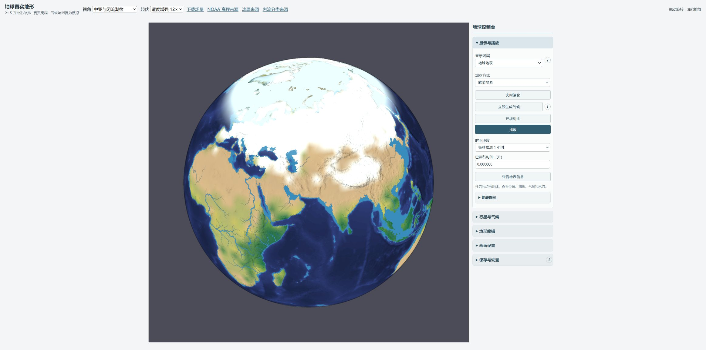
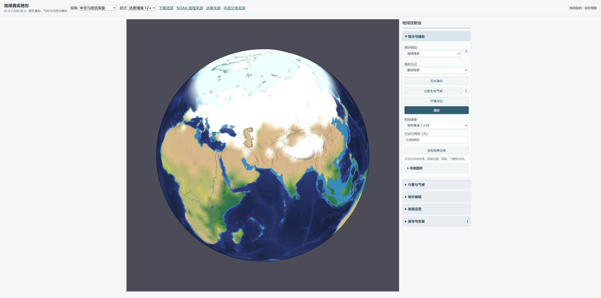
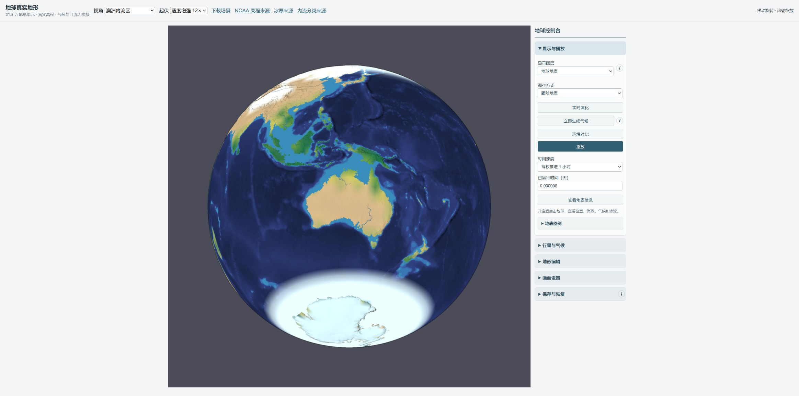
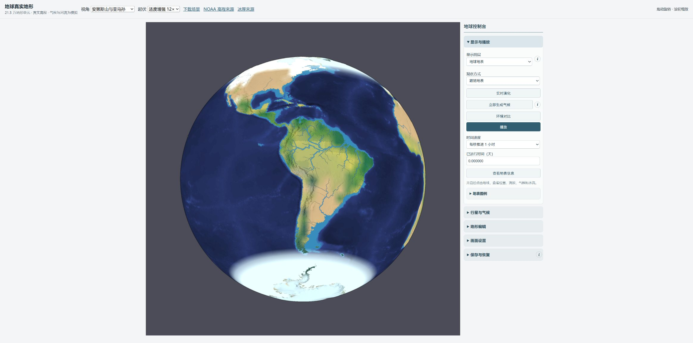
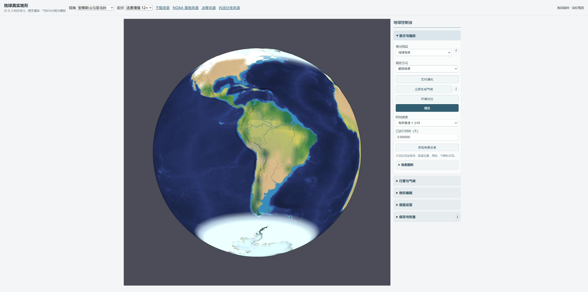
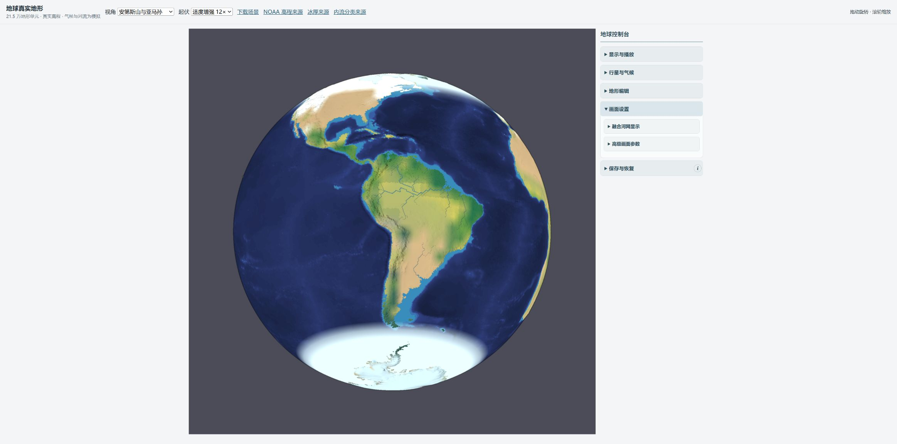
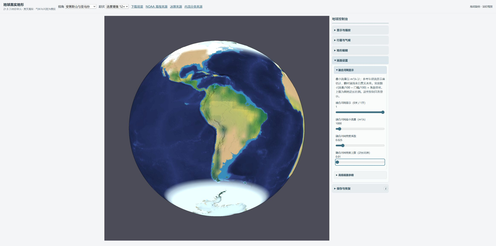
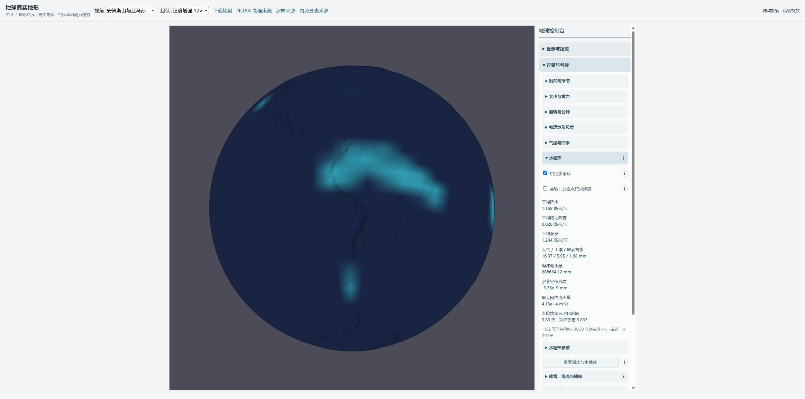

# 地球真实性第4部分：内流河网、有限湖盆与显示控制

验收日期：2026-10-11。基线：`fdf4b6bd95d578d481ef8152c2b03b064225c68c`。实施分支：`codex/earth-endorheic-rivers`。

## 完成结果

参考河网现在识别真实闭流集水区，在内部终点结束；普通外流区仍通过当前 DEM 的真实边缘鞍部建立无环汇流树。参考年径流只生成河流图层，实际蓄水转移仍由有限水库决定。闭流标签不删除物理边、不增加水，也不制造永久无限高坝。

里海在源水文数据中被特殊处理为沿海，因此另用通用的湖泊多边形、陆地内环和完整负高程水体连通分量识别。其166个三角形现在具有有限地表水库存、signed湖床、湖面降水和库存限制的蒸发；干床的几何、坡面光照与CPU拾取同步。没有补造观测湖水位，正式第0天里海仍是干床。

正式场景河网默认最小流量为 **1000 m³/s**、宽度系数 **0.025**、边长比例上限 **0.35**。相同第0天状态下，原显示数值生成9014个河网三角片，新默认生成2242个；提高门槛到10000 m³/s生成232个，关闭为0。流量数组SHA和全部水库存不随显示参数改变。[机器审计](audit.json)

原 DEM、绘制约束、应用高程偏移，以及正式完整初始 `runtime` 相对基线逐项 `deepEqual`。独立观测陆冰/冰架、海面与海冰照明、分离热库保留；实验共享水汽仍关闭。完整测试 **199/199通过**，类型检查、生产构建、严格地球验证及两次独立审阅通过。[代码审阅](CODE-REVIEW.md)，[物理与视觉证据审阅](EVIDENCE-REVIEW.md)

## 数据与拓扑

采用HydroBASINS standard level 4 v1.c，WGS84；由15″ HydroSHEDS派生，原基础尺度约500m，level 4是流域层级。`ENDO=1`为内部集水区，`ENDO=2`为终点子流域，以 `NEXT_SINK` 聚合；终点的虚拟 `NEXT_DOWN` 不被当成物理出海口。[官方技术文档](https://data.hydrosheds.org/file/technical-documentation/HydroBASINS_TechDoc_v1c.pdf)

全球9区源包共39,341,154字节，当前mesh采样得到193个闭流组、11,050个闭流三角形、9,083个终点子流域三角形。参考树优先在终点子流域中选择当前mesh可解析低点；分裂后的连通片各自终止。父节点总指向更早结算的节点，平台和嵌套分类不会形成receiver环。

Natural Earth 1:50m Lakes v5.0.0及已有Land v4.1.0辅助确认封闭负高程水体，排除水库。算法没有地名或地区坐标条件；当前169个负高程连通分量中，只确认里海对应的完整166个三角形。Natural Earth明确把技术上属于湖的里海纳入海岸线。[官方说明](https://www.naturalearthdata.com/downloads/50m-physical-vectors/50m-coastline/)

源包SHA、投影、版本、许可、字段、采样方法和案例一手来源见[数据报告](DATA-SOURCES.md)和[正式来源元数据](../../../scenes/earth-land-sea/drainage-source.json)。样本与mesh fingerprint绑定，样本SHA-256为 `1c7274c9a78232942f14de319bb9ddb4ec15756a1f38a812134c537d6daa70d2`。原GIS文件仅在忽略的build缓存中；本仓库发行的是应用集成分类，保留HydroSHEDS署名、原许可入口和免责声明。

| 实际追踪起点 | 当前参考终点 | 出海 |
|---|---|---|
| 伏尔加 54°N,45°E | 里海内部根193872，床−935.34m | 否 |
| 里海 42°N,51°E | 同一内部根，查询床−567.68m | 否 |
| 咸海 45°N,59°E | 组107内部根，床27.80m | 否 |
| 塔里木 40°N,85°E | 组106内部根，床785.90m | 否 |
| 乍得湖 13°N,14°E | 组1内部根，床280.71m | 否 |
| 图尔卡纳湖 3.5°N,36°E | 组8内部根，床362.00m | 否 |
| Lake Eyre −28.5°,137.5°E | 组152内部根，床约+1m | 否 |
| 亚马孙 −3°,−60° | 现有海岸出口 | 是 |
| 刚果 0°,23°E | 现有海岸出口 | 是 |

以上为对本次mesh的完整receiver追踪，坐标只用于验收查询。源身份约束不等于实测河道；最近三角形可距查询点十几到数十公里。[逐点结果](audit.json)

## 水量、湖岸与显示单位

真实水库保留供体水位、接收水位、边缘鞍部及可用库存约束。只有实际水位越过出口鞍部，才能产生有限转移；物理路由不读取闭流组来阻断边。未到鞍部的蓄水留在盆内，降水和融雪增加现有地表库存，蒸发先受该库存限制，耗尽后停蒸发。负高程内湖不再作为全局外洋出口，也不能从全局海洋借水维持蒸发。单测把2mm受控库存从既有海洋转入湖后蒸干，总水量保持一致。

湖岸按现有三角形床面储水积分和真实体积重建。零库存时head低于最低床面，显示干床；增加库存扩大覆盖，排干重新显露床面。湖水仍为床面上的覆盖与湖岸图层，没有另建随head位移的自由水面网格。

参考流量采用面积加权的示意年径流，含未校准0.35径流系数及当前湿度、液态雨、融雪调制。真实瞬时图层使用最近一步 `fluxM3S`，二者数组与账本独立，但都以蓝色显示。因此不能仅凭蓝线判断实际溢流，需查看地表水库信息或水流诊断。

| 控制 | 含义 | 正式值 | 缺失字段的旧档 |
|---|---|---:|---:|
| 融合河网显示 | 0关/1开；只影响图层 | 1 | 1 |
| 最小流量 | 流量必须严格大于门槛，m³/s | 1000 | 300 |
| 宽度系数 | 示意宽度倍率，不是物理河宽米数 | 0.025 | 0.07 |
| 宽度上限 | 三角形对应边长的比例 | 0.35 | 0.85 |

内部河流单位为 `Q/100`；几何宽度比例为 `min(上限, sqrt((Q−Qmin)/100) × 5.5 × 系数 / 网格边长)`，用于原atlas着色。缩放、门槛和上限仅重绘，不重新生成气候或修改DEM。旧编辑层艺术河流参数仍保留，中文名称说明其所属层。

可选 `terrain.drainage` 保存来源字符串、basinId、terminal、inlandLakeId；长度、整数范围、终点关系严格校验。缺失分类的旧存档保持可读。地形重建/恢复产生新网络，派生缓存重新建立；正高程编辑退出负高程湖分类，Reset清除观测分类。

## 同状态浏览器截图

实际Chrome截图，原始viewport为2327×1156；第0天、暂停、zoom 0.26、12×显示起伏、顶光60、轮廓强度3保持一致。原模型广泛的冬季雪色也保持原状态，不能解释为实测冰盖。历史中亚/澳洲截图由 `prepare-before.mjs` 构建Git基线代码与基线存档；外层只提供相同镜头选择。其余三组在改动前直接从正式页面捕获。

**中亚与里海：修复前 / 修复后。** 修复后里海呈干床，表示未给它补造湖水；参考水系内部终止由上述路径审计核对。




**澳洲内流区：修复前 / 修复后。** Lake Eyre的内部终点由拓扑核对；图像不能恢复旧DEM已经丢失的负高程盐湖盆底。




**外流控制组与默认疏密：亚马孙修复前 / 修复后。** 非洲（乍得/图尔卡纳与刚果）及亚洲全景也保留于同目录。




[非洲修复前](before-africa-day0.png) / [修复后](after-africa-day0.png)；[亚洲修复前](before-asia-day0.png) / [修复后](after-asia-day0.png)。

全部四项控制可见；同一暂停状态将上限从0.35改为0.01。宽度、门槛、开关也经实际键盘控制即时改变。[DOM读数记录](browser-checks.json)中的第0天水量残差始终为1.164×10⁻¹⁰mm；单测另逐项deepEqual真实水量/路径。




[变细](channels-thin-day0.png)、[20000m³/s门槛](channels-major-day0.png)、[关闭](channels-off-day0.png)保留对应画面。

## 实际演化、保存恢复与GPU

Node实际连续执行共用30分钟时间步，并非直接跳时间标签：

| 模型天数 | 累计步数 | 水量残差 mm | 能量残差 J/m² | 严格JSON恢复 |
|---:|---:|---:|---:|---|
| 0 | 0 | 1.164×10⁻¹⁰ | 0 | 通过 |
| 2 | 96 | 1.513×10⁻⁹ | −1.523×10⁻⁴ | 通过 |
| 24 | 1152 | −1.607×10⁻⁸ | −1.747×10⁻⁴ | 通过 |

全部细格与粗格水量非负，粗细分区残差满足全局等效水深阈值。独立审阅再次运行 `audit.ts`，结果JSON逐字节一致。[复现记录](audit-reproduction.json)

实际连续积分存档经正式加载器恢复后，也在Chrome保存了[中亚第24天](after-central-asia-day24.png)与[亚马孙第24天](after-amazon-day24.png)；它们不参与第0天前后对比。

浏览器实际点击播放、暂停并切换水流诊断；时钟9.844067天，物理模型9.833天、472步，剩余约15.5分钟是正常固定步长滞后。水量残差−3.38×10⁻⁹mm。演化后的完整模拟由实际下载按钮保存，再经场景原有同源自动加载流程恢复并下载第二次，严格核对完整runtime、terrain/drainage和view。[保存恢复结果](browser-roundtrip.json)

Chrome自动上传助手缺少“允许访问文件网址”权限；没有扩大扩展权限，恢复核验使用本应用已有的同源 `File/DataTransfer → terrain-load` 流程。下载按钮本身成功生成实际文件。



独立实际GPU验收16/16通过：全负高程受控湖盆、零库存/排干0个蓝像素；较低/较高库存蓝色面积522,067→1,594,040像素；R16F负床像素1,983,475，最小显示高程−0.230713；相反光照985,404个负床像素改变。CPU拾取inland→marine→inland切换最大半径误差2.315×10⁻⁵。双河网各561个三角片，共94,248字节上传，缓冲239,904字节，WebGL错误0。[GPU读回](gpu-after.json)

下图是明确受控库存与照明的机制验收，不是地球湖水位或河流预报。容量压力阶段使用人工通量，图层数与上载容量只证明GPU接口。修复前的 `gpu-before.json` 记录负床通道为0；该初版fixture含边缘海洋格，随后改为全内湖，不能把两版的颜色计数当成相同fixture的严格差值。


海面光照20项、球面径向648项、原地表水GPU回归全部通过；普通marine仍为海平面基球，不受海底DEM坡面光照影响。[海面回归](gpu-surface-lighting.json)，[径向回归](gpu-radial.json)，[地表水回归](gpu-terrain-water.json)

## 复现与边界

在仓库根目录执行：

```powershell
npm test
npm run typecheck
npm run build
node_modules/.bin/esbuild.cmd scenes/earth-land-sea/verify.ts --bundle --platform=node --format=esm --outfile=build/earth-relief/verify.mjs
node build/earth-relief/verify.mjs
node_modules/.bin/esbuild.cmd docs/evidence/earth-endorheic-rivers-20261011/audit.ts --bundle --platform=node --format=esm --outfile=build/endorheic/audit.mjs
node build/endorheic/audit.mjs
node docs/evidence/earth-endorheic-rivers-20261011/prepare-before.mjs
```

正常本地服务使用8002，浏览器GPU页为 `/tests/endorheic-render.html`、`/tests/gpu-surface-lighting.html`、`/tests/terrain-water-render.html`、`/tests/gpu-radial.html`。`npm test`会编译这些GPU页，GPU判断需在实际浏览器中运行。[完整测试日志](tests.log)，[严格地球验证](verify.json)

数据重采样需先运行 `make-world.ts --coordinates` 生成mesh坐标与邻接，再运行 `sample-drainage.py --check`；Python需numpy。`apply-drainage.mjs` 核对样本SHA、mesh和所有原地形/初始runtime不变，再更新正式文件。其完整命令与下载来源见数据报告。

保留的物理限制：

1. ETOPO由15″源先降采样至0.1°，再进入约50km地形三角形；HydroBASINS与它来自不同DEM。细分水岭、嵌套小盆地、河道和狭窄真实溢流口可能丢失。物理溢流服从当前可解析DEM，观测标签不能补回不存在的鞍部。
2. 原海岸导入仍把低于海平面的陆地约束到+1m，Lake Eyre等绝对盆底没有恢复。里海已保留现有负湖床，沿岸未解析低陆地仍受此约定影响。
3. 没有观测初始湖水位、现代取水工程、地下水或盐分预算。第0天里海干床是诚实的未初始化结果，不能称为现代真实湖岸。
4. 湖面积分额受已有粗格 `1−land` 上限限制，小湖可能缺少独立E/P面积。湖面目前复用已有水面热分额，没有独立淡水湖热库；未实现淡水湖冰、湖雪及其相变热。原初始库存保持原值，不能把旧海冰解释成实测内湖冰。
5. 参考流量、气候雨雪、河宽与湖岸均为未校准模型。其用途是正确区分内部/外部参考排水、真实有限蓄水与显示控制，不是定量预测现实洪水或湖泊变化。

按用户授权自动完成代码与证据提交、合并main并正常推送origin；最终提交与本地/远端一致性在交付答复中记录。
