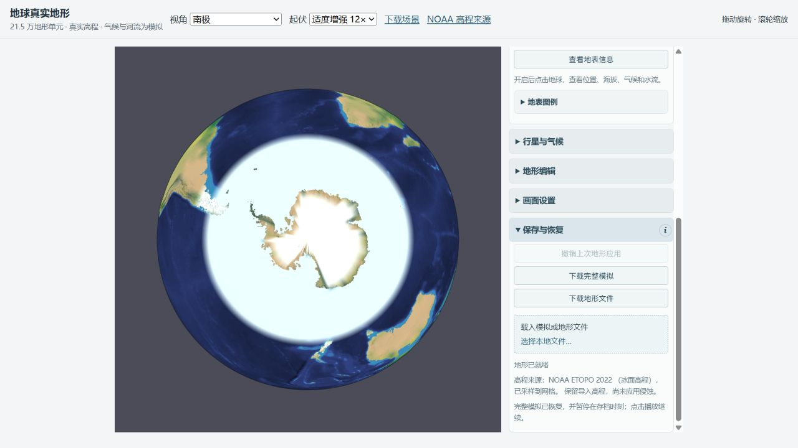
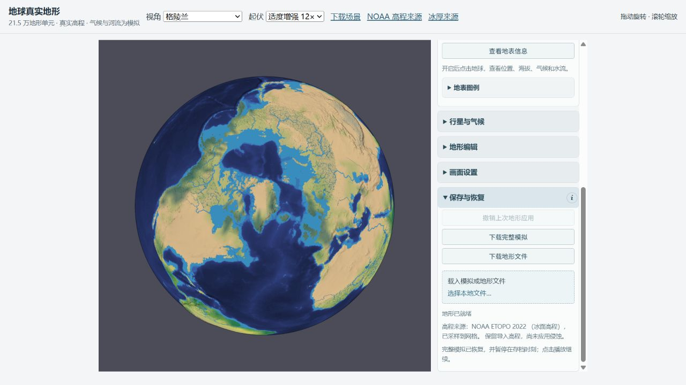
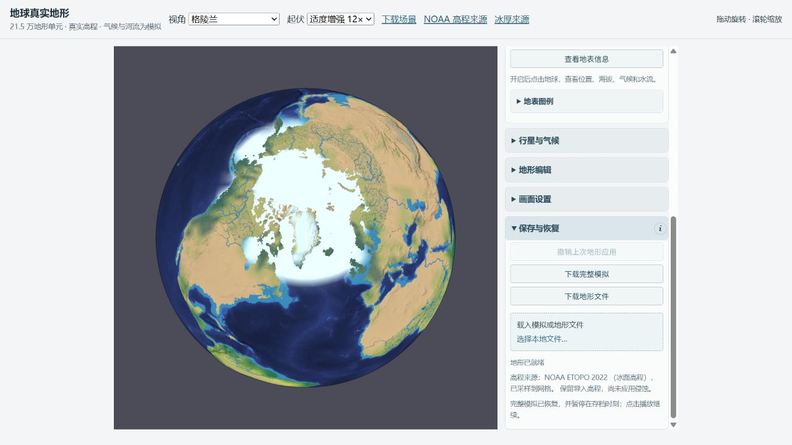
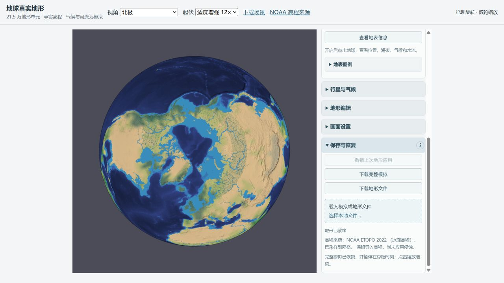
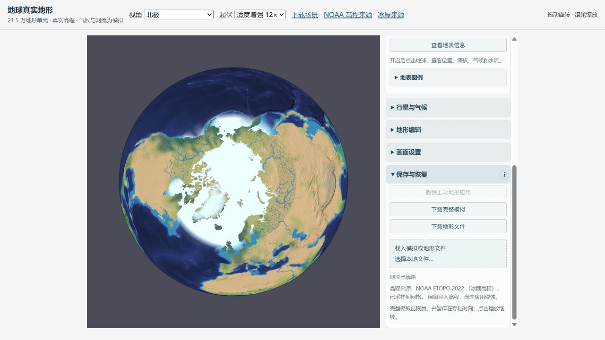
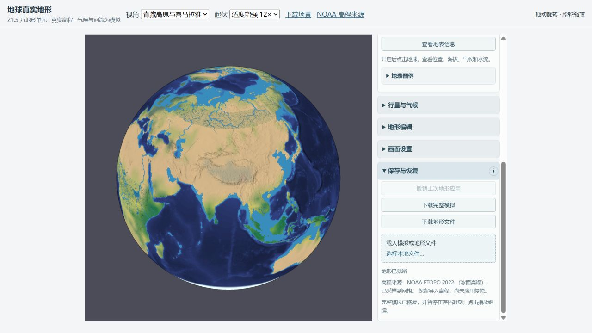
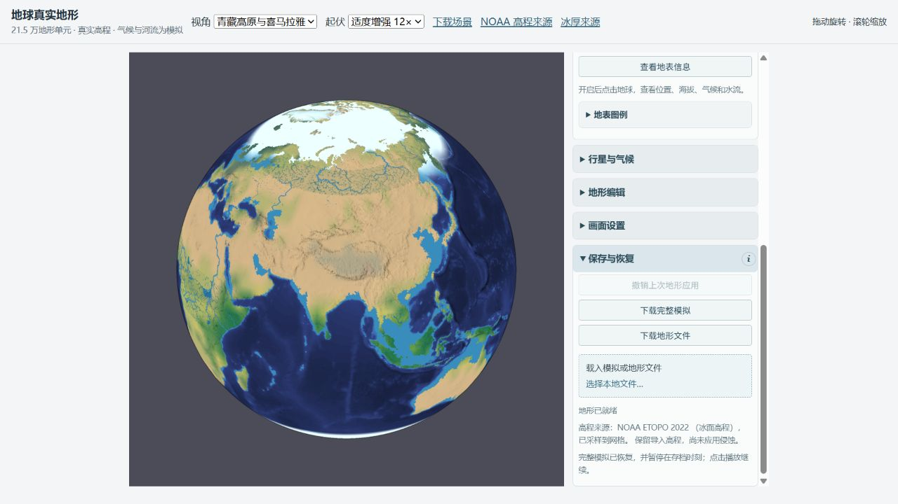

# 地球冰库存与独立热储层修正

2026-10-10。固定比较基线 `be7460963bec88be82eac11a6f4dcc62e7a5c188`，实施分支 `codex/earth-ice-inventory`。本次修正了南极、格陵兰没有真正大陆冰库存的根因，并分开空气、陆地、海洋的热储层。**季节海冰仍过宽、季节振幅不足，不能称地球气候已校准。**

## 已实现的行为

原场景使用 ETOPO 冰面高程，却只根据参考气候最暖月推测冰盖。南极和格陵兰的参考夏温高于阈值，导致第 0 天大陆冰量为零；雪色不能替代真实冰厚。混合海岸格还会因海冰冻结把整格空气和陆地夹到约 −1.8°C。

正式场景现在读取独立的实际 ICE 厚度和 grounded/shelf 分类，以 917 kg/m³ 转为守恒库存。grounded 冰先分配已有雪、地表、土壤水，再从有限海洋供水；冰架从有限海洋供水。每份冰均有水源，没有新增总水。第 0 天大陆冰为全球当量 49,438.576 mm，独立浮冰架 1,040.698 mm；海洋供水减少，总水仍为 739,407.316 mm。这是模型库存分配，不是对现实海平面的预测。

ETOPO 已有冰面高程保持原值，不能再加一遍 ICE 厚度。动力学床参考取现有粗格冰面 DEM 减初始条件冰厚，并保存、核对床高 checkpoint；冰川坡度采用床高加当前冰厚。原始产品 BED 单独留作来源诊断，不能把不同 geoid、分辨率与采样误差混成真实基岩。浮冰架只进入独立冰架库，融水回海洋；grounded 冰和积雪融水走原地表径流。

地球存档显式启用 `separateReservoirs`：空气热容量 10⁷ J/m²/K，陆地热容量为陆地比例乘原配置，海洋为海洋比例乘 4.2×10⁶ J/m³/K 与混合层深度。辐射作用于对应表面，空气与表面采用守恒换热（10 W/m²/K 按面积比例）；海流传输海洋热量，陆冰流动使用陆地温度。冻结、融化与蒸发只从对应表面热层取热，凝结和降雪潜热归空气。相界为陆地冰雪/冰架 273.15 K、季节海冰 271.35 K；空气可独立高于融点。

Inspect 分别标明当地空气与表面估算，局部冰面降尺度诊断遵守相界，不改空气温度或物理账本。比较图与融合地表包含浮冰架；季节海冰统计不混入冰架。新增格陵兰视角和冰厚来源入口。

默认程序星球继续用旧热路径。旧档案缺少可选字段时按原路径恢复，冰架缺省为零；新分层档案必须具备完整三层温度和冰库。关闭水循环时观测配置休眠，关闭冰川运动仍保留冰库存；普通地形导入与 Reset 清除观测配置。

## 数据来源与边界

使用 [GFZ GDEMM2024 正式发布](https://doi.org/10.5880/GFZ.1.2.2024.002)的独立 ICE/LTM/BED/SUR 字段，其极地厚度继承 BedMachine Greenland v5 和 Antarctica v3。使用作者附带 1 角分版本，CC BY 4.0；来源版本、坐标、米制单位、nodata、水平注册、垂直基准和引用见 [DATA-SOURCES.md](DATA-SOURCES.md)。它不是最新逐日冰况产品，也不提供季节海冰。

采样输出仍是原有 96×49 地表网格：最近邻确定分类，同类角点插值厚度，冰类缺测直接报错；实际采样缺测 0。574 个冰类种子包括 533 个 grounded 和 41 个 shelf，含极点重复行，点数不是冰面积。HTTP 范围读取的每个实际使用字节段均记录 SHA256、ETag、日期和总文件长度；不是整 TIFF 的校验值。样本文件另有完整 SHA256。

罗斯点 ICE=334.5 m，而 SUR−BED=662 m；差值包含约 327.5 m 水腔。Vostok 也有冰下液态水。因此没有用两个 DEM 的差替代冰厚。Vostok 被归入大陆冰库，但本模型没有冰下湖水文/应力求解。ETOPO 的 EGM2008 与产品 EIGEN-6C4 geoid 没有强行拼接。

来源点掩膜与既有 Natural Earth 面积比例不完全一致。6 个 grounded 点对应 `localLand=0`，保留记录但不在海面创建接地冰；12 个 shelf 点有部分陆地面积，冰架按该格 land/sea 两份热表面库存保存，仍保持 shelf 类别。没有用单个点样本把整格改成陆地，也没有改变岸线或伪改 DEM。具体坐标、厚度与独立实测见 [source-coastline-mismatches.json](source-coastline-mismatches.json)、[coastline-policy-review.json](coastline-policy-review.json)。这意味着不能声称完整原始冰盖体积无损导入；岸线细节仍需未来面积栅格重采样。

原始 85°S/0°源点 ICE=2177.75 m、72°N/40°W源点=3185 m；运行控点取最近的 3.75°地表种子，为 2526 m 和 3087.5 m。不要把运行格厚度当作精确坐标的原始观测值。青藏/喜马拉雅输入零仅表示本产品不含当地山地冰川，不能解释为现实没有冰川。

## 连续积分与账本

每一步都执行实际 `ThermalRuntime.sync`，保持地形水流、冰川和动态大气开启；没有调季节滑块、重新生成参考温度或关闭耗时子系统。旧单柱稳定步长约 1568.7 s，新分层为 1800 s，所以比较接近同一真实日数而非同一步数。

| 场景 | 第0天 | 约第170天 | 约第350天 |
| --- | ---: | ---: | ---: |
| 基线实际模型天数 | 0 | 169.992838 | 349.989528 |
| 基线累计步数 | 0 | 9363 | 19277 |
| 修正实际模型天数 | 0 | 170 | 350 |
| 修正累计步数 | 0 | 8160 | 16800 |

独立账本直接累加大气、土壤、地表、雪、海冰、grounded、两份 shelf 和全球海洋库存；焓为三层 C×T 加蒸汽潜热、减全部冰类融化潜热，再扣累计净辐射。没有只复用模型自己的 residual。最终前后结果见 [before-continuous.json](before-continuous.json) 与 [after-continuous.json](after-continuous.json)。

这是新的第0天初始条件：分配观测冰及其潜热、设置分层相容温度后记录新的 `initialEnthalpy`。基线初始焓约9.083×10⁹ J/m²，修正约−4.918×10⁹ J/m²；连续守恒相对于各自初态检查，没有宣称从原温暖海水状态无外界能量地冻结出整个观测冰盖。独立账本在第0/170/350天记录点重算，非逐步重新计算所有独立总账。

| 三个记录时点最大绝对残差 | 基线 | 修正 |
| --- | ---: | ---: |
| 独立总水，mm | 7.38×10⁻⁸ | 8.63×10⁻⁸ |
| 独立总焓，J/m² | 3.15×10⁻⁵ | 2.68×10⁻⁴ |

焓检查使用与账本数量级有关的浮点容差（本次下限 0.001 J/m²）。初始冰库潜热很大，绝对末位误差比基线稍大；没有调整总水或焓来隐藏漂移。地形 offsets、constraints、实际网格 elevations 的 SHA256 前后逐项相同。

48×24 为守恒物理网格，96×49 为地表显示估算；区域采用球面面积裁切。陆冰覆盖定义为条件陆地冰厚≥1 m，积雪≥30 mm 水当量；季节海冰范围定义为浓度≥15% 的海洋面积，0.5 m 库存映射为满浓度。格陵兰矩形包含邻近粗格，不能拿其区域百分比当卫星冰盖面积。

| 诊断 | 基线第0/170/350天 | 修正第0/170/350天 |
| --- | --- | --- |
| 南极物理陆地平均冰厚，m | 0 / 0.000366 / 0.001088 | 2226.164 / 2226.164 / 2226.150 |
| 南极显示雪或厚冰覆盖 | 76.28% / 76.28% / 84.71% | 98.58% / 98.58% / 98.58% |
| 格陵兰矩形显示 grounded 覆盖 | 0 / 0 / 0 | 77.71% / 77.71% / 77.71% |
| 青藏/喜马拉雅物理厚冰覆盖 | 0 / 0 / 0 | 0 / 0 / 0 |
| 北极物理季节海冰范围，百万 km² | 20.59 / 0 / 20.61 | 20.59 / 19.86 / 20.61 |
| 南大洋物理季节海冰范围，百万 km² | 48.51 / 48.51 / 10.21 | 48.51 / 48.51 / 47.90 |

第350天南极运行控点冰厚 2525.944 m，格陵兰 3087.332 m；千米冰库存不再只靠薄雪维持。第170天格陵兰矩形空气均温 +7.56°C、陆地储层 −5.49°C、海洋约 −1.8°C；局部内陆显示空气约 +1.0°C、冰面约 −10.3°C。这是分层机制与相界的验证，不能据此声称温度已匹配观测。南极粗格空气初值也明显受混合格及参考异常影响，局部与物理粗格温度必须分列。

## 浏览器与截图

仅使用 `http://localhost:8002/scenes/earth-land-sea/index.html`。8000、8001 未动。真实浏览器恢复完整第0/170/350天存档，截图维持同镜头、12×显示起伏、overhead=60 和原渲染参数；只有新增格陵兰视角另列。旧档基线采用原物理积分，但由当前渲染器显示：第一部分海面光照修正保持一致。

第170天的南极、格陵兰是最直接的厚冰保留对照：

| 地区 | 基线第170天 | 修正第170天 |
| --- | --- | --- |
| 南极 |  |  |
| 格陵兰 |  |  |
| 北极 |  |  |
| 青藏/喜马拉雅 |  |  |

所有第0/350天和美洲对照为同目录 `before/after-{antarctic,greenland,arctic,tibet,americas}-day{0,170,350}.jpg`。亮白极区光晕和宽海冰仍存在，截图不是季节海冰拟真验收通过的证据。

浏览器实际点选格陵兰 71.92°N/39.96°W，读到 3089 m 原冰面海拔、网格陆冰 2557.6 m、局部空气 +1.0°C 与冰面 −10.3°C；网格陆冰与局部 3087 m 使用不同分辨率。完整读数见 [greenland-day170-probe.txt](greenland-day170-probe.txt)。默认旋转模式下，点选需先在「地形编辑→画笔与手工编辑」切换为绘制模式，再打开「查看地表信息」；Inspect 会阻止绘制。

真实播放/暂停、图层往返和控制台记录见 [browser-validation.json](browser-validation.json)；气温与水流图层截图为 [temperature-day170.jpg](temperature-day170.jpg)、[runoff-day170.jpg](runoff-day170.jpg)。

## 复审与验证

- 最终全套 `npm test`：183/183；`npm run typecheck`、`npm run build`、Earth 场景验证与 `git diff --check` 通过。日志与 [scene-validation.json](scene-validation.json)随报告保存。
- 真实 WebGL2 [海面光照 20 项回归](gpu-surface-lighting.json)通过；海底不影响海水/海冰坡面光照，陆地/积雪仍有坡面光照。
- [受控湖泊 GPU 检查](gpu-terrain-water.json)通过：无水时无湖面，储水增多扩大湖面，排空后消失，湿地可见；这是渲染夹具，不是地球降水预测。
- [独立代码审阅](CODE-REVIEW.md)修复了开关/导入、局部相界、恢复床高、有限供水负库存与无水循环 Inspect 字段遗漏；相关独立回归68/68、自建行为探针8/8通过，无剩余阻塞。
- [独立物理/视觉审阅](PHYSICAL-VISUAL-REVIEW.md)核对数据、海岸冲突、实际床高、相界、截图及未校准海冰。

跨 Node/浏览器恢复时，反照率重算曾出现约 5.55×10⁻¹⁷ 的舍入差。校验现在允许 `8×Number.EPSILON`，0.001 等实质改动仍拒绝；水量与焓账本未因此放宽或跳过。显示初值字段验证尺寸、有限值和范围，但不是每个像素与原始源数据逐值防篡改校验。

## 明确保留的模型限制

1. 北极和南大洋海冰过宽，南半球至第350天仍约47.9百万 km²，季节振幅严重不足。两极通过各自纬度、太阳季节与库存演化，没有添加对称白环；现有海冰热阻/厚度、海洋吸热与交换尚未校准，不能宣布季节真实性问题已全部修好。
2. 本次是冰库存演化，ETOPO 导入几何保持固定。冰架融尽后不会自动退岸变海面，grounded 冰流动/消融也不会重绘顶面；没有完整应力、崩解或冰下湖水文。
3. 运行格很粗，海岸冲突、冰缘、岩石露头和小岛仍被概化。局部纹理降尺度不增加物理分辨率，也不证明精确冰盖体积。
4. 空气与表面已分层，但辐射、垂直热交换、移动降雨/径流显热等仍简化；局部和粗格的温度差很大，不能作为真实温度场。
5. 热带降雨、闭流盆地河网及网格升级没有扩展。本次没有手绘河道、加伪冰盖高程或为了截图更改季节。
6. 冰架物理库存全年约578,871 km³没有净消融，不能把这解释为验证了真实冰架季节行为。北极水流诊断仍有粗格放射条带，不能当真实河网或新融水通道。高倍速浏览器播放会明显增加交互延迟，本次实际恢复后从170播放到342.5025天才暂停；正式入口维持每秒1小时。

完整复现命令见 [REPRODUCE.md](REPRODUCE.md)。正式入口保持第0天暂停，可从当前库存实际继续播放。

实施提交、main合并与合并后复验见 [RELEASE.md](RELEASE.md)。
