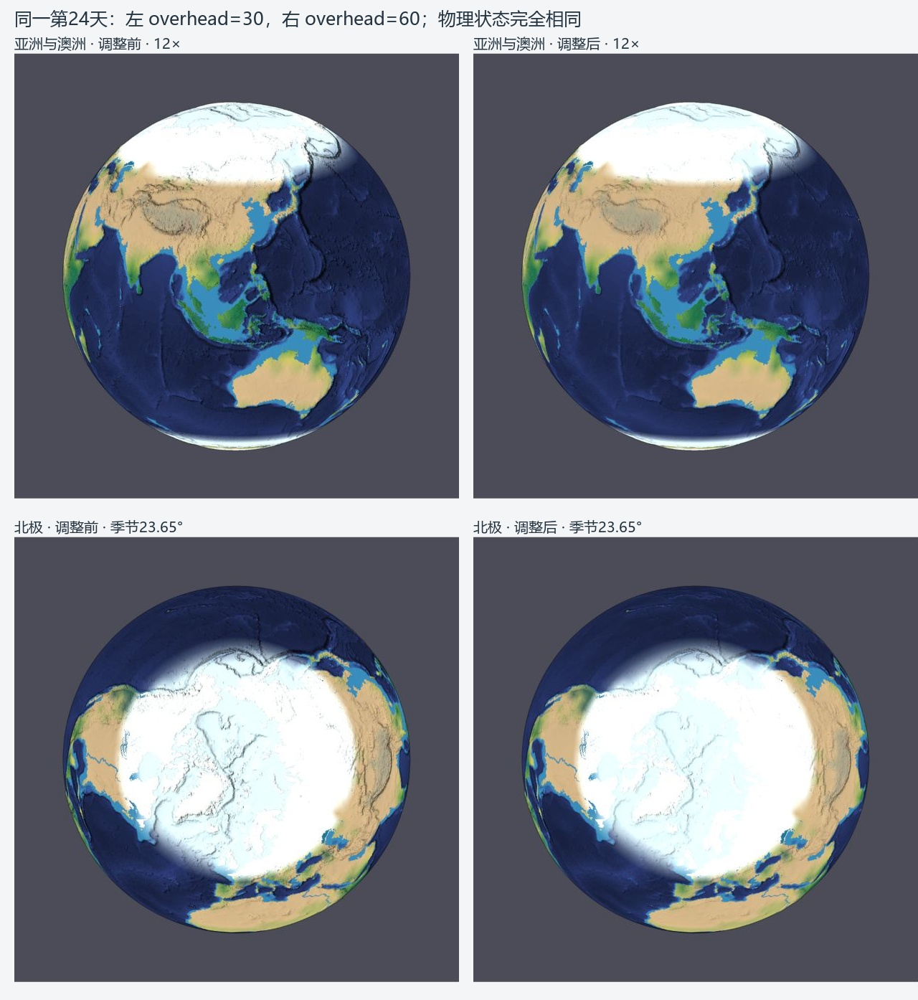
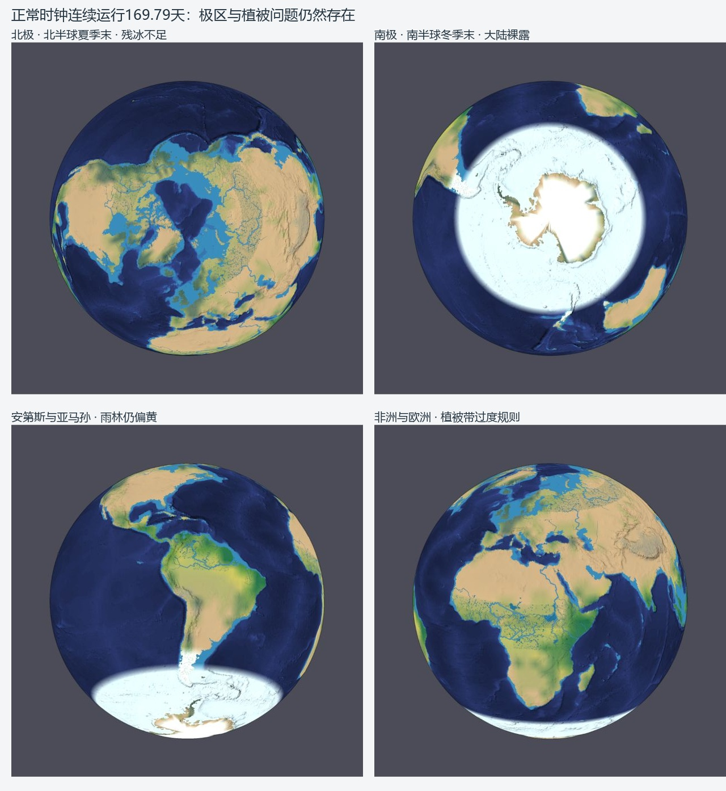

# 地球场景拟真审查（2026-10-10）

本次实际打开并播放了 `http://localhost:8002/scenes/earth-land-sea/index.html`。基线提交为 `a4ec11e3ed1c8df5b7a1bfe0e75cc4bfc4d34b41`。仅采用显示参数 `render.overhead: 30 → 60`，减弱坡面纹理的黑色阴影；真实 DEM、默认 12× 显示起伏、中文控制台、融合地表、河流湖泊及全部物理参数保留。它是视觉改善，气候尚未校准到地球观测。

## 实测方法与证据

- 正常浏览器时钟：真正点击播放，以每秒 1 天推进，然后暂停在 **23.560600 天**；场状态为 **23.548084 天**，1,297 步。`baseline-native-playback.jpg` 和四张 `baseline-*-day23.jpg` 保存该次结果。
- 最终配置重新载入后另一次**正常时钟连续播放到 169.791800 天**，场状态 **169.77496875876864 天**、季节约 **167.35°**（北半球夏季末、南半球冬季末），再次暂停。欧亚雪带退去、北极残冰不足、雨林植被仍偏黄，南极广阔裸露区仍在。`final-*-day169.jpg` 保存七个区域，`final-browser-check.json` 保存真实步数、均温、预算和控制状态。水量残差 -4.42e-9 mm，焓残差 2.38e-5 J/m²；这些只证明数值守恒，不能证明地球气候正确。粗热柱范围 -2.8～36.2°C，也不能等同于极区真实近地空气温度。
- 固定前后对照：恢复同一第 0 天存档，通过播放按钮和受控浏览器帧调度推进时钟到 **24 天**，场状态为 **23.983823519445345 天**，1,321 个实际物理积分步，季节 **23.6546196°**（北半球春分之后，太阳直射约 9.2°N）。每帧推进 200 ms，共 120 帧，再完成绘制并暂停。控制的只是帧调度，没有替换热、水、冰或渲染计算。
- 前后各 7 个固定镜头：亚洲/澳洲、非洲/欧洲、青藏/喜马拉雅、安第斯/亚马孙、美洲、北极、南极。`before-*-day24.jpg` / `after-*-day24.jpg` 为完整浏览器截图。
- 另检查气温、降水、土壤湿度、水流与风图层（`diagnostic-*-day24.jpg`）。
- 季节 90°、270° 的两极截图是**即时生成的夏至/冬至参考状态**，均第 0 天、0 积分步，不能当作从春分连续播放半年或全年。`season-reference-check.json` 明确记录这一点。
- 参数探针在 Node 上使用同一 DEM 与守恒模型，分别初始化并实际积分约 24 天。不同参数会改变稳定步长，末次采样时刻相差不到 0.02 天；物理候选的浏览器视觉比较统一使用第 0 天同季节。没有把这些候选当作精确同时间的视觉改善。
- `summary.json` 证明第 24 天显示调参前后完整 runtime、地形 offsets 和 constraints 完全相同。两个正式存档与原提交逐项比较，唯一更改字段是 `overhead`。

第 24 天同状态的显示对照：左为 overhead=30，右为 overhead=60。以下拼图仅裁切、标注原始浏览器截图。



正常时钟连续播放到第 169.79 天后的四个区域；[完整界面截图](final-restored-day169.jpg) 保留暂停控制台与时间读数。



## 看到了哪些真实差异

| 区域 | 可见问题与读数 | 判断 |
|---|---|---|
| 北极 | 春分参考海冰覆盖非常广；极区海面还显示深海脊的阴影纹理 | 海冰温度闭合及海洋热输送误差；叠加海底坡面光照是渲染问题 |
| 南极 | 夏至参考中大片大陆变棕色；春分看似白色，但南纬 85° 测试点初始冰盖厚度为 0，最暖参考月 +24.4°C | 薄雪不能代替千年冰盖；以“最暖月 < 0°C”初始化冰盖的方式在当前温度模型下失效 |
| 亚马孙 | 中部大面积呈黄绿色，测试点年雨量 **628 mm**、年均 26.3°C，被判为草原 | 雨量/湿度初始化及生物群落机制偏差；温度本身并非主要初始问题 |
| 刚果 | 同样呈草原，年雨量约 **394 mm**；河网却很密 | 初始雨林缺失；参考河宽不能作为真实水量证据 |
| 撒哈拉 | 沙漠大范围位置大致正确，但南缘纬带边界规则；测试点年雨量 115 mm、年均 16.7°C | 年平均与当前季节分开看；干湿空间结构过度依赖纬度闭合 |
| 欧亚大陆 | 春季宽雪带；德国测试点参考年均约 0°C、最暖月 30.5°C，西伯利亚 62°N 点年均 -18.6°C、最暖月 33.7°C；植被多判成草原/沙漠 | 陆海季节热惯性、热输送和降水结构都偏差，单个全局旋钮无法同时校准 |
| 青藏/喜马拉雅 | 青藏雪盖在播放 24 天后大幅消退；窄山脊与平原之间的气候值跳跃明显 | 96×49 地表采样与 48×24 物理网格无法解析完整雪线和坡向。28°N/86°E 落在山前低地采样格，不能当作珠峰读数；另设 28.25°N/86.85°E 山脊点 |
| 安第斯 | 大地形已正确，但中央安第斯连续积雪/冰川不完整；亚马孙到西岸的雨林—荒漠梯度不足 | 地形水汽抬升、背风耗水与冷海流影响不足；窄雪峰另受分辨率限制 |
| 澳洲 | 内陆干、海岸较湿的方向正确，但东岸过窄、分类多为草原；北部湿季和南部冬雨结构不足 | 不能用统一蒸发倍率替代季风、锋面与海岸输送 |
| 河流/湖泊 | 亚马孙、刚果蓝线密且有宽度夸张，洼地水体由毫米级初始蓄水发展，未以真实湖泊水位初始化 | 连续河网是 Priority-Flood 参考排水树；真实湖岸来自守恒蓄水。闭流盆地应有自己的蒸发/蓄水/溢流终点，不能给 DEM 人工切槽 |

地形仍是 NOAA ETOPO2022 的冰面高程与 Natural Earth 海陆掩膜，实际网格验证高度传递误差小于 0.001 m。这是数值传递误差，不是地形空间精度。小岛、峰顶、冰架边缘和窄湖岸不能据此宣称准确。

## 参数实验与取舍

所有物理实验一次只改一个参数，保留了完整读数；均未覆盖正式场景。

| 参数 | 变化 | 得到的改善 | 退化与结论 |
|---|---|---|---|
| 参考热输送 diffusion | 0.55 → 0.8 | 两极参考海冰范围有所收缩，西伯利亚年均从 -18.6°C 升至 -14.3°C | 亚马孙、刚果变冷，南极最暖月仍 +22.4°C，初始冰盖仍不足；不采用 |
| 有效 IR emissivity | 0.61 → 0.64 | 部分最暖月降低 | 全球初始均温 13.3 → 10.7°C；两极海冰扩大，撒哈拉更冷；不采用 |
| 海洋混合层 | 10 → 30 m | 海岸季节温差减小，东澳最暖月 25.4 → 19.0°C | 65°S 测试点最暖月低于海水冻结点，参考海冰全年存在；南极大陆夏温仍高，雪盖明显退化；不采用 |
| 陆地热容量 | 2 → 20 MJ/m²/K | 西伯利亚季节温差减小，南极最暖月 24.4 → 8.1°C | 青藏点被初始化为约 **224 m** 冰层，南极仍缺冰盖；不采用 |
| 显示 overhead | 30 → 60 | 亚洲山坡、北极冰面和海面上的黑色细碎阴影减弱；其他区域地形、雪盖和河道仍可辨认 | **采用**。相同场状态与镜头比较；不会修复气候、冰厚或河道位置 |

还检查过 1× 起伏和取消描边：它们未解决海底坡面纹理落到海冰上的根因，最终恢复 12× / 描边 3。初始降水闭合中雨量随蒸发系数近似线性增长：即使把蒸发份额从 0.5 提到上限 1，亚马孙该测试点也只有约 1,256 mm/年，仍不到本模型雨林阈值 1,600 mm，且会同时增湿其他地区，因此没有采用这种全局补偿。

## 按收益/成本排序的机制建议

| 优先级 | 建议 | 收益与成本 |
|---|---|---|
| 1 | 海水与海冰的坡面光照使用海面/冰面法线，避免继承海底 DEM 导数；保留真实海底数据用于诊断 | 最小成本，直接消除剩余海底脊“透印”；本次参数只缓解 |
| 2 | 用冰盖掩膜和厚度初始化已有守恒冰库；区分冰面 DEM、冰厚与基岩；校验南北极各自的季节海冰而非做成对称 | 高收益，中等数据接入成本，修复南极/格陵兰裸露和冰库存缺失。随后分离空气、陆地、海洋热柱，避免混合格被海水冻结温度或陆地融雪温度共同夹限 |
| 3 | 让参考年气候与播放水循环使用一致的水汽/降水闭合；增强热带辐合和深对流、季风与地形耗水，并做分区统计验证 | 高收益，成本较高，修复雨林与欧亚/澳洲植被。当前生成是地理模板，播放是饱和凝结，二者不同 |
| 4 | 参考河网识别闭流盆地，止于湖泊/盐湖；依据已有水库预算决定蒸发、季节干涸与真实溢流；另暴露融合河网专用阈值/宽度参数 | 中等成本，修复错误贯通和过密显示；现有旧河流滑块并不控制融合河网的硬编码 300 m³/s 门槛、0.07 宽度系数 |
| 5 | 山地、海岸和极区分级加密温度/积雪网格，并增加温度/水储层差异；不要只把地形三角形数量继续翻倍 | 高成本；用于雪线、冰川、雨影和窄海岸，而不是伪造峰高或逐地区涂颜色 |

## 一手参考与季节口径

- [NSIDC：南北极海冰的区别](https://nsidc.org/learn/ask-scientist/how-does-antarctic-sea-ice-differ-arctic-sea-ice)：北极是陆地包围海洋，南极是海洋包围大陆。其季节范围不能强行对称。
- [NSIDC：海冰季节极值](https://nsidc.org/learn/parts-cryosphere/sea-ice/quick-facts-about-sea-ice)：北极通常 3 月最大、9 月最小；南极约 9 月最大、2–3 月最小。场景第 0 天是北方春分，而非客户端今天的 10 月 10 日。
- [NASA：南极海冰月平均对照](https://science.nasa.gov/earth/earth-observatory/world-of-change/antarctic-sea-ice/)：9 月与次年 2 月对比，海冰范围使用 15% 浓度阈值。本报告面积积分只是模型 96×49 网格的近似诊断，不能当作卫星面积。
- [NASA：南极约 98% 被冰覆盖](https://modis-snow-ice.gsfc.nasa.gov/content/022408ant.html)：大陆冰盖与季节海冰、暂时积雪是不同库存。
- [NASA：全球月度植被](https://science.nasa.gov/earth/earth-observatory/global-maps/vegetation/)及[雨量—植被](https://science.nasa.gov/earth/earth-observatory/global-maps/total-rainfall-vegetation/)：检查赤道全年高绿度与季节差异。不能把一天模拟降水乘 365 当成年观测。
- [NASA：积雪—地表温度](https://science.nasa.gov/earth/earth-observatory/global-maps/snow-cover-land-surface-temperature/)：青藏和安第斯需比较同月雪盖；这里的卫星地表温度不是本程序日均混合热柱的气温，不能直接作数值误差基准。
- [NASA：安第斯实景雨林—荒漠梯度](https://science.nasa.gov/earth/earth-observatory/looking-down-on-the-andes-151670/)和[阿塔卡马雨影与冷海流](https://science.nasa.gov/earth/earth-observatory/atacama-greening-144989/)：局地极旱不能只归因于纬度。
- [澳洲气象局 1991–2020 年、季、月平均雨量](https://www.bom.gov.au/climate/maps/averages/rainfall/)：中央干旱、海岸/山地增湿、北部夏雨和南部冬雨；这是气候平均，不是当天天气。

## 复现与验证

```powershell
node scenes/earth-land-sea/apply-render-config.mjs
node node_modules/esbuild/bin/esbuild scenes/earth-land-sea/audit-realism.ts --bundle --platform=node --format=esm --outfile=build/earth-realism/audit.mjs
node build/earth-realism/audit.mjs
```

`PROBE=land-capacity-20mj` 可单独运行候选；`--initial-only` 只生成参考场；`--annual` 才连续积分整年。候选完整存档写入 `build/earth-realism/`，可以在浏览器载入；统计写入此目录。浏览器第 24 天原始状态不作为正式默认存档，默认仍第 0 天暂停。

验证结果：161/161 测试通过，typecheck、build、地球场景 verify、完整地形重生成一致性及 `git diff --check` 通过。保存显示配置后的正式场景重新载入，确认 overhead=60、默认 surface、中文控制台、正常时钟、播放/暂停、关键图层及无新增浏览器错误。

另记录一个既有跨运行时精度限制：浏览器播放后的存档在同一浏览器成功恢复；Node 严格解码因 albedo **5.55e-17** 舍入差被拒绝。原文件未绕过检查或改写，此问题留在 `summary.json`。正式第 0 天存档的 Node verify 通过，不能据此宣称所有播放后的跨引擎恢复都已验证。
