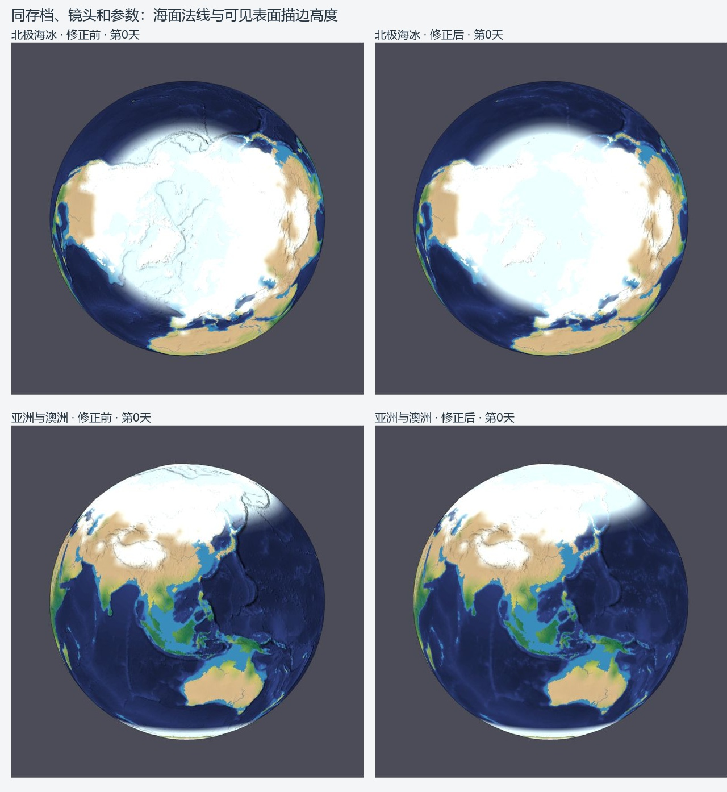
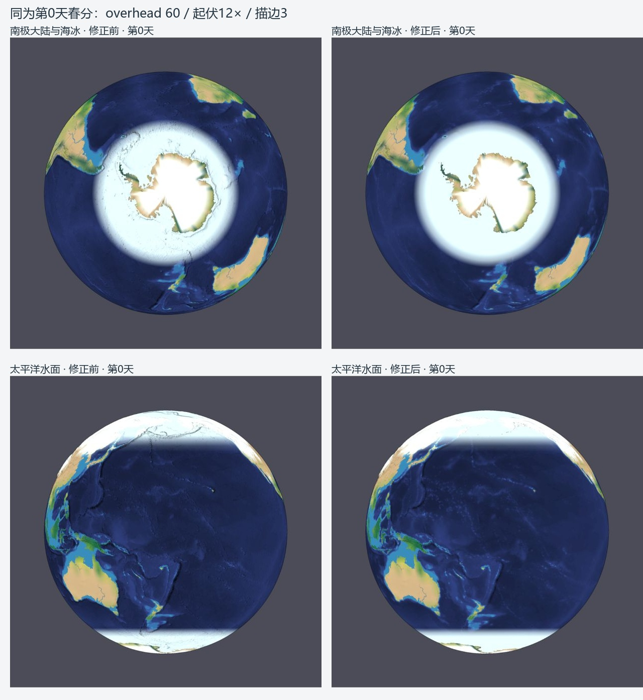

# 地球海水与海冰光照修正 · 2026-10-10

本次完成上一份拟真审查的第一项机制修正：海水与海冰不再继承海床的坡面阴影和脊线描边。真实海底 DEM、水深配色、陆地坡面明暗和物理状态保留。没有继续调低整体阴影，也没有调整冰库存、气候、降水或河网机制。

上一会话用户已接受的全部审查成果完整保留并纳入独立提交 `60d5ddf`，包含两个正式存档、有效显示配置、生成/应用/审查脚本和 [原拟真审查证据](../earth-realism-20261010/REPORT.md)。本次正式存档未再改变。

## 两条透印路径与修正

1. `sphere_position` 已将水面几何放在零高度基础球面，但 `frag_drape` 仍以海底 DEM 求坡度。本次按细网格插值高程 `v_em.x<=0`，使用局部切平面的向上法线 `(0,0,1)`，对应球面的径向法线；陆地继续使用原坡面梯度。选择依据与融合地表海岸线一致，零高程、部分海冰和过滤跨岸样本也适用。
2. 实际截图发现，光照修正后北极仍有细碎脊线：屏幕高度纹理 `vert_depth.v_z` 保存了负海床。本次改为 `max(0,a_em.x)`，使描边读取实际可见表面高度。正海拔陆地的高度值保持原样。

海冰在当前几何中与海水同在基础球面，本次没有生成波浪、冰脊或额外冰厚网格。海水仍可呈现深浅蓝色水深配色；它与坡面阴影、黑色脊线是不同通道。DEM 本体、拾取高程、物理诊断及原始存档均未被平滑或截断。

## 同状态真实浏览器对照

入口为 `http://localhost:8002/scenes/earth-land-sea/index.html`。8002 既有服务可用，全程未干扰 8000/8001。修正前后的浏览器都加载同一 `earth-simulation.json`，为第 0 天北方春分、暂停状态，`surface` 图层、跟随地表、zoom=0.26、overhead=60、起伏 12×（mountain_height=5.651）、描边强度 3。四组镜头均通过相同顶部视角选项选择，没有改变物理季节。

[preservation.json](preservation.json) 记录正式存档 SHA-256、逐字段保护检查，以及完全相同的 [修正前](before-controls.json) / [修正后](after-controls.json) 控制值。与审查基线逐字段比较，两正式存档仅含上一会话已接受的 overhead 30→60；其余所有字段完全相同，包括海底、地形 offsets、constraints、完整 runtime 和物理配置。正式模拟仍为第 0 天、0 积分步，浏览器恢复后暂停。

以下拼图只裁切、排版和标注原始截图，未润色截图像素。左为修正前，右为修正后。





| 地区 | 原始前后截图 | 核对结果 |
|---|---|---|
| 北极 | [前](before-arctic-day0.jpg) / [后](after-arctic-day0.jpg) | 中央海冰长条脊线、海沟阴影消失；格陵兰陆地山地明暗保留，冰缘无可见位移。 |
| 南极 | [前](before-antarctic-day0.jpg) / [后](after-antarctic-day0.jpg) | 大陆外海冰环的海床纹路消失；大陆山地、雪盖与既有裸露区保留。 |
| 亚洲/澳洲 | [前](before-asia-day0.jpg) / [后](after-asia-day0.jpg) | 日本以东海沟和印度洋海脊的黑色硬边消失；喜马拉雅和青藏山地仍清晰。 |
| 太平洋 | [前](before-pacific-day0.jpg) / [后](after-pacific-day0.jpg) | 开阔海洋的黑色海床锐边消失；真实水深色带保留。 |

## 播放、图层与兼容性

实际点击中文「播放」，使用每秒推进一小时的正常时钟，再实际点击「暂停」，推进至 **2.275329 天**；时间继续积分后海水和海冰的表面仍正确。见 [暂停后的完整界面](playback-paused-asia.jpg) 与 [控制读数](playback-controls.json)。该状态用于交互验证，不覆盖第 0 天正式存档，也不作为前后截图比较状态。

同一暂停时刻也检查了 [北极](playback-paused-arctic.jpg)、[南极](playback-paused-antarctic.jpg) 和 [太平洋](playback-paused-pacific.jpg)，暂停时间保持稳定。最后重新加载正式场景，确认 [第 0 天暂停截图](final-restored-day0.jpg) 和 [最终读数](final-controls.json)。

九个显示图层逐项往返，均保持同一暂停时刻：[记录](diagnostics.json)。实际截图保留 [昼夜](diagnostic-day-night.jpg)、[太阳辐射](diagnostic-insolation.jpg)、[水流诊断](diagnostic-runoff.jpg)。陆地仍有坡面明暗，河流与湖泊通道保留，中文控制台正常。

在普通 `/embed.html?mode=editor&mesh=high` 编辑器通过文件选择器导入同一正式存档，恢复成功，切换 `original` 地形层：[截图](ordinary-terrain-day0.jpg) / [状态](ordinary-state.json)。普通地形层继续显示水深配色和陆地起伏。浏览器控制台错误/警告记录见 [browser-check.json](browser-check.json)。

## 行为回归与独立审阅

| 验证 | 结果与证据 |
|---|---|
| 完整 Node 测试 | **161/161 通过**，[tests.log](tests.log) |
| 新增真实 GPU 回归 | **20/20 通过**，[gpu-after.json](gpu-after.json) |
| 同一最终 GPU 夹具对基线 renderer | **9 项预期失败**，[gpu-before.json](gpu-before.json)；证明测试能捕获旧缺陷 |
| typecheck / build | 退出码 0，[typecheck.log](typecheck.log) / [build.log](build.log) |
| 地球场景 verify | 通过，[verify.json](verify.json)；第 0 天，高程传递误差 0.0009415 m，河流生成保留导入高程 |
| 既有 GPU 兼容回归 | 描边纹理连续性 771 样本、球面径向 648 项、轮廓 30 项、辐射 87 项、极区 116 项、湖泊面积/干湿状态均通过，[记录](gpu-compatibility.json) |
| 存档/状态保护与 diff check | 逐字段及同状态控制检查通过，`git diff --check` 通过 |
| 独立代码审阅 | **可合并，Critical/Important/Minor 均为 0**，[审阅记录](CODE-REVIEW.md) |
| 独立视觉核对 | 实际查看全部 8 张原始截图，四组对照通过，[审阅记录](VISUAL-REVIEW.md) |

GPU 测试调用实际 `drawLand`、`drawDepth`、`drawDrape` 并读回像素，覆盖普通地形/融合地表、开水面、45% 海冰、完整海冰、零高程、跨岸过滤、陆地雪盖以及开启强度 3 的描边。640×640 采样包含偏离球心的径向描边区域，避免只测球心而漏掉描边透印。修正后，改变海床而固定水面/海冰状态的最大颜色差均为 **0**；陆地坡面仍随地形梯度改变，水深配色仍随深度改变。

`gpu-before-first-iteration.json` 和 `gpu-outline-before.json` 是实现中间阶段的定位记录，夹具或修正阶段不同，不作为最终相同夹具的前后结论。最终严格对照是 `gpu-before.json` 与 `gpu-after.json`。

从仓库根目录复现：

```powershell
npm test
npm run typecheck
npm run build
node node_modules/esbuild/bin/esbuild scenes/earth-land-sea/verify.ts --bundle --platform=node --format=esm --outfile=build/earth-seaice/verify.mjs
node build/earth-seaice/verify.mjs
node docs/evidence/earth-seaice-lighting-20261010/verify-preservation.mjs
node docs/evidence/earth-seaice-lighting-20261010/prepare-before.mjs
git diff --check
```

真实浏览器打开 `/tests/gpu-surface-lighting.html` 和 `/build/earth-seaice/gpu-before.html`，即可运行相同最终夹具与当前/基线渲染器。基线生成器从 Git 读取原始 renderer，不改写工作树或正式存档。

## 剩余模型问题

本次解决光照与描边的渲染透印。北极海冰范围/季节闭合、南极与格陵兰冰库存初始化、热带偏干及植被分类、山地雪线分辨率、闭流盆地和河宽夸张，仍见 [原审查报告](../earth-realism-20261010/REPORT.md)，没有用显示变化宣称这些问题已解决。

原报告记录的浏览器播放存档在 Node 严格解码中因 albedo 约 5.55e-17 舍入差失败，作为既有跨运行时精度限制保留。本次没有修改或绕过该检查，也没有将它混作光照回归；本次通过的是正式第 0 天存档 verify，不声明所有播放后存档的跨引擎恢复都通过。

## 发布记录

实施分支为 `codex/earth-seaice-lighting`，发布目标仅为 origin。上一会话成果和本次修正分别提交：

- `60d5ddf`：完整保留拟真审查和已接受的显示配置。
- `0670211`：海水/海冰表面光照、描边机制修正与测试/截图证据。
- `9cab40c`：以 `--no-ff` 正常合并到 main。

合并后的树与已审阅分支完全相同，再次运行完整测试 **161/161 通过**，见 [main-tests.log](main-tests.log)。完整基线到合并提交的 `git diff --check` 通过。已执行普通 `git push origin main`，没有强制推送，也没有推送 upstream；随后 fetch 核对本地 main 与 origin/main 均为 `9cab40c7821db971a6994e27c4a829bd9f793f56`，差异计数 0/0，工作树干净。见 [发布检查点](release.json)。

本发布记录及合并后的测试日志随后作为文档归档提交，不改变已验证的代码或正式存档。
