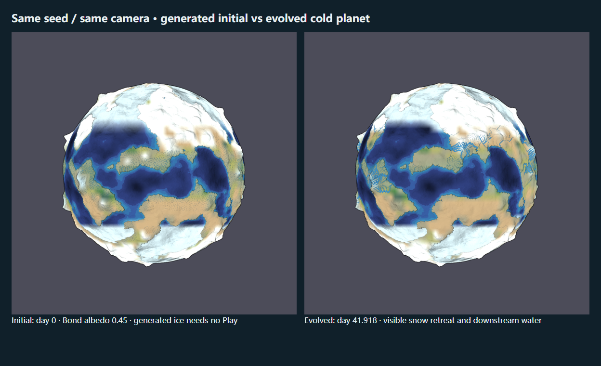
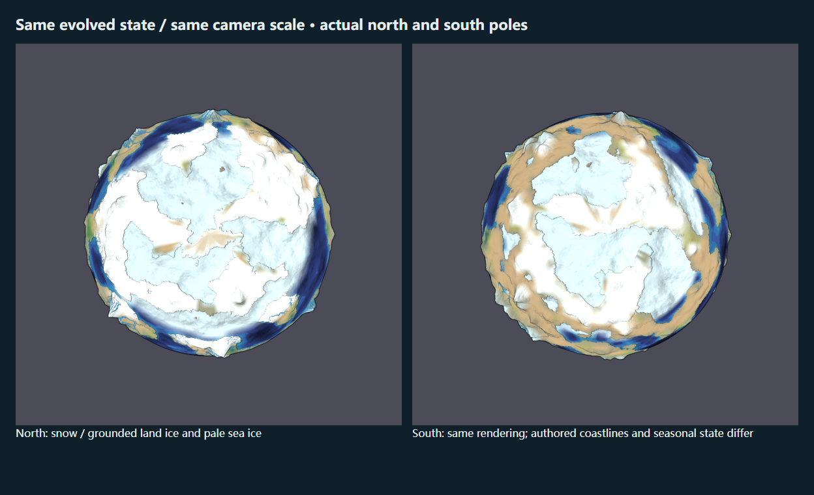
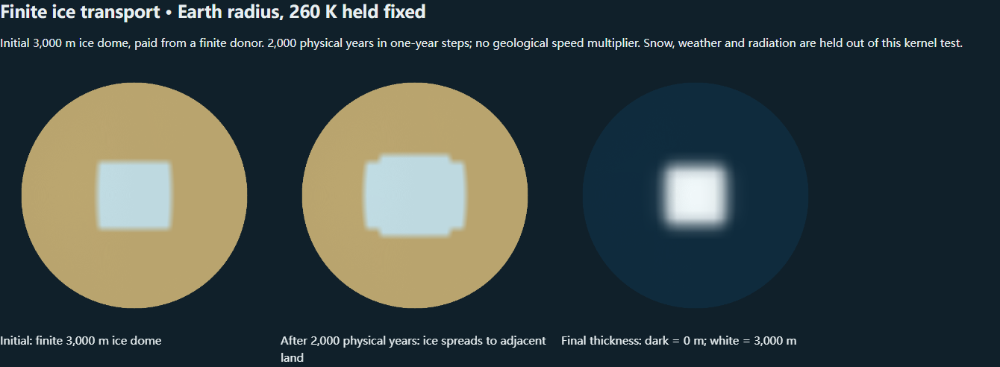
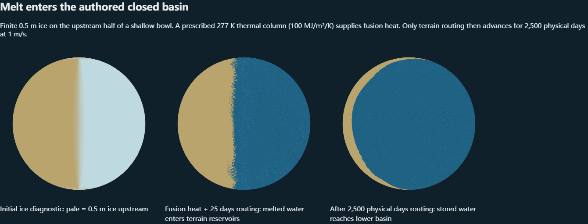

# 第三阶段专项复验：陆地冰川流动与冰川侵蚀

日期：2026-10-09（Asia/Shanghai）。基线为 `8bf253dc9cfe72169ec5b8927015c2e9a47475cf`，被验证的代码提交为 `457ebd5ab7686b83266b3cc0e091009eaab1dba7`。本轮复验已有第三阶段，不扩展环流和天气模型。截图及报告归档在 [glacier-stage3-20261009](evidence/glacier-stage3-20261009/report.json)。

## 实际修复

1. **坏冰量存档拒绝。** 原加载校验只检查字段、地形、反照率等；冰面反照率已饱和时，把单个冰库增加 1,000 kg/m² 仍会通过。独立 8×4 复现中，水残差达 31.25 mm，焓残差为 −10,437,500 J/m²。候选运行时现在同时检查水量和焓账本，校验成功才可替换当前世界；单独改冰量、再同时改初始水账本的两个文件均拒绝，当前世界保持精确一致。阈值底限为 10⁻⁶ mm / 10⁻⁴ J/m²，并按 64 / 128 个机器精度乘库存/能量尺度保留可表示数的误差。原运行守恒阈值没有放宽。
2. **极点侵蚀候选单值。** `previewElevation` 原先在极点仍按经度采样最外行，非均匀冰川侵蚀候选因此可能在同一物理极点给出不同高度。现按陆地加权的最外行床高和候选高连续收敛到单值。渲染、拾取和应用地形共用此函数。受控输入的极点高度差由约 0.06999 降至 0；实际 GPU 北/南极的 33 / 39 个 atlas 顶点均上传同一 `0.7649999857` 高度。
3. 修正侵蚀面板说明：河流/坡面预览的地质年由 Evolve 推进；冰川磨蚀随 Astronomy Play 的真实物理时钟累积。

两项核心回归先在旧实现失败，再在修复后通过。独立只读审查确认原问题，复审未发现新的代码缺陷。额外随机试验覆盖 100 组、每组 100 步，冰保持有限非负；最大水误差 2.24×10⁻⁸ mm、固体误差 7.62×10⁻¹² m。

## 逐项验收

| 要求 | 结果与证据 |
|---|---|
| 有限水支付初始化冰盖、积雪压实、坡度输运 | 零年龄生成即有冰；无水供体不生冰。内核测试和下方 2,000 年受控图验证冰扩展、正值、库存与固体闭合。 |
| 融冰实际消耗潜热、融水接入河湖 | phase 测试核对可用显热和融化量；下方真实路由/渲染夹具将 229.25 mm 全局冰水当量转为等量地表水。 |
| 磨蚀、搬运和沉积固体守恒 | 独立固体账本；新增最后一块冰融尽后沉积运输泥沙的回归。无隐式地质时间倍率。 |
| Capture / Apply / 可逆工作流 | 原生冰川浏览器组捕获累计候选、应用后重建并将气候年龄置零；通用 application 组验证撤销、保留后来笔刷、精确地形/河流/像素恢复。 |
| 完整下载上传、续演、可见帧回退、坏档和迁移 | 原生 glacier / simulation / weather / circulation 组及 Node 测试通过。旧完整 v1 缺失冰川字段迁移为关/零；关闭水清除冰状态及显示种子。 |
| 南北极、经线、旋转、陆冰/海冰 | 实际同尺度两极、不同旋转角截图；视角变化不改运行时；x=0/1000 经线图像精确一致。对称陆海输入按半年度相位交换半球。 |
| 原始地图、默认 Live planet、移动端 | Original 像素精确恢复；默认四套耦合开关仍启用并自动播放；移动宽度无溢出。 |

## 实际行星画面

种子 187，Earth 默认物理参数、Bond albedo 0.45，48×24 气候/冰网格，冰川和地形水启用。初始年龄 0；演化年龄 **41.9179820543 天**，3,272 个真实物理步。对照使用 Surface 相机，x=500、y=500、zoom=0.212；不改变地形或状态。画面由生产浏览器截取，再按同尺寸并排排版。



实际观察：生成后即可见冻结地表；演化后季节积雪退缩，部分下游水面和流量改变。全局陆冰水当量为 7,069.158734 → 7,025.527285 mm，最大冰速 0.562513 m/yr，最大累计磨蚀仅 **5.743491 微米**。因此这张图不能证明肉眼可见的冰川几何侵蚀；明显表面变化含积雪融化和水文响应，不全部归因于冰流。原生浏览器残差：水 1.548324×10⁻⁸ mm，焓 −4.649162×10⁻⁶ J/m²，固体 1.427011×10⁻²³ m。

极区同一演化状态，Surface 相机 x=202.349、zoom=0.212，北 y=0、南 y=1000；另外检查 x=750 旋转图。该种子的北极点是陆地（局地参考高约 191.78 m），南极点是海洋。海洋上的浅蓝白色是海冰，陆地白色包含雪和陆冰；海岸线与季节响应造成自然差异。没有人为把随机两极改为同形。



## 明确标注的受控输入

以下是 6,000-region authored sphere、同一生产 WebGL Renderer 的直接帧缓冲截图。它们隔离检验第三阶段内核，未冒充完整行星演化预测。

**冰流：** Earth 半径、260 K 固定、有限供体支付初始 3,000 m 冰穹；按一年一步调用实际冰流模型共 2,000 物理年，不加速系数。20 个原先裸露格点达到可见的 >5 m 冰；最大累计磨蚀 8.949349 m。全局冰量保持 57,312.5 mm，水残差 −1.455192×10⁻¹¹ mm、固体残差 1.431375×10⁻¹⁷ m。右图是 0–3,000 m 的实际冰厚诊断。方格边缘反映 48×24 的分辨率限制。



**融水：** 浅闭合盆地上游半球规定 0.5 m 冰；规定 277 K、100 MJ/m²/K 的热柱提供真实显热，然后只运行地形路由。左图冰量诊断以浅色表示 0.5 m；中图是 25 物理天，右图是 2,500 物理天，路由速度 1 m/s。229.25 mm 冰水当量全部进入可解析地形库存，融合能消耗 76,569,500 J/m²；水/焓残差均为 0。水的体积加权床高从 1.667220 m 降至 0.754460 m，最大局部水深 0.962757 m，图像显示汇入低盆地。



[极点受控 GPU 图](evidence/glacier-stage3-20261009/controlled-pole.png) 使用规定的 0–700 m 非均匀侵蚀候选，隔离极点插值，不声称它是 40 天内产生的侵蚀。[应用后](evidence/glacier-stage3-20261009/native-applied.png) 与 [原生侵蚀预览](evidence/glacier-stage3-20261009/native-erosion-preview.png) 记录真实 Capture/Apply；微米级几何变化不可肉眼分辨，应用后的覆盖差异含气候重启。[移动端](evidence/glacier-stage3-20261009/native-mobile.png) 和 [默认 Live planet](evidence/glacier-stage3-20261009/live-default.png) 保留。

## 验证与复跑

**144/144 Node 测试**、typecheck、build、diff 检查通过。九套既有浏览器验收共 **49 组**：glacier 4、simulation 7、terrain-water 5、application 6、environment 7、geomorph 5、surface 6、weather 5、circulation 4；太阳 GPU 检查 87、极区 GPU 检查 116。新增 recheck 覆盖受控冰流/极点/融水、实际两极、经线、视角不改状态、两种坏冰档和 Live planet。报告为 [专项复验](evidence/glacier-stage3-20261009/report.json)、[既有浏览器组](evidence/glacier-stage3-20261009/native-report.json)、[全部回归](evidence/glacier-stage3-20261009/regressions.json)。

环流浏览器在并行执行时一次严格 PNG 续演比较失败，而模型断言通过；单独完整重跑原严格断言通过，重跑图解码后差异为零，未放宽阈值。原失败 PNG 对在重跑前未保留，故不声称已确定其像素差原因。没有修改环流物理。

```powershell
$env:PLAYWRIGHT_MODULE='file:///C:/Users/helio/.cache/codex-runtimes/codex-primary-runtime/dependencies/node/node_modules/playwright/index.mjs'
$env:BASE_URL='http://localhost:8002'
npm test
npm run typecheck
npm run build
node scripts/glacier-browser-check.mjs
node scripts/glacier-recheck.mjs
```

默认脚本输出在 `build/validation/glacier-stage3/`；归档图片和报告在本文件链接的稳定 `docs/evidence/` 路径。第二阶段交接目录 `build/validation/stage2-handoff-20261009/` 保留。

模型仍仅支持冰盖和宽尺度冰输运：48×24 网格不解析狭窄山谷，无浮动冰架、崩解、底部水文或完整应力平衡；初始厚度和磨蚀系数属示例参数。地形应用会经过高度界限及粗网格到细网格近似，并重启环境，不是保守沉积物重映射。这些限制未在本轮扩大或隐藏。
