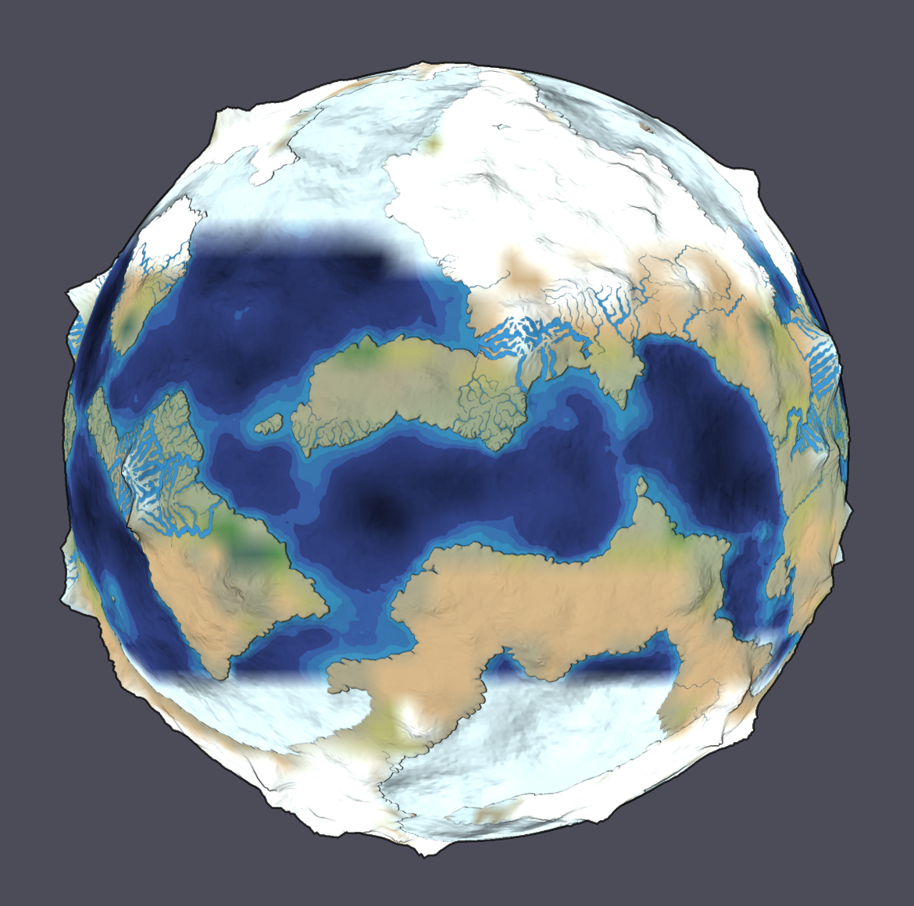
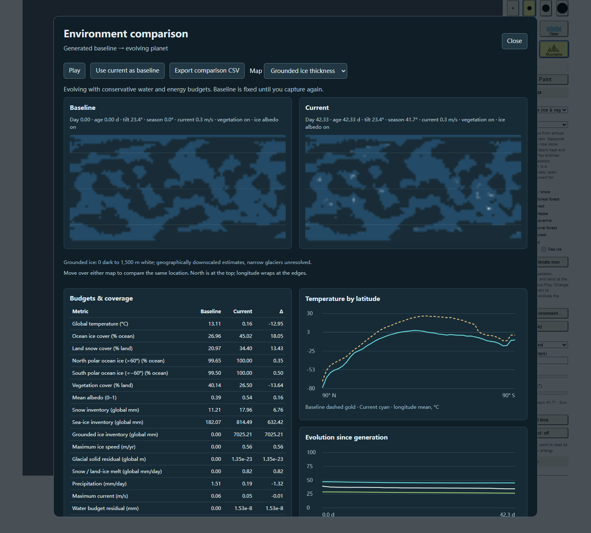

# Grounded ice and glacial erosion

Enable **Grounded ice flow & glacial erosion** in **Ice, ocean & vegetation**. Changing the switch restarts climate. Cold-climate initial ice (an illustrative estimate up to 1,500 m) is paid for by available snow, surface, soil and ocean water. An empty donor inventory cannot supply ice. The mass participates in the existing water and enthalpy budgets.

Snow above 50 mm per land area compacts on a 30-year timescale. A simplified Glen-type thickness/surface-slope relation transports ice between land cells, with paired transfers, finite donor and equalization limits, and a 20 km/year speed cap. Melt consumes available fusion heat and enters surface water before either coarse or terrain routing. Grounded ice affects albedo and evaporation; the natural view shows geographically downscaled ice, with snow composited above it. Inspect reports cell thickness and speed. The comparison dialog includes grounded-ice thickness, inventory, speed and solid-budget metrics.

Glacial abrasion accumulates eroded height and an equal volume of sediment. Ice transports that sediment; it deposits where the ice disappears. **Erosion → Capture glacial erosion** opens this accumulated candidate in the existing terrain workflow. **Apply erosion to terrain** rebuilds the authored terrain and rivers and restarts climate. Applying inherits that workflow's height bounds and coarse-to-mesh approximation; it is not a conservative sediment remap. The climate clock advances ice and abrasion together; no hidden geological acceleration is applied.

Complete saves and visible-frame rollback preserve ice mass, its numerical compensation, motion diagnostics and all erosion/sediment fields. Older complete-v1 files lacking glacier fields decode to off/zero. Disabling water clears the glacier display and seed fields.

## Acceptance — 2026-10-09

- **126/126 Node tests**, typecheck, build and diff checks passed. Tests cover finite initialization, compaction, downhill transport, tiny-radius limits, melt/latent heat, separate solid conservation, exact JSON continuation, visible rollback, legacy field defaults and disable/reload cleanup.
- [Browser acceptance](evidence/glacier-report.json): four groups, no runtime/shader errors. A cold scenario (Bond albedo 0.45) evolved for over 40 physical days with terrain water enabled. Ice moved, melted and eroded; saved runtime and globe pixels restored exactly. Corrupt sediment state preserved the active world. Comparison, Original restoration, glacial erosion application and mobile layout passed.
- Final browser residuals: water **1.525040715932846×10⁻⁸ mm**, enthalpy **−1.2099742889404297×10⁻⁵ J/m²**, solid **1.3536094183884296×10⁻²³ m** global equivalent.
- The full simulation, terrain-water, surface, environment, application, planet and water browser regressions passed. GPU solar checks: 87; polar checks: 116.
- A thick-ice/tiny-transfer regression exceeded the existing energy threshold before compensated ice updates. Persisted compensation fixed it without relaxing the threshold. Independent review's stale fields on water disable were also reproduced RED, fixed GREEN and re-reviewed; no remaining findings.
- Actual evolved globe and comparison screenshots were inspected.

## Scope

This uses the equal-area climate grid (48×24 by default), mean authored land heights and a single thermal column. It supports ice sheets and broad ice transport; it cannot resolve narrow valley glaciers. It has no floating shelves, calving, basal hydrology, full stress balance or gravitational/frictional heating. Abrasion coefficients and initial thickness are illustrative. Thin moving margins and evolving solid terrain require finer grids and a separate solver for scientific prediction. The model's numerical budgets describe its stated reservoirs, not a complete planetary energy model.
