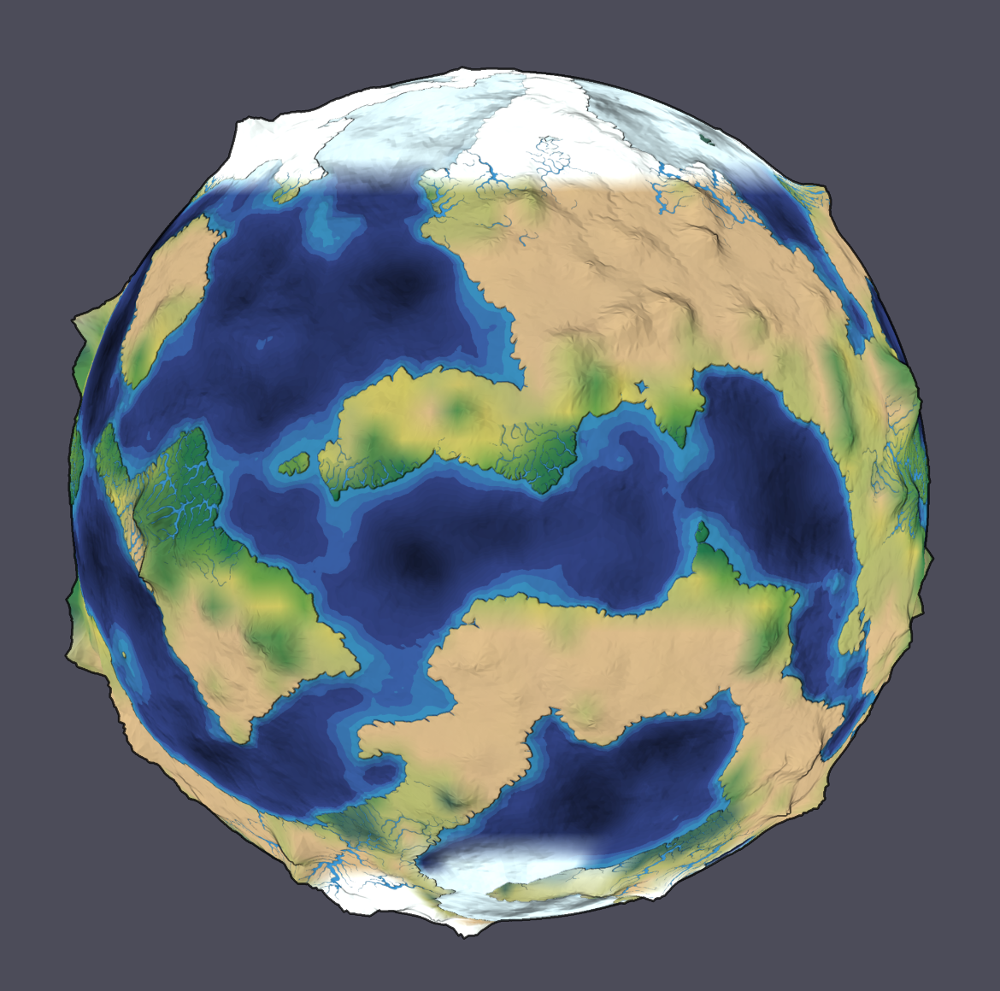
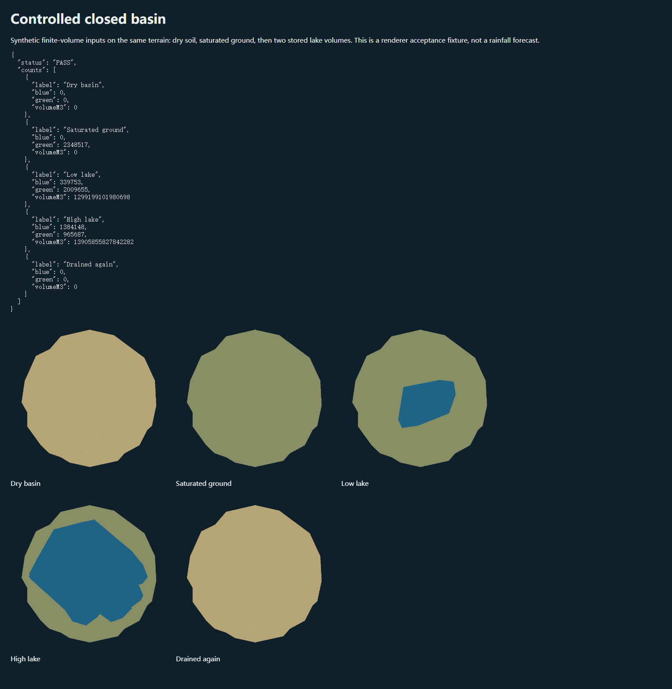

# Terrain rivers, lakes and wetlands

Enable **Ice, ocean & vegetation → Terrain rivers, lakes & wetlands** after generating terrain. Changing the switch regenerates climate. Play moves real surface water among 53,834 triangle reservoirs on the default mesh. Natural surface uses their discharge to size connected rivers, reconstructed standing water for lakes, and soil saturation/standing water/slope for wet ground. Original map retains its original artistic rivers. Inspect reports the nearest terrain reservoir's mean depth in metres and outflow in m³/s.

Rain, snowmelt, soil drainage and evaporation modify the existing conservative water ledger. Fine reservoir volumes partition that ledger; they are not counted as extra water. Pair transfers are donor limited and respect physical bed levels and edge sills. Closed depressions remain closed until water reaches an outlet. Unresolved coastal storage stays in the ledger and is reported by the panel.

The routing and shoreline reconstruction consume the authored mesh's actual ridge/valley topology. During independent review, a 10→5 m visible valley was found to be incorrectly blocked by a 100 m region-edge sill. The regression failed before repair; the fixed shared valley split gives a 7.8215 m crossing and positive discharge. Independent stress checks up to 27,000 regions found finite bed patches, positive weights and normalized areas.

Complete simulation saves include fine volumes, receiver sides and fluxes. Restore validates graph membership and agreement with coarse stores before replacement. A pending fine partition cannot advance through coarse routing before terrain attaches. Older version-1 complete files without the optional routing fields still use coarse routing. Visible-frame rollback includes fine state.

## Acceptance — 2026-10-09

- `npm test`: **120/120**. Includes depression/spill, empty/ocean/all-land, unresolved coast, source/sink reconciliation, positivity, partition closure, corruption rejection, exact continued evolution, visible rollback, legacy decoding and the valley topology reproduction.
- Typecheck, production build and `git diff --check`: passed.
- [Terrain-water browser report](evidence/terrain-water-report.json): five groups; no runtime/shader errors. Real UI evolved beyond 12 days, saved, restored exact runtime fields and globe pixels, rejected inconsistent fine/coarse water without replacement, and restored Original pixels exactly. Final water residual **−9.66247171163559×10⁻⁹ mm**.
- Existing simulation (7), environment (7), application (6), surface (6), planet (8) and water (5) browser groups passed. GPU surface/solar checks: 87; polar checks: 116. The complete-save regression again continued to step 7,665 with identical fields and pixels after reload.
- [Controlled basin GPU fixture](../tests/terrain-water-render.html): dry/drained lake pixels 0; low-volume lake 339,753 pixels; high-volume lake 1,384,148 pixels. Saturated ground changes separately from lake coverage. Screenshots preserve the actual GPU framebuffer; the synthetic reservoir inputs are explicitly labelled and are not a rainfall forecast.
- Independently reviewed; the topology finding was fixed and re-reviewed. Globe, basin and mobile screenshots inspected in the implementation session.

## Playback performance — 2026-10-09

CPU profiling of the all-enabled default planet identified shoreline reconstruction as the main playback stall: every water step sorted bed heights, allocated temporary arrays and repeated atlas seam/pole clipping. Static bed coefficients, wetland slopes and atlas coordinates are now cached per routing network. Each update computes current water levels and fills an independent typed render buffer. The reservoir solver, timestep, shoreline equation and rendering resolution are unchanged; terrain regeneration creates a new network and cache.

The opt-in `node scripts/terrain-water-benchmark.mjs` checks the real shoreline path on 23,996 triangles against a 50 ms median budget. On this machine the median fell from **170.26 ms to 13.46 ms**. Separate full-page traces recorded **105 animation callbacks above 50 ms in 32.37 s** before and **0 in 26.87 s** after; maximum callback duration fell from **111.46 ms to 20.03 ms**. These are CPU callback timings, not GPU presentation times or a device-independent frame-rate guarantee. [Measurement record](evidence/live-planet-performance.json).

Validation: 139 numerical tests, typecheck and build passed. Added shoreline tests cover sloping/equal-height beds, independent queued buffers, wet/dry transitions and rollback. The controlled basin GPU fixture retained identical dry, saturated, low-lake and high-lake pixel counts.

## Stage-2 recheck and dry-storage repair — 2026-10-09

Independent rechecking found a save-blocking roundoff case during prolonged drainage. A controlled 120-region authored-valley terrain, with finite initial water and no rain or evaporation, exercised the ordinary `WaterModel.step` path. At step 2,060 (42.92 days), fine/coarse transfer rounding left one coarse surface store at −1.0071×10⁻¹⁷ kg/m² while its fine partition retained 6.7164×10⁻⁶ m³. Complete export correctly rejected this state with `Invalid surfaceKgM2`; the small global mass residual alone had hidden the failure.

Fine reservoirs now re-anchor to the authoritative coarse store before each routing update, including steps without source changes. Added sources remain area weighted; extraction uses the target-volume ratio directly, avoiding cancellation near exhaustion. The coarse inventory, strict save validation and conservation thresholds are unchanged. The new regression failed on the old implementation and passes 2,500 ordinary water steps plus exact checkpoint restoration and continued drainage. A separate complete-file export fixture runs 20,000 steps (416.67 days), remains nonnegative and exports successfully with a −1.1351×10⁻⁹ mm water residual. [Before/after reproduction](evidence/terrain-water-dry-storage.json).

Fresh acceptance: **140/140 tests**, typecheck, build, the terrain-water (5), simulation (7), surface (6) and coupled-weather (5) browser groups pass. Production GPU solar/surface checks (87), polar checks (116) and live-startup checks (13) pass. Actual screenshots were inspected for connected rivers, rising/draining basin shorelines, wet ground, north/south poles through rotation, the atlas meridian and the mobile layout; exact Original, fine-state restore and 98-day continuation comparisons pass. All-enabled coupled state also restores exactly. Shoreline reconstruction remains within its budget: 23,996 triangles, **12.43 ms median** against 50 ms. Independent review of the correction found no remaining actionable issue. [Recheck report](evidence/terrain-water-recheck.json).

## Model limits

The Earth extension adds optional observed catchment/terminal identities to the reference drainage tree, while physical transfer still uses the reservoir's actual edges and sills. Confirmed closed negative beds are finite inland stores, with precipitation and donor-limited evaporation; their dry geometry and picking retain signed bathymetry. Reference annual channels and actual finite-transfer channels are separate render overlays. The fused display threshold is in m³/s; its width coefficient, edge-length cap and visibility never modify water stores. Missing display fields in older saves restore the earlier 300 / 0.07 / 0.85 values. [Earth acceptance and limits](evidence/earth-endorheic-rivers-20261011/REPORT.md).

This is a head-based reservoir model without momentum, calibrated flood depths, channel hydraulics or subgrid groundwater. Mean reservoir columns route water; volume-weighted piecewise bed reconstruction supplies a draped shoreline approximation. Lakes are not separate horizontal 3D water meshes. Fine sources inherit the coarse climate and unresolved coast cells are retained rather than assigned an invented outlet. River widths are exaggerated for readability; wetland colors indicate a diagnostic proxy, not a vegetation species simulation. Verification uses this machine's Chrome/WebGL2 and emulated mobile viewport.
