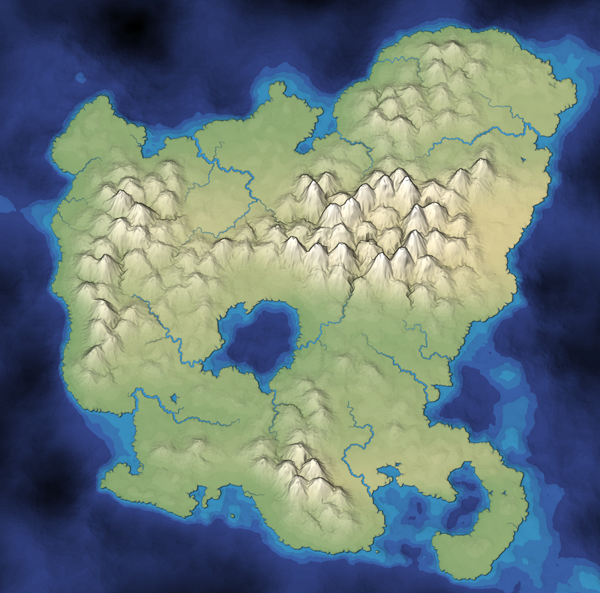
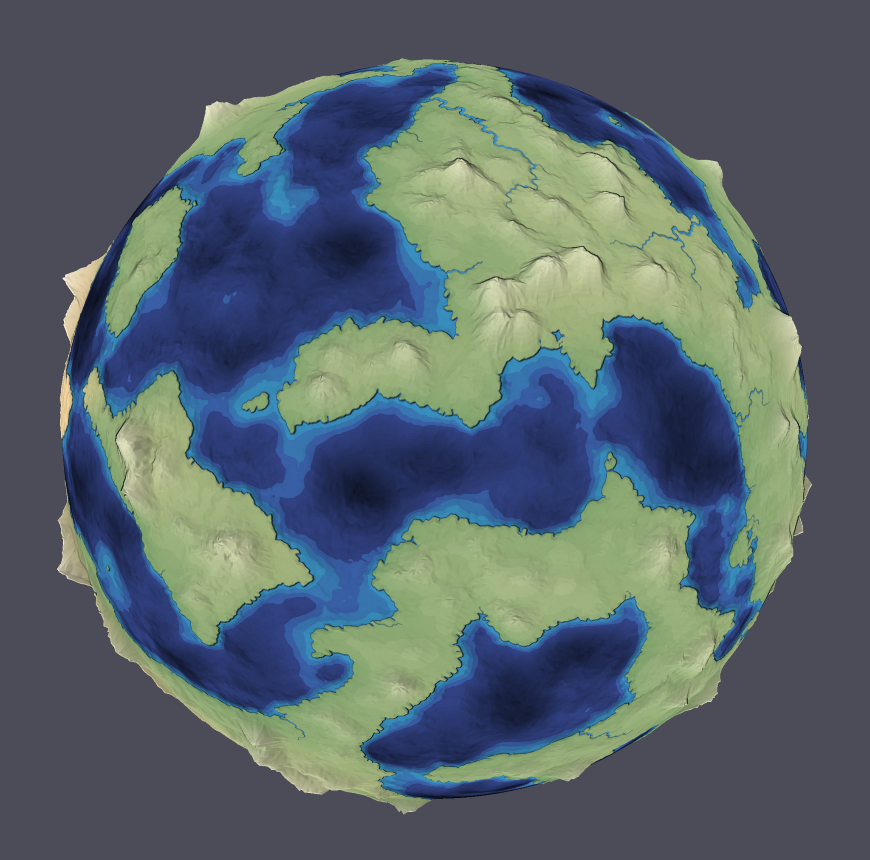
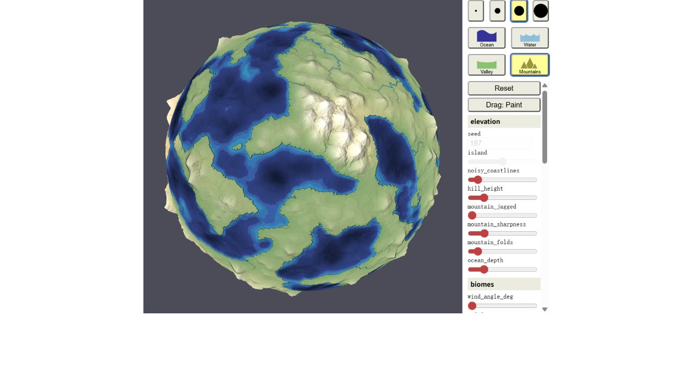
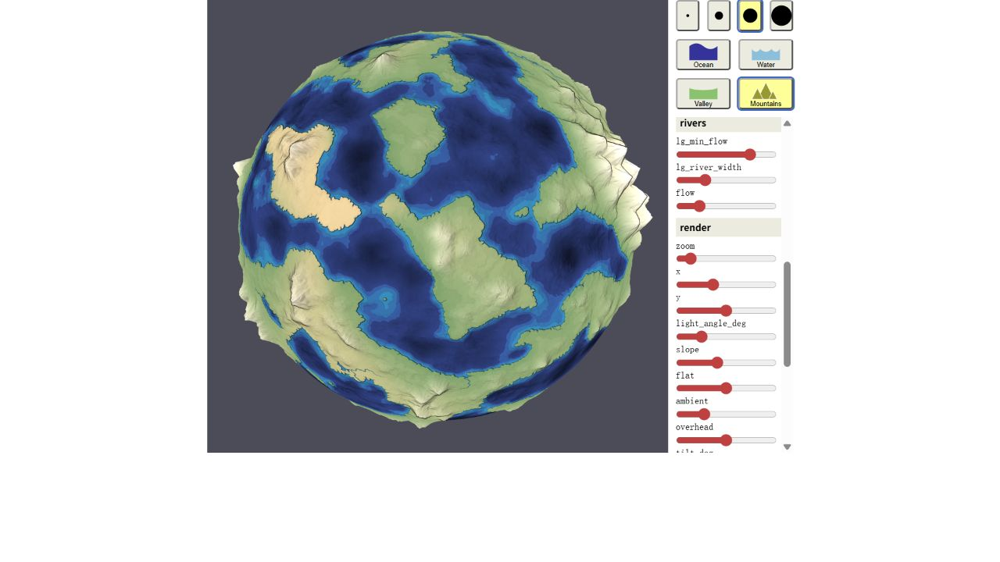
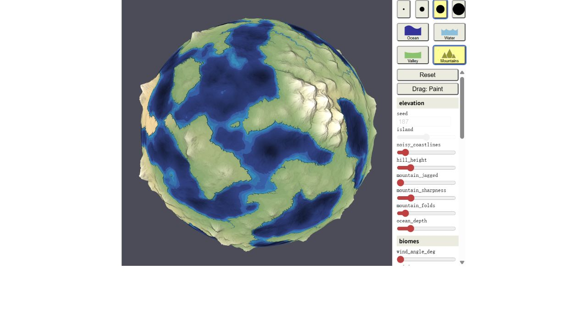

# Spherical renderer validation — 2026-10-08

Implementation base: upstream `c1d8cb018a11a8b9e17d59233c36c176429d37eb`.
Branch: `codex/sphere-original-renderer` in the independent clone.

## Coupled environment — 2026-10-09

Base `8f88870`, branch `codex/coupled-environment`. Adds finite snow/sea-ice reservoirs,
fusion and vaporization energy, albedo feedback, melt routing, coast-bounded
prescribed ocean heat transport, gradual vegetation cover/composition and a
baseline/current comparison dialog. Direct geographic generation remains zero-age.
[Methods and limits](coupled-environment.md).

103 Node tests pass, including 14 new environment tests; typecheck/build pass.
Coverage includes finite stores, mass/enthalpy closure, phase limits, snowmelt
outflow, snowfall latent heat, albedo, conservative ocean advection, uniform-field
preservation and dry coasts, slow vegetation response, exact frame partitions and
rollback, independent snapshots, CSV provenance and symmetric generated polar caps.

[Environment browser report](evidence/environment-report.json): seven groups,
no errors. Six maps, in-dialog playback beyond 10 days, fixed baseline, changed
parameters, CSV export, mobile overflow and matched polar globe views were checked.
[Comparison screenshot](evidence/environment-evolved-comparison.png),
[current arrows](evidence/environment-ocean-currents.png),
[north](evidence/environment-north-pole.png), [south](evidence/environment-south-pole.png),
[mobile](evidence/environment-mobile-comparison.png),
[CSV](evidence/environment-comparison.csv).

Production in-app playback was also inspected at day 55.54. Water residual was
−2.00e−8 mm and combined enthalpy residual 1.09e−5 J/m². The generated poles both
show pale sea ice; later differing seasonal coverage is allowed. Visual inspection
caught legacy black table text on a dark dialog; a browser regression now checks
its legibility. The corrected screenshots were re-inspected.

Existing surface browser checks: six groups, GPU87 and polar-renderer116, empty
errors. Planet checks: eight groups / DOM20 / GPU648+771+30+87, empty errors.
Water checks: five groups including a >90-day coupled transient, empty errors.
These cover source terrain preservation, original artwork restoration, clocks,
model disable and mobile controls as well as the new coupling.

One fresh read-only whole-change review found three important issues: stale initial
routing after frozen seeding, supercooled ice/liquid initialization causing a large
first-step freeze, and incomplete comparison parameters. All were reproduced with
failing tests and corrected; the environment suite then passed. History's absolute
clock beneath a generation-age title was also corrected to generation age. The
full suite exposed compensated-summation loss in the extreme albedo=1 initial
adjustment; compensated heat/radiation accumulators now preserve the original
1e−4 J/m² test bound, including rollback. No threshold was relaxed. Reviewer also
ran 15 extreme configurations for 3,200 steps each without positivity or material
conservation failures. No findings remain deferred.

Accepted model boundaries: no salinity/momentum/deep ocean, glacier motion or
empirical prediction; fine geographic cover is a disclosed downscaled estimate.
Review excluded those claims, and production appearance was assessed separately
through browser screenshots. Runtime comparisons and new switches remain session
state rather than expanding the terrain-document schema.

## Polar sea ice retains freezing and melting history — 2026-10-09

Base `e20ff5c`, continuing `codex/polar-surface-fix`. The user identified that the southern ocean remained blue while the northern ocean was white. Comparing actual terrain and a symmetric all-ocean control at the default season gave the same ±86.25° ice-free thermal estimates: north −34.934°C, south +6.927°C. The north already rendered sea ice. The instantaneous cover rule erased all southern sea ice without accounting for ice accumulated in winter; the earlier terrain-sampling fix did not address this separate problem.

The temperature/season generator is unchanged. A bounded diagnostic ice-energy reserve now uses the twelve monthly reference estimates to find a periodic freeze/melt history directly at the selected date. It advances during Play on the fixed thermal substeps and joins the existing presented-frame checkpoint. This is an explicitly one-way visual approximation: no heat/mass feedback, actual ice thickness, sea-current dynamics or physical ice-extent calibration. [Methods and chosen scales](natural-surface.md#sea-ice-with-freezing-and-melting-history).

RED: the southern polar-ocean persistence regression failed on `seaIceFraction=0` while the matching northern ocean had full ice. GREEN: 89 Node tests, typecheck and build passed. Checks cover brief warmth versus sustained melting, warm planets with no forced caps, tropical open ocean, reference-year closure/date continuity, hemisphere exchange after half an orbit, zero-tilt symmetry, actual default-terrain polar oceans, fixed-step partition independence, and exact restoration after multiple unpresented futures. Water-disabled ice evolution is covered too.

[Surface browser](evidence/sea-ice-surface-report.json): six groups, no captured errors, GPU87 and actual-renderer116 (including opaque ice over ocean at both poles). The default south-pole probe reports ocean with 100% estimated sea ice, while the ice-free thermal estimate remains +7.0°C. This does not claim liquid water beneath ice is at +7°C. Same camera x=202.349, zoom=.212, viewport1388×1244 captures both poles at phase0, phase180, and zero tilt: [interactive paired comparison](evidence/sea-ice-comparison.html). Visual inspection confirms pale sea-ice cover in both polar oceans with seasonal edge differences, alongside the existing land snow. The hemispheres are not forced to have matching coastlines or land snow.

Regressions: [planet8/DOM20/GPU648+771+30+87](evidence/sea-ice-planet-report.json) and [water5](evidence/sea-ice-water-report.json). Error lists are empty, and original surface plus painted-radius round trips are pixel-exact.

One independent read-only review found no actionable Critical, Important or Minor issue. It independently passed all 89 Node tests, inspected all six paired screenshots, checked disable/re-enable/slow-spin recovery, and verified exact annual closure and half-orbit correspondence for 2,000 randomized forcing cycles. Its excluded judgments—calibration of the 2 m cap, 0.5 m cover scale, linearized cooling closure and pre-existing temperature generator—are accepted as the explicitly documented limits of this potential-cover estimate. They are not claims of validated sea-ice thermodynamics. No findings remain deferred and no second general review was dispatched. The interactive comparison page was also checked manually at all three settings in the in-app browser.

## Local terrain and latitude for polar cover — 2026-10-09

Base `a12c2e9`, continuing `codex/polar-surface-fix`. The user correctly rejected the preceding fix: averaging colors only rounded the tip of the white sector. Its center-only checks passed while the visible footprint remained wrong. Inspection of the default south terminal band found temperatures from roughly −26°C to +11°C, with land/ocean and elevation differences all being projected from the same −73.4° sample latitude toward −90°.

Natural cover now uses 96×49 local geographic reference samples, including both poles, angular-neighbor height reconstruction with actual polar vertices, and endpoint latitude texture coordinates. Analytical climate generation still needs no Play. During Play, interpolated coarse temperature/soil changes update this local initial estimate; the conservative solvers and budgets keep their original grid. [Methods and downscaling limits](natural-surface.md).

RED: a uniform polar plateau surrounded by an asymmetric lower-latitude coast incorrectly inherited different annual temperatures from the outer thermal ring. The first fine-grid version also retained radial stripes. A temporary unlit render retained them; replacing UV-derived sampling directions with Cartesian directions did not remove them either. Both diagnostic shader edits were restored. An independent scalar investigation found adjacent −86.25° targets, only 0.245° apart, selected vertices at −85.396°/−88.116°/−84.437°. This fabricated heights 2312/701/2169m and snow fractions 1/.053/1. A sparse polar-height regression reproduced the alternating-bin defect before correction. Four angular-nearest height reconstruction now yields about 1819/1826/1826m and snow .971/.976/.976 with unchanged climate/snow equations. A full default-generator regression checks this actual reported region, in addition to synthetic fixtures.

GREEN: all 84 Node tests, typecheck/build and diff-check passed. Additional tests check terrain painting with cached sampling, scalar anomaly continuity, and existing exact presentation rollback. [Surface browser](evidence/local-polar-surface-report.json): five groups, no captured errors; GPU87 checks include separately resolved ±86.25° rows. The actual renderer passes 112 checks, including full 12-longitude rings at 4° and 18° from both poles, two camera rotations, texture-size replacement and restore. These fixtures establish addressing and lifecycle; the default-terrain regression and screenshot inspection establish the sampling defect separately.

Compared the same x=202.349, y=1000, zoom=0.212 south view at day zero: [previous inadequate result](evidence/polar-south.png), [local reference result](evidence/local-polar-south.png), [full view](evidence/local-polar-south-context.png). Also inspected [north](evidence/local-polar-north.png) and [rotated south](evidence/local-polar-south-rotated.png). The false radial snow stripes are removed; broad white land regions remain. The coverage now follows locally sampled geography; terrain relief remains shaded. This is not validation of real Antarctic ice extent or a calibrated glacier model.

One independent read-only review correctly rejected visual acceptance of the first fine-grid attempt and traced its residual stripes to the height sampling above. It also found that a populated search neighborhood could miss closer vertices on sparse meshes. A new sparse-mesh regression failed before correction; candidate lookup now covers a spherical cap, includes collapsed polar bins regardless of longitude, and falls back to exhaustive search unless the fourth nearest candidate is inside that cap. The regression compares against exhaustive angular neighbors. Both findings are addressed; physical ice calibration remains outside the documented potential-cover scope. No second general review was dispatched.

Regressions: [planet8/DOM20/GPU648+771+30+87](evidence/local-polar-planet-report.json), [climate6](evidence/local-polar-climate-report.json), [thermal5](evidence/local-polar-thermal-report.json), [water5](evidence/local-polar-water-report.json). All captured error lists are empty. Original surface, painted-radius and the final climate display-radius round trips are pixel-exact. Surface and climate browser runs were repeated after the angular sampling correction; other reports cover the earlier local-reference implementation.

## Superseded polar color blend — 2026-10-09

Base `122f476`, branch `codex/polar-surface-fix`. The reported south-pole screenshot reproduced at camera x=202.349, y=1000, zoom=0.212, with generated climate paused at day zero. Clamping the outer cell-centered latitude row extended each longitude's color to the pole, producing radial wedges. Both terminal caps now blend to their respective ring-average RGBA at the pole. Land color and sea ice converge independently of approach longitude; the fine coastline and physical climate fields remain unchanged. This repairs interpolation, not climate calibration or ice dynamics.

RED: the production GPU regression approached the south pole from eight longitudes and returned [150,160,110] instead of the common expected [115,150,90]; the CPU pole-value test also failed before the helper existed. GREEN: all 79 Node tests, typecheck, build and diff-check passed. The [surface browser report](evidence/polar-surface-report.json) passed five interaction groups with no captured errors, 71 actual-shader checks (including both poles over land and sea), and 12 actual-renderer checks covering both poles through camera rotation, texture replacement and disable/restore. Paused generation still advances no model time, and the Original map round trip remains pixel-exact.

Saved [south pole](evidence/polar-south.png), [rotated south pole](evidence/polar-south-rotated.png), [north pole](evidence/polar-north.png) and [full south-pole view](evidence/polar-south-context.png). The claim that these established the visual defect was fixed was incorrect: the fan-shaped footprint remained. The [planet regression](evidence/polar-planet-report.json) passed eight interaction groups, 20 DOM checks and GPU648/771/30/71 with no captured errors; its painted radius round trip was pixel-exact, but those checks did not establish correct polar cover. This implementation is superseded above.

## Natural surface: ice and vegetation — 2026-10-09

Base `fd53216`, branch `codex/climate-biomes`. The natural surface connects generated climate to terrestrial colors, snow and sea ice while preserving the original layer. Generate climate now opens this layer. Twelve analytical season samples supply an annual reference; current temperature/soil moisture change coverage/tint without reclassifying forests each winter. Thresholds and one-way visual limits are documented in [methods](natural-surface.md).

RED: missing surface module, missing natural layer and missing GPU surface-color function. Browser checks then exposed the renderer wrapper's old seven-texture register cap; its bound now admits the eighth sampler. GREEN: 77 Node tests, typecheck/build and diff-check. New tests cover climate classes, dry/cold/hot cases, seasonal snow versus underlying forest, annual-date independence, altitude/moisture, finite extremes and exact surface/probe rollback to a nonzero presented state across multiple queued futures.

[Surface browser](evidence/surface-report.json): four groups passed with no captured errors. No-Play initialization, legend/probe, immediate season/relief/albedo changes, deterministic regeneration, Play, budget preservation, exact layer/original round trips, disabling and mobile width are checked. Actual GPU diagnostics passed 39 checks, including terrestrial colors versus sea ice selected by fine coastline elevation. Visually inspected [natural surface](evidence/surface-natural.png), [northern summer](evidence/surface-summer.png) and [mobile](evidence/surface-mobile.png); relief and artistic rivers remain visible. Coarse interpolation and shaded colors are not claims of resolved glacier margins.

Regressions: [planet8/DOM20/GPU648+771+30+39](evidence/surface-planet-report.json), [generated climate6](evidence/surface-climate-report.json), [thermal5](evidence/surface-thermal-report.json), [water5](evidence/surface-water-report.json), [geomorph5/renderer19](evidence/surface-geomorph-report.json), [application6](evidence/surface-application-report.json), [legacy9/83 generations](evidence/surface-legacy-report.json). All captured error lists are empty. Legacy brush reset differed by eight channels at 1/255 rounding tolerance; the natural/original layer round trip was pixel-exact.

One independent final review of `fd53216..d6d612c` found no Critical or Important issue and one Minor edge case: rainless cold terrain with a brief summer thaw could be labeled tundra. A focused regression reproduced it; the dry-cold barren guard now applies below a 10°C warmest-month reference. The single fix pass passed all 78 Node tests, typecheck/build, surface browser4/GPU39 and diff-check. No findings remain deferred. The reviewer independently passed 38 focused Node tests, production disable/re-enable/slow-spin recovery, GPU39 and 64 extreme configurations advanced 320 steps each, with no captured errors. Quantitative ecological calibration and glacier/sea-ice dynamics were explicitly outside review scope; this exclusion is accepted because the delivered and labeled feature is potential cover, with no claim of ice mass, thickness or growth dynamics. No second review was dispatched.

## Generated climate without Play — 2026-10-09

Base `c742c28`, branch `codex/generated-climate`. User requested initial climate from physical/geographic parameters rather than waiting for Play. Temperature, estimated seasonal wind, initial rain/humidity/soil/surface stores and diagnostic outflow now generate directly at the selected date. They spend no integration steps and preserve the paused clock. Play subsequently evolves the generated state. Initial estimates, daily-mean temperature, parameterized winds and lack of a pressure solver are explicit in the UI and [methods](generated-climate.md).

RED: climate module missing, then runtime still uniform and vector wind setter missing. GREEN:73 Node tests including7 new groups; typecheck/build/diff-check passed. New checks cover latitude/season, sea response, altitude, wind belts/retrograde, windward/lee contrast, generated zero-age budgets, changing vector-wind positivity/conservation, and320-step cases spanning radius10–100,000km, high relief and albedo0/0.3/1. The prior rollback comparison now uses the same generated reference instead of a uniform direct-kernel initial condition; checkpoint assertions remain exact.

Browser:6 new [climate groups](evidence/climate-report.json) pass with no page/console errors. At day0 and age0, initial temperature range is88.645K and initial rain is nonzero. Manual season/tilt/physical height edits update while paused; zero tilt removes seasonal contrast. Arrows and signed probes respond to retrograde; erosion capture explicitly labels generated discharge estimates. Rain and surface-outflow legends distinguish generated initial estimates from the latest simulated step. Play changes fields and preserves budgets; camera/display changes preserve history. Original terrain art restores and mobile controls fit. A display-radius round trip initially differed in one color channel by1/255, consistent with existing renderer rounding tolerance; final evidence had zero differing channels. [Temperature](evidence/climate-temperature.png), [initial rain](evidence/climate-rain.png), [wind](evidence/climate-wind.png), [mobile](evidence/climate-mobile.png) were visually inspected.

Regression reports: [planet8/DOM20/GPU648+771+30+32](evidence/climate-planet-report.json), [water5](evidence/climate-water-report.json), [thermal5](evidence/climate-thermal-report.json), [geomorph5/renderer19](evidence/climate-geomorph-report.json), [application6](evidence/climate-application-report.json), [legacy9/83 generations](evidence/climate-legacy-report.json). All error lists are empty.

One independent final read-only review of `c742c28..bd044cd` found one Important issue: the precipitation/outflow legends still called initial estimates “Latest-step” fluxes. A new browser assertion reproduced the failure before the fix. Both legends now switch on water elapsed time; the six climate browser groups, five water regression groups, all73 Node tests, typecheck/build and diff-check passed afterward. No Critical or Minor findings, outstanding rulings or deferred findings. No second review was dispatched. The reviewer independently passed34 climate/thermal/water tests and32 extreme parameter combinations; stores remained finite/nonnegative, maximum water residual was3.8×10⁻⁸mm, and queued-frame rollback restored checkpoints and thermal/wind pixels exactly. Qualitative geographic closures were reviewed within their documented illustrative scope, without a claim of calibrated atmospheric dynamics.

## Applied erosion and portable terrain — 2026-10-09

Base `007e3a9` (completed D preview), branch `codex/apply-erosion`. This increment stores bed-height offsets before regenerated regions/rainfall/drainage, adds one application undo that preserves later painting, and exports/imports versioned terrain JSON with physical/time/view settings. It recouples environment classification to accepted terrain; it does not persist climate, transfer mobile sediment, conserve volume across fine remapping, or replace the artistic river model.

Node RED: missing gate/application/document modules; GREEN: 66/66, including five new application/schema/gate/real-generator groups. Browser RED: missing Apply button. Six application browser groups passed, including exact original buffer/pixel undo, two applications followed by painting/undo, portable document round trips with space camera and changed physical radius/time, nonmutating invalid/oversized/incompatible files, delayed read cancellation, and delayed real-worker reply coalescing plus Apply→Reset and edit→Load. Buffer checks include only the active river prefix; unused capacity intentionally retains old bytes and is never rendered. Desktop and mobile screenshots were inspected. Typecheck/build passed.

Evidence: [application report](evidence/application-report.json), [restored terrain](evidence/application-loaded.png), [mobile document controls](evidence/application-mobile.png). Regression passes: [planet8/DOM20/GPU648+771+30+32](evidence/application-planet-report.json), [geomorph5/renderer19](evidence/application-geomorph-report.json), [thermal5](evidence/application-thermal-report.json), [water5](evidence/application-water-report.json), [legacy9/83 generations](evidence/application-legacy-report.json). All browser error lists are empty.

One independent final read-only review of `007e3a9..35b8d1b` found no actionable Critical, Important or Minor issue and declined no judgment. The reviewer independently passed the five application Node tests and loaded full-size all-ocean/all-land documents with extreme ±2 offsets and maximum rainfall controls in isolated headless Chrome. Elevation, geometry and river buffers remained finite with no page errors. Review found revision/buffer ownership, layer-only undo, validation-before-mutation, asynchronous import cancellation and climate invalidation coherent. No repair pass was needed. The reviewed implementation and verification records are retained in local commits; no merge or push was performed for this increment.

## Geomorphology stage D preview — 2026-10-09

Base `d91729e` (local checkpoint of stage C), branch `codex/geomorph-preview`. First D increment: frozen latest-step runoff, stream-power-inspired incision, conservative slope redistribution, mobile/ocean sediment stores, separate geological years, deformed terrain preview, comparison, one-click undo and reset. Applying/saving the experiment or recoupling source climate/river geometry remains later work. Those limitations and uncalibrated coefficients are explicit in the panel and README.

Node tests first failed on missing kernel/projection modules, then passed 61/61 including nine new model/runtime checks. Covered equilibrium, dry smoothing, conservative incision/transport/settling, closed basins, mixed coasts, all-ocean, nonnegative stores, step refinement, copied/frozen forcing, tiny-radius/extreme-coefficient work caps, complete undo and preview projection. Typecheck/build and diff-check passed.

The browser regression first failed on the missing panel. Its five groups now pass: actual geometry changes; exact comparison/undo/reset restoration; independent astronomical/geological clocks; budget and units; invalid input; source reset; authored painting preservation; mobile layout; and the actual renderer fixture. That fixture passed 19 checks against GPU vertex uploads, CPU picking at radii100/300/1000 and heights0/50/150, rotated physical probes, and restoration during detached worker-buffer ownership. The source worker buffers retained the original elevation values. A stale-probe regression failed after source replacement; invalidation now clears the old preview height readout and the browser check passes.

All eight planet interaction groups, five water groups (>90 simulated days) and nine legacy groups (83 generations) passed with no captured runtime errors. Actual DOM controls passed20 checks, including capture after two unpresented climate advances and independent geological time. GPU radial648, outline771, silhouette30 and diagnostic32 passed. Original-map and painted round trips were pixel-exact in the planet test. Touch is browser emulation, not physical-device coverage.

A solver-only Node benchmark on this machine used 1,152 cells and 100 measured32-step batches after10 warmups: median2.50ms, p953.45ms. Over about2.23million geological years, the solid-volume residual was−1.59×10⁻⁷mm global equivalent. This does not include atlas reconstruction, GPU work or click-to-display latency and is not a whole-app performance claim. Explicit clicks rebuild the preview surface; continuous astronomy updates reuse it.

Visually inspected evolved terrain and signed height-change screenshots. Preview retains the authored fine structure and artistic river positions; the coarse colors are diagnostic, not claims of resolved channels. Evidence: [interactions/renderer](evidence/geomorph-report.json), [kernel benchmark](evidence/geomorph-benchmark.json), [planet/DOM/GPU](evidence/geomorph-planet-report.json), [water regression](evidence/geomorph-water-report.json), [legacy regression](evidence/geomorph-legacy-report.json), [evolved terrain](evidence/geomorph-evolved.png), [height change](evidence/geomorph-change.png), [mobile](evidence/geomorph-mobile.png).

Independent final read-only review found no Critical, Important or Minor issue. The reviewer independently passed all nine geomorph Node tests, actual renderer19 and DOM20 fixtures, diff-check, and100 deterministic randomized kernel cases of320 steps each across mixed land fractions and radius/coefficient/discharge extremes. Stores remained finite/nonnegative, with maximum solid-budget residual2.30×10⁻⁷mm. Fine-mesh volume remapping, physical calibration, permanent application/recoupling, cross-device performance and screenshot aesthetics remain outside that review's verified claims, consistent with the disclosed preview scope.

## Water cycle stage C — 2026-10-08

Base `b53a739` (local checkpoint of completed stage B), branch `codex/water-cycle`. Optional one-way water tracer shares the thermal grid, terrain snapshot, stable substep and presented-state checkpoint. It adds finite ocean/atmosphere/soil/surface stores, conservative vapor transport, precipitation, hydraulic-head routing and three diagnostic layers. No terrain regeneration or artistic river change is triggered by environmental advancement.

Fresh Node checks: 52/52. New checks cover finite reservoirs, empty ocean, all-land/all-ocean, evaporation bounds, longitude/polar transport, soil overflow, closed basin retention/spill, mixed coastal drainage, discharge volume units, timestep refinement, small-radius stability and full paired rollback after multiple unpresented advances. A coastal regression first failed because a sea-level transfer deposited 0.0746kg/m² on adjacent high land. Separate land and ocean destinations now prevent uphill deposition and preserve total mass.

Typecheck/build passed. Five water browser groups passed after more than 90 simulated days, including positive precipitation and evaporation, residual below 10⁻⁶mm, aligned water/thermal ages, pause, all three layers, inspection units, display-scale independence, invalid inputs, wind/physical/painting resets, unsupported spin, disabling and pixel-exact original restoration. Five thermal, eight planet and nine legacy interaction groups also passed. Legacy tests made 83 generations. Actual-DOM fixture passed 15 assertions, including queued water updates, speed changes and hidden-tab rollback. Actual GPU fixtures passed 648 radial, 771 outline, 30 silhouette and 27 solar/thermal/water checks. No captured runtime errors. Touch was emulated at 390×844; no physical mobile device was tested.

A Node benchmark on this machine (1,152 cells, 10 warmup and 100 measured batches of 32 substeps) measured median 2.10ms and p95 3.06ms for paired solver advancement, checkpoints and texture encoding. It excludes rendering and is not a whole-app FPS claim. The approximately 45-day run closed the water inventory to −2.1×10⁻⁹mm against about 333,393mm total. Surface routing is tested separately under flowing, flooded and basin conditions; the benchmark's simple alternating-land snapshot had no standing water at its final sample.

Visually inspected precipitation, soil and mobile screenshots. The fixed 0–20mm/day precipitation scale can be dark at low rates; soil shows evolving seasonal storage. No dynamic recoloring is used to imply stronger rain. GPU interpolation is for display; all budgets and probe values use cell data. Scientific assumptions, units and reset rules are documented in the README.

Independent final read-only review found no actionable Critical, Important or Minor issue. The reviewer independently passed all 52 Node tests, DOM15, GPU27, diff-check, and 36 additional 200-step stress cases across radius endpoints, signed/zero wind, zero/maximum diffusion, land/ocean/mixed coverage, initially empty ocean and substantial standing water. Stores stayed finite/nonnegative; worst mass error was 4.0×10⁻⁹mm. Full interaction regressions and build/typecheck were reviewed as supplied evidence, not independently rerun. Deferred climate physics and physical-device performance remain the documented limits, not verified capabilities.

Evidence: [water interactions](evidence/water-report.json), [paired benchmark](evidence/water-benchmark.json), [planet/DOM/GPU report](evidence/water-planet-report.json), [thermal regression](evidence/water-thermal-report.json), [legacy regression](evidence/water-legacy-report.json), [soil view](evidence/water-soil.png), [precipitation view](evidence/water-precipitation.png), [mobile controls](evidence/water-mobile.png).

## Seasonal temperature stage B — 2026-10-08

Base `7750d1e`, feature branch `codex/seasonal-temperature`. Adds an optional daily-mean surface energy-balance approximation on 48×24 equal-area cells, separate from the generator and its rainfall/river fields. Default appearance and initial paused state are unchanged.

Fresh Node checks: 38/38, including 13 thermal tests. Verified total solid angle 4π, seam adjacency and positive conductance, analytical daily forcing and global S/4, pairwise transport conservation, sea/land inertia, fixed-step partition invariance, step-halving convergence, radiation/heat budget closure, checkpoint restoration, invalid model inputs, small-radius stability, unsupported slow spin and bounded clock advancement. Typecheck/build passed.

Browser coverage: all five thermal groups passed, including more than 90 simulated days; all eight planet groups and nine legacy groups passed. The legacy run included all four brushes, both poles/date line, camera controls, reset/seed determinism, and 83 generations (Worker time 14.0–50.6ms, median 19.2ms on this run). Actual DOM controls passed nine assertions including multiple thermal fields queued beyond the presented frame, pause rollback and resume. Actual GPU fixtures passed 648 radial, 771 outline, 30 silhouette and 16 solar/temperature checks. No captured runtime errors. Original canvas and the painted-radius round trip were pixel-exact in the final planet run.

The mobile planet runner initially tapped before the first terrain was ready. It now waits for the first worker response and two animation frames before probing; this tests inspection on a rendered globe rather than relying on panel construction timing. Mobile checks remain touch emulation, not physical-device testing.

An isolated Node benchmark of 100 measured 32-substep batches on 1,152 cells gave median 0.61ms and p95 0.73ms on this machine, following 10 warmup batches. This supports keeping this bounded solver synchronous for this increment, without making a whole-app FPS or mobile performance claim. The sampled benchmark's cumulative energy residual was 1.84e-5 J/m² after about 45 days; this is floating-point bookkeeping error against explicit integrated net radiation, not a claim of zero physical net forcing.

The thermal texture is only 48×24 RGBA8 (4,608 bytes); stored temperatures, capacities and energy accounting are Float64. Colors encode a fixed −80…+60°C range at about 0.55°C per byte and interpolate visually; inspection uses the original cell temperature. State is reinitialized on terrain/model/manual-time changes rather than claimed to conserve energy across those external edits. Fast rates are bounded by stable work per frame; the sampled temperature time and lag are shown.

Independent read-only review identified an Important pause-history defect: two queued advances could overwrite the checkpoint for the still-visible field. The new regression first failed with a restarted epoch; runtime now retains the last acknowledged presented state until rendering advances. The actual-DOM fixture covers an animation update followed by a speed-change update, then pause/resume with matching field and clock. The review also identified a speed-limit explanation based on assumed 60fps; a 20fps regression first failed, then passed after the clock exposed actual clamping. Both findings were fixed; all 38 Node tests, typecheck/build and both affected browser runners passed afterward. No outstanding review findings.

Evidence: [thermal interactions](evidence/thermal-report.json), [solver benchmark](evidence/thermal-benchmark.json), [planet/GPU regression](evidence/thermal-planet-report.json), [seasonal screenshot](evidence/thermal-seasonal.png), [mobile panel](evidence/thermal-mobile.png). Scientific assumptions and limits are documented in the README.

## Planet physics stage A — 2026-10-08

Implemented on `codex/planet-physics`, from `2fcdcb1`, in the dedicated spherical clone. The renderer and procedural generation remain Mapgen4's. Default physics state is paused, Original map, Follow surface; physical radius and real elevation scale are independent of scene radius and artistic mountain height. Day/night, top-of-atmosphere insolation, analytical spin/season phases and body-coordinate inspection are optional.

Fresh checks: 25/25 Node tests, typecheck, build. New analytical checks cover Earth-scale mass/gravity/escape speed, constant-density scaling, calibrated elevation versus visual exaggeration, solar-year/flux/Teq references, prograde/retrograde/synchronous geometry, polar incidence, global S/4 integration, frame-rate-independent clock progression, presented-frame pause and model-rotated picking. The physics panel browser runner first failed because the panel was absent, then passed all eight interaction groups with zero captured errors.

Actual WebGL2 fixtures passed: 648 radial checks including three planet model transforms (maximum world-coordinate error 0.000268 scene units), 771 continuous outline probes, 30 silhouette checks, and 10 new solar-layer checks. The original canvas PNG at 1300×1000 viewport was byte-identical to a baseline captured before implementation. Physical radius changes, toggling layers off and a full terrain/preset reset also restored those pixels in the planet runner. [Planet report](evidence/planet-physics-report.json).

Full legacy browser regression passed all nine groups and 83 terrain generations, including all four brushes, coast/pole/seam operations, styles, seed/reset determinism, mouse navigation and emulated touch. Measured Worker generation time was 13.6–55.4ms, median 14.9ms on this machine; this is not total frame time. Persistent land/river atlases and body picking geometry are now reused on time/camera-only changes. No multi-device animation benchmark was performed.

The browser run found and resolved the inherited control-count assertion: adding the prior radius control brought legacy inputs to 33, not 32. Mobile inspection initially scrolled the globe offscreen; the portrait controls now scroll within a bounded panel. Painting explicitly freezes the last presented simulation time instead of a queued future rotation. Touch validation is emulation, not physical device coverage.

Independent review found that the Pause button still froze a queued frame instead of the visible frame. A deterministic actual-DOM controls fixture reproduced presented time 3600s versus paused time 3660s, then passed all four checks after the button used the shared presented-frame pause path. The extended painted-state check also exposed a test selector targeting the legacy slider label instead of its input; it now proves the radius changes visually and the painted canvas returns without generation. One diagnostic run differed in one color channel by 1/255, within the legacy runner's eight-channel tolerance; the final run was pixel-exact. Physical radius, density and relief changes also preserved painting. Node tests, typecheck, build and the complete planet browser runner passed after the fixes.

Screenshots: [day/night](evidence/planet-day-night.png), [mobile inspection](evidence/planet-mobile.png). The default page appearance remains original; existing browser pages were not reloaded. Dedicated preview uses port 8002.

Scientific limits: spherical mass model, circular orbit around a fixed solar preset, no atmospheric refraction/terrain shadowing, no weather or temperature evolution. Teq is a global radiation-equilibrium diagnostic. Physical elevations are calibrated from generated fields before artistic folds; negative heights describe a seafloor estimate while water renders at sea level. No physics-engine dependency or climate solver was introduced.

## Runtime sphere radius control

The `sphere_radius` control on `codex/sphere-radius` changes the actual geometry radius, from 100 to 1000 in unit steps, default 300. It updates both GPU passes, slope distance metrics, and CPU picking. Mountain height remains absolute and the camera is unchanged. Generation retains its reference scale and angular layout, so changing radius redraws without replacing the mesh, rivers, or painted constraints. The UI includes the current numerical value. Slider/wheel zoom limits share a minimum of 0.05 so a radius-1000 globe can fit on screen.

Before implementation, the new CPU regression and GPU fixture failed because a requested radius of 100 still produced radius 300. Afterward: 12/12 Node tests, typecheck and build passed. The extended actual-shader fixture passed 216 checks across radii 100/300/1000, four cameras and three heights; maximum error 0.000268 world units ([report](evidence/radius-gpu-report.json)). The existing 771 outline-continuity probes and 30 silhouette checks passed separately in the browser.

Browser verification painted mountains at radius 100, changed to 1000 and back to 100, and compared canvas screenshots: the returned image was byte-identical. Then an Ocean stroke at radius 1000 created the expected water inlet under the stroke. Numeric display, default 300, both radius endpoints, and wheel zoom down to 0.05 were checked. No captured warning/error logs. Independent review found no actionable issues. Screenshots: [radius 100](evidence/radius-100-painted.png), [same painting at 1000](evidence/radius-1000-painted.png), [Ocean brush at 1000](evidence/radius-1000-ocean-brush.png).

The user's existing tab had painted edits, so it was preserved without reloading. A separate clean preview shows the new control at its default radius of 300: [radius control](evidence/radius-control-current.png).

## Exterior silhouette completion

The terrain drape pass cannot shade empty background pixels, so ridge lines previously vanished when the adjacent terrain gave way to the background. Drape alpha now records coverage (background 0, all terrain including sea-level water 1). The existing final pass samples that mask in eight circular directions and darkens the silhouette on both sides, then outputs opaque alpha. Interior colors remain unchanged away from the silhouette. Width and strength follow the existing `outline_depth` and `outline_strength` controls; either at zero disables the new outline. No additional framebuffer or render pass is allocated.

The new `/tests/gpu-silhouette.html` fixture exercises actual drape coverage and final composition. Before implementation, 22 of 30 checks failed; afterward all 30 passed. Checks include eight edge directions, same-colored terrain/background, sea-level coverage, preserved interior/far-background pixels, opaque output, and both disable controls. [GPU report](evidence/silhouette-gpu-report.json). The prior 72 radial-position checks and 771 continuous-sampling checks also passed in the browser. Node tests 11/11, typecheck and build passed.

Visual checks at the user's seed/view and at height 150 with a 45-degree roll show lines around exposed peaks; rotating at height 50 retains the outline as the visible silhouette moves. [Exaggerated peaks](evidence/silhouette-high-peaks.png). Independent read-only review found no actionable issues. The final pass adds eight texture reads per pixel while outlines are enabled; cross-device frame-time performance was not benchmarked.

The user's current page was refreshed after confirming there was no painted edit; all 32 parameter values were restored and compared for equality. Same-view [before](evidence/silhouette-before-current.png) and [after](evidence/silhouette-after-current.png) show the new exterior line. No runtime warnings/errors were captured.

## Fixed diamond bands during rotation

After the radial perspective correction, the outline texture still used nearest-neighbor sampling inherited from the planar renderer. Radial taps move continuously in screen space; rounding those taps to whole texels introduces jumps along fixed diagonal boundaries (`radial.x ± radial.y = constant`). This caused terrain moving through those boundaries to abruptly acquire ridge outlines.

Changed the R16F outline texture to linear filtering, preserving the elevation comparisons and outline controls. A new browser fixture constructs the real Renderer and samples its actual outline texture across a smooth ramp. Before the fix it failed: maximum adjacent-sample jumps were 0.09998 horizontally/vertically and 0.20007 diagonally. After the fix all 771 samples passed, with maximum jumps 0.000489/0.000977 and maximum interpolation error 0.000147. See [GPU results](evidence/outline-sampling-report.json). This fixture is built by `npm test` but executed separately in WebGL2 at `/tests/gpu-outlines.html`.

Node tests (11/11), typecheck and build passed. Same-camera screenshots at seed 187, wind 78.584, x 212.958, y 472.108, zoom 0.173 and exaggerated outline strength 30 document [before](evidence/outline-before.png) and [after](evidence/outline-after.png). Forward/reverse drags at zoom 0.286 retain mountain outlines without the nearest-texel jumps; no captured runtime warnings/errors.

## Mountain perspective correction

The first sphere version added a camera-dependent screen-up offset to radial height. A peak at `[0,0,1]` with elevation 0.8 and height 50 incorrectly became `[0,40,340]` in the default camera. Both the CPU regression and actual WebGL2 shader fixture reproduced this failure before the fix.

Terrain now stays on its local radial line, `[0,0,340]` for that example, and camera transforms only rotate/project the fixed geometry. CPU picking uses the same displacement. Ridge outline samples follow the projected surface normal; coast sampling retains its symmetric neighborhood. Original palette, slope lighting, river shading and atlas passes remain.

After this correction, `npm test` passed 11/11 tests, typecheck and build passed. The browser-only [GPU fixture](../tests/gpu-radial.html), built by `npm test`, passed 72 vertex checks across four cameras and heights 0, 50 and 150. Maximum world-coordinate error was 0.00009273 units (tolerance 0.001). The fixture imports the actual displacement snippet used by the depth and drape shaders; it also compares GPU results with CPU picking positions. This browser run is separate from the Node test runner.

Current in-app browser verification (1280×720, WebGL2): painted a mountain chain, inspected the same chain at longitude controls 500, 450 and 350, rolled 90 degrees, raised mountain height to 150 and restored 50, checked coast outline 0.4 and restored 0. No captured warning/error logs. The images below were replaced with this corrected build. The user's pre-existing painted tab was preserved and a new preview tab opened. Independent read-only review found no actionable issues in the correction.

## Fresh build

The previous ignored build directory was retained as `.build-before-sphere-validation/`. A new empty `build/` was created by `npm run build`; it contains only the current sphere bundles, build marker, tests, reference fixture and new validation output. The original project outside the clone has no tracked changes. Dependency installation removed the former Three.js dependencies.

Passed:

- `pnpm install --frozen-lockfile` (with esbuild's build script explicitly allowed).
- `npm run build`.
- `npm run typecheck`.
- `npm test`: 11/11 tests, including production-density generation, topology and radial mountain positions.
- `git diff --check`.

## Geometry and generation

The default mesh has 26,919 regions and 53,834 triangles. Tests check reciprocal halfedges, Euler characteristic 2, normalized directions, worker structured-clone reconstruction, and no ghost region.

At production density both ridge and valley folds have zero inverted or collapsed faces. An independent reviewer reproduced a fixed-longitude-jitter defect (794 inverted valley faces), then verified the final tangent-space jitter fix: zero inversions and minimum edge length 3.529 world units. This regression is covered by the full-density test.

Other checks cover longitude wrap, polar-cap atlas area, angular brushes crossing the seam and poles, all-land drainage to a sink, all-ocean empty rivers, acyclic land drainage, finite geometry/river buffers, and ray picking on raised radial terrain under rotated views. Seed 187 → 188 → 187 reproduces elevation and element buffers bit for bit at full density.

## Initial implementation browser checks (before perspective correction)

Chrome, WebGL2, desktop viewport 1300×1000; additional mobile emulation 390×844. The original fixture was rebuilt directly from upstream source and checked alongside the new renderer.

The [browser report](evidence/browser-report.json) records 9 interaction groups, zero captured runtime/shader errors, and 83 terrain generations. Worker computation was 13.5–54.5 ms, median 14.3 ms on this machine; this is **worker time only**, not full frame time or a cross-device performance guarantee.

Verified all four brushes, reset, empty-space clicks, right-drag rotation, wheel zoom, synchronized sliders, seam/pole painting, seed changes, neutral/biome colors, coast/ridge/river-bank outlines, light-angle changes, and touch-mode rotation/painting. Screenshots after reset/seed restoration are compared with a tolerance of at most eight color channels differing by 1/255; one observed GPU screenshot discrepancy was a single channel in one pixel. Core terrain-data equality has no tolerance.

Visual inspection confirms the original layered ocean palette, green/tan biome transitions, blue variable-width rivers, lit mountain slopes, dark ridge profiles, and coastal lines. `colormap.ts` and `dual-mesh/` are unchanged. The original river fragment shader, custom lighting controls, elevation-based outlines and final composition remain in `render.ts`.

### Original, unmodified default

### Spherical default

### Spherical terrain after painting mountains

The hemisphere and mountain layout differ because the mesh and noise cover a closed sphere. The third image is a real brush result, not the default seed. In the corrected projection, central mountains are viewed from above, and the same mountains show a side profile as they approach the limb.

### The same painted mountains near the limb, after correction

### Corrected preview at an intermediate angle

## Limits of verification

Touch was emulated, not tested on physical touch hardware. Browser rendering was tested on this machine's Chrome/GPU, not across all GPU vendors. Very close polar views retain longitude/latitude atlas sampling limits. Rendering and navigation work without a new material/lighting engine; no generic physical material was substituted.

The independent code review found no remaining correctness issue after the fold fix. It did not independently grade visual fidelity; the screenshot comparisons above were performed in the main implementation session.

## Complete simulation persistence — 2026-10-09

The [save/resume acceptance](simulation-save.md) records 110 passing Node tests and real browser save/reload/continuation with exact runtime fields and globe pixels, conservation budgets, corrupted-file preservation, asynchronous cancellation, legacy files, applied erosion and brush painting. Restored globe, comparison and mobile screenshots were inspected in the implementation session; independent review checked the persistence code.

## Terrain water — 2026-10-09

The [terrain-water acceptance](terrain-water.md) records 120 passing Node tests, five new browser groups, shared authored river-valley topology, finite conservative stores, exact fine-state persistence, and real GPU dry/wet/rising-lake evidence. Existing complete-save, terrain application, environment, surface, planet and water browser regressions passed. Independent review's false-valley-dam finding was reproduced, fixed and re-reviewed.
