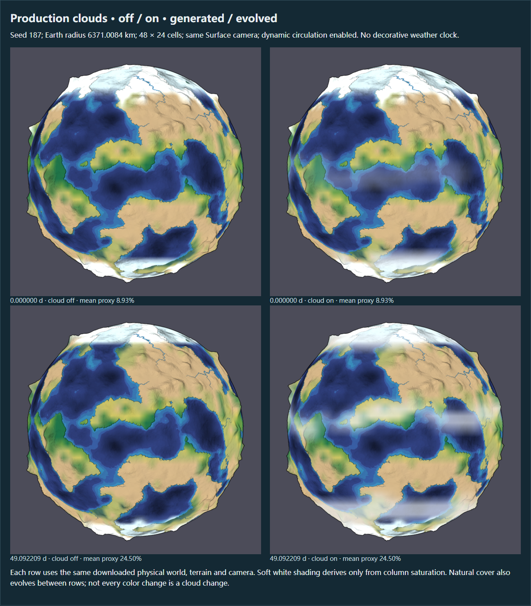
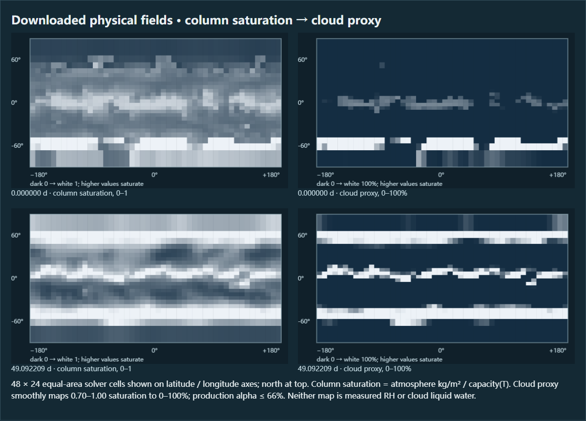
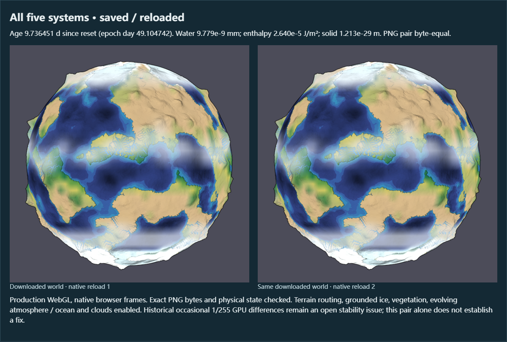
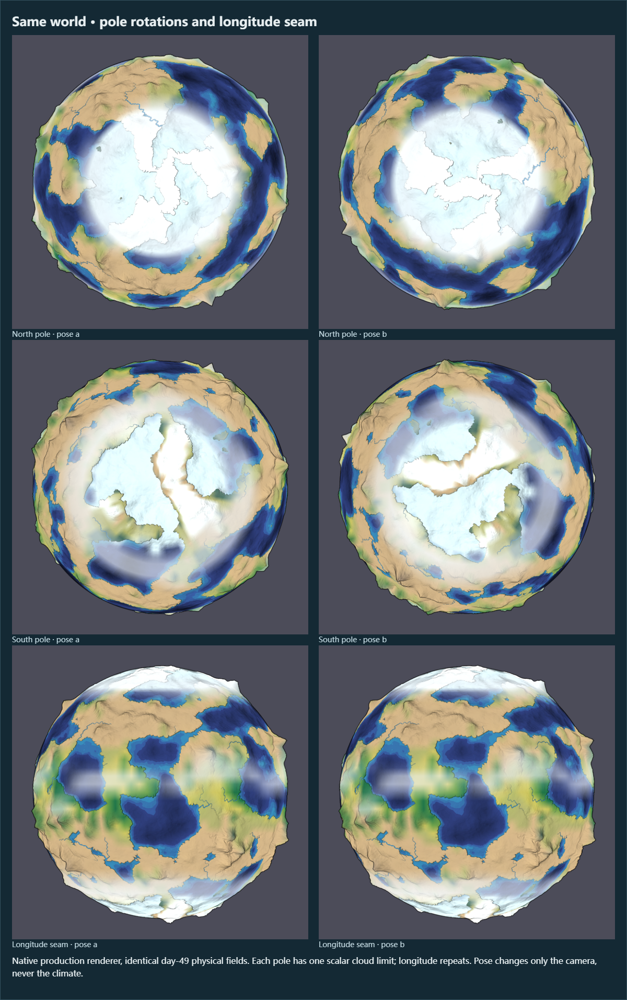
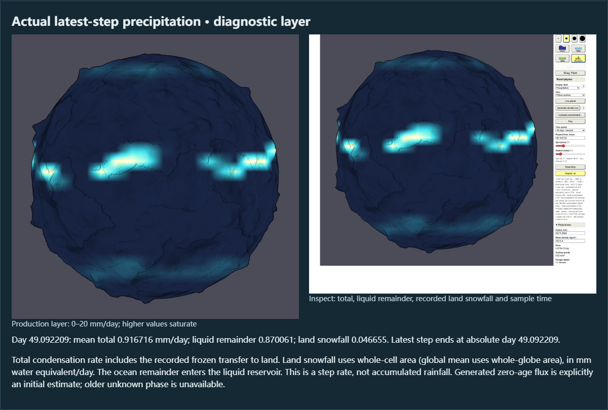
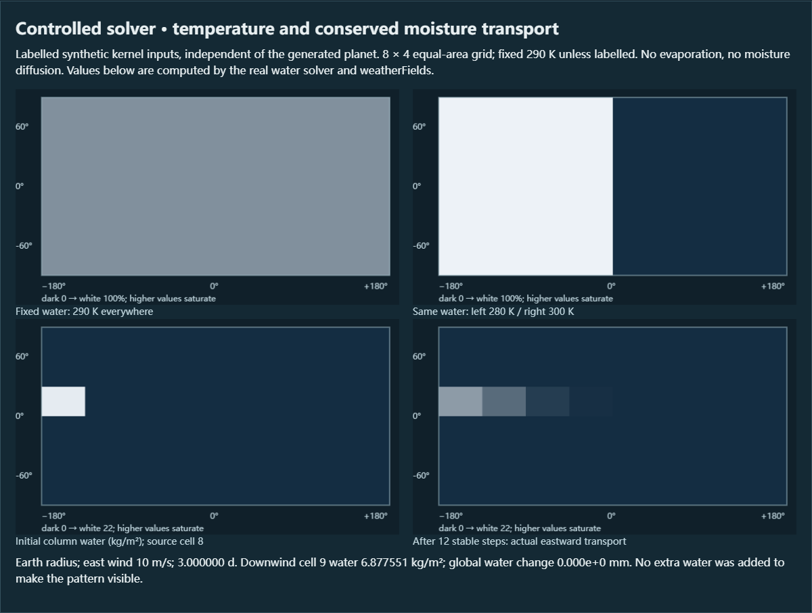
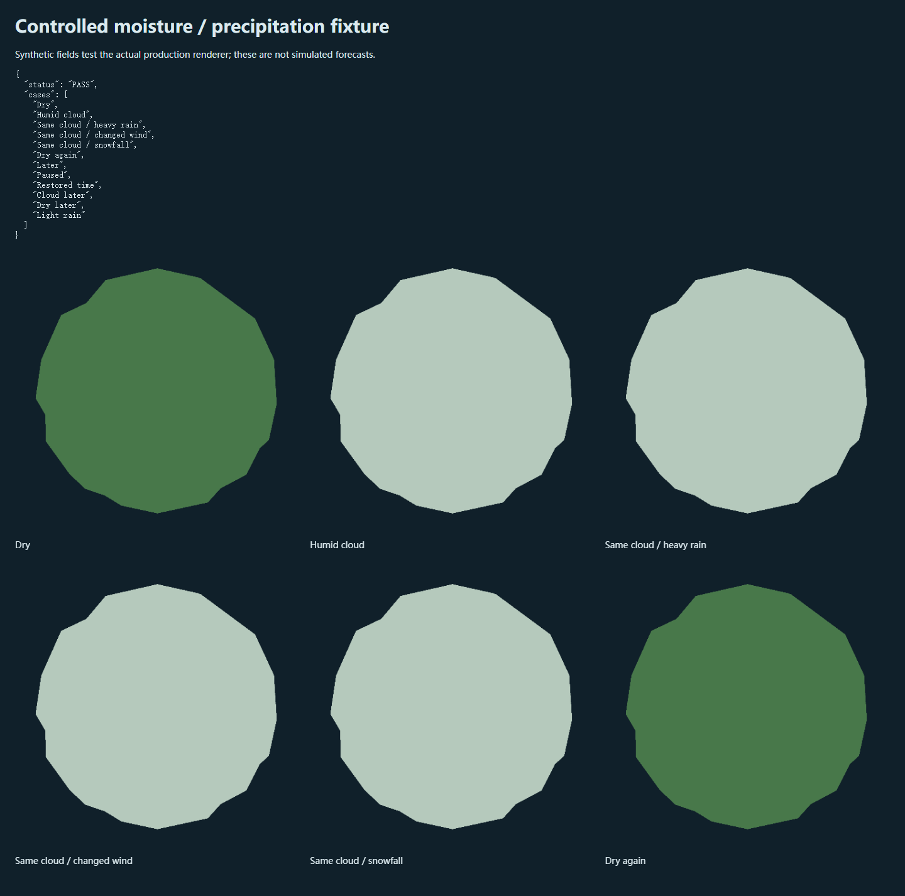
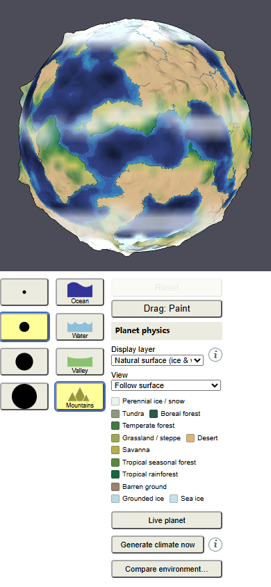
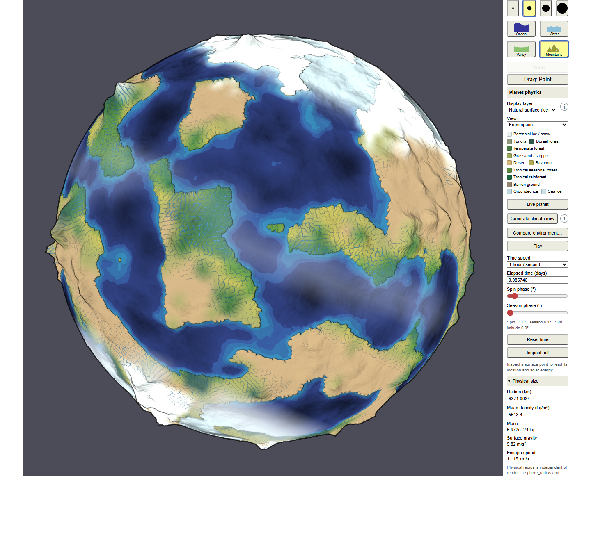

# 第五阶段云层复验与五阶段联动验收

日期：2026-10-09（Asia/Shanghai）。基线 `99824435f2dcafc9edffb54ce3fd3deb08baa20f`；生产改进和验收实现 `df63794d97114cc0fd55cc25dc271758e573bb26`；完整 GPU 边界分块导出及错误处理 `f1dc8d981c2c57acc817a91107b940543eb434d3`。

本轮完成当前云层显示、降水诊断语义改进及五阶段联动验收。最终严格验收通过，但**偶发最大 1/255 的 GPU 像素差异仍未解决**。本轮基线再次出现该差异，原图与完整世界状态已保留，后续通过不能证明其根治。

## 生产改进与范围

自然表面仅显示柔和云层。云量由 `atmosphereKgM2 / moistureCapacity(temperatureK)` 推导，在饱和度 0.70–1.00 内平滑映射，叠加透明度不超过 66%。它是柱水汽饱和度的示意代理，不是测量相对湿度、云液水或真实云微物理。没有雨雪符号、独立动画时钟或云辐射反馈；实际水循环中的雨雪和潜热交换仍运行。

修正 Inspect 将包含雪的总降水称为 rain 的问题：分别显示总降水、液态余量和实际记录的陆地降雪。初始值标为生成估计；发生模拟后标为最近一步实际速率。零步或旧存档缺少降雪记录时，相态显示 unavailable，不再暗示雨雪均为零。速率为每整格面积的水当量 mm/day；面板陆地降雪均值按全球面积计算。海洋余量进入液态库，不能解读为独立求解的海洋降雪相态。

当前柱水汽饱和度使用当前温度和水汽，降水记录来自前一步的实际转移；潜热可能已改变当前温度。保持这一时间语义，不用当前温度反推已发生的相态。物理求解器、生产 shader、DITHER、守恒门槛均未改动。

## 实际世界与已查看截图

种子 187，Earth 物理半径 6,371.0084 km，顺行、倾角 23.44°，48×24 等面积气候网格。下图来自生产浏览器原生 rAF，加载真实下载世界后截取；每次再下载核对完整 runtime、地形及相机。复验者逐张打开了本报告归档图，确认没有雨雪符号、云层条纹或明显接缝，地表水、极区冰及地形仍可辨。

### 同世界云层开关与演化



零步平均云量 8.93%，49.092209 天为 24.50%。上排零步，下排 49 天；各排左右仅切换显示，物理世界、地形和相机保持一致。49 天为 3,832 个真实稳定积分步，模型时间 4,241,566.841341156 s。模型时间按 `epochS + steps × stepS` 记录；世界用户时钟另存于 `terrain.settings.timeS`，两者可能存在不足一步的积分残余。



字段图直接读取真实保存状态，范围明确标注，云量增强与水汽／容量比对应。不能将白色极区地表冰直接认作云。

### 五阶段全系统与恢复



热、水、细地形水路、冰川、动态环流、植被及冰反照率均启用。该世界在开启地形水路与冰川后重建了基准，因此模型年龄为 9.736451 天，模型绝对时间为 5,083,879.036337784 s，不是 49 天快照的同年龄版本。平均云量 28.53%。两次原生加载 PNG 完全相等，且与验收运行的原始全系统 PNG 相等；完整文档、恢复后继续演化的字段与像素也严格相等。

| 守恒量 | 全系统恢复世界残余 | 全系统继续演化残余 | 原门槛 |
|---|---:|---:|---:|
| 水 mm | 9.778887×10⁻⁹ | 3.958121×10⁻⁹ | 10⁻⁶ |
| 焓 J/m² | 2.640113×10⁻⁵ | 1.670048×10⁻⁵ | 10⁻⁴ |
| 固体 m | 1.212909×10⁻²⁹ | 2.916453×10⁻²⁹ | 10⁻¹⁰ |



这是同一 49 天世界，仅改变显示姿态：北极和南极各两个相差 90° 的方向，接缝两侧各一个方向。地形和相机变化逐项核对，物理字段不变。目视未发现扇形纹或断裂；这不替代数值极点／经线连续性检查。

### 真实降水诊断、受控解释与默认体验



49 天全球平均总降水 0.9167158 mm/day，记录陆地降雪 0.0466550 mm/day；它们为最近一步速率，非累计量或当前云量。温度、风、降水及 Original 层在切换云层前后 PNG 均严格一致。



此图是独立标注的 8×4 受控计算，不是上方真实世界：固定水汽为 290 K 容量的 85%，280 K 与 300 K 区域分别得到云量 1 与 0；关闭蒸发及扩散，以 Earth 半径、10 m/s 东风积分 3 天，下风格水汽为 6.8775508 kg/m²，全球水量变化为零。它直接调用生产 WaterModel 与 weatherFields，验证局部温度容量响应及输运来源。



生产 GPU 夹具 12 个案例通过：相同水汽下改变雨量、风、雪和时间不产生额外图案；变干后恢复原像素。





移动端未横向溢出。默认 Live 等地形就绪后启动真实全系统，13 项入口／暂停／恢复检查通过。运行中采样 120 个原生浏览器帧间隔，中位数 16.7 ms，P95 16.8 ms；这是当前机器的浏览器帧间隔，不是 GPU 单独耗时或跨硬件性能保证。

## 验收结果与源代码对应

数值测试 **154/154**，typecheck 与 build 通过。浏览器八套共 **46 组**：climate 6、simulation 7、glacier 4、terrain-water 5、environment 7、planet 8、circulation 4、weather 5。附加风箭头生产 GPU 检查 528/528，通过的行星投影夹具保留在回归报告中。

最终无观察探针的天气验收 **10 个严格像素对均为零差**：Pause、关闭、49 天恢复、98 天续演、温度／风／降水不受云污染、Original、全系统恢复、全系统续演。完整世界比较包含配置、时钟、地形、相机、显示选项和物理字段，损坏显示选项或降雪数组不能部分替换当前世界。

最终验收在提交前运行，原记录为基线 HEAD 加工作区 patch。为避免误把 HEAD 当成完整被测版本，[源验证](evidence/weather-stage5-20261009/source-verification.json) 将被测 13 个源文件 SHA256 逐项与 `df63794` 的 Git blob 核对一致，保留原 patch 和构建 bundle／worker 指纹。之后 `f1dc8d9` 只改探针完整导出的分块及失败处理，没有改物理或生产渲染源。

## 未解决的像素微差与取证改进

本轮基线全系统恢复出现 **25 个像素、29 个通道，最大 1/255** 差异；两个完整文档严格相等。失败图、哈希、两份完整状态和当时脚本已归档于 [pixel-investigation](evidence/weather-stage5-20261009/pixel-investigation/failure.json)。当时没有保留完整上游 GPU 边界，不能据后续成功捕获推断这次失败的根因。

第四阶段与早期本轮探针用 R16F 的 RED/FLOAT 读回且未检查 GL 错误，曾返回全零数组。旧报告仍保留，但其 land/elevation/depth “一致”不能排除上游差异。现按 [EXT_color_buffer_float 规范](https://registry.khronos.org/webgl/extensions/EXT_color_buffer_float/) 的 RGBA/FLOAT 浮点读回保证读取，提取 R 并检查 framebuffer、GL 错误及非恒定范围：elevation 0.177124–0.883301，depth −0.645508–0.572266。本轮有效探针运行四个恢复／续演对的输入、上游 GPU 纹理及最终输出均一致；它们是成功样本，不是微差失败现场。

另一次早期 Wind 检查错误来自受控 rAF 截到了切层前的帧：Wind 首图与前一 Temperature 图完全相同。改为单独原生 rAF 加载完整世界后检查，温度／风／降水三层严格通过；这项采集修正不能解释偶发 1/255 差异。

完整探针一次性返回超过浏览器／Node 字符串上限，因此改为每块最多 1 MiB，流式 gzip 保存。成功导出 40 个字段引用、419,101,232 解码字节，逐字段长度及 SHA256 核对通过；归档按内容去重为 15 个字节字段、18,217,665 字节 ZIP。[完整边界档案](evidence/weather-stage5-20261009/boundary/49-day-raw.zip) 是**成功的 49 天恢复样本**。立即及延迟 ENOSPC 内存注入均正确传播错误、销毁流且不悬挂。独立只读复核没有剩余 Critical/P2 发现，同时确认渲染稳定性问题仍开放。

## 复查入口

[汇总](evidence/weather-stage5-20261009/summary.json)、[全部运行矩阵](evidence/weather-stage5-20261009/run-matrix.json)、[最终天气验收](evidence/weather-stage5-20261009/report.json)、[原生截图记录](evidence/weather-stage5-20261009/recheck-report.json)、[回归报告](evidence/weather-stage5-20261009/regressions.json)、[独立复核说明](evidence/weather-stage5-20261009/review.md) 和 [文件 SHA256 清单](evidence/weather-stage5-20261009/manifest.json) 均保留。world-states.zip 内是原始下载文档；ZIP 内数据未修改。

在仓库根目录运行 `npm test`、`npm run typecheck`、`npm run build`。服务使用 8002；设置可用的 `PLAYWRIGHT_MODULE`、`BASE_URL=http://localhost:8002` 和一个全新的 `WEATHER_FOLDER` 后依次运行：

```powershell
node scripts/weather-browser-check.mjs
node scripts/weather-recheck.mjs
```

需要边界观察时另建输出目录，设置 `WEATHER_BOUNDARY_PROBE=1` 再运行天气验收；不要覆盖本轮证据。探针在像素失败时导出完整 GPU 边界并让验收失败。归档的 effective-check.mjs 当时刻意在匹配的 49 天样本触发导出以验证工具，并非通常验收脚本；历史脚本副本用于审计，执行应使用仓库 scripts 下的实现。
