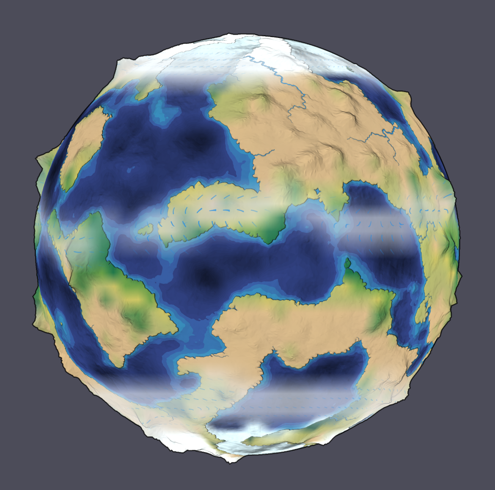
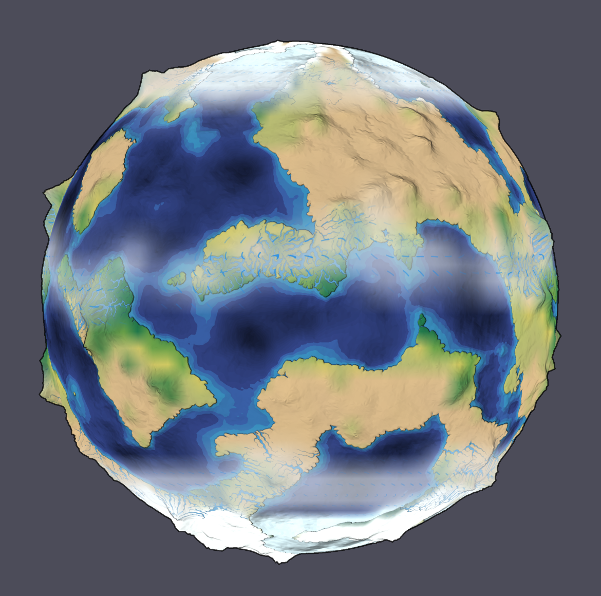

# Clouds and precipitation

Generate climate, open **Ice, ocean & vegetation**, enable **Clouds & precipitation on Natural surface**, and choose Natural surface. Play changes clouds and precipitation with the same conserved water fields used by climate; Pause freezes the display. Turning the overlay off restores the underlying globe exactly. Other map layers, terrain painting and Original remain available. The switch is a view preference, so it does not regenerate climate or change budgets.

Cloud shading is an illustrative column-saturation proxy. `saturation = atmosphereKgM2 / moistureCapacity(temperatureK)` uses the water solver's existing temperature-dependent column capacity. A smooth transition over saturation 0.70–1.00 maps to 0–100% displayed cloud, composited at at most 66% opacity. It is not measured relative humidity or cloud liquid water. Geographic interpolation wraps longitude and gives each pole one scalar limit.

Blue strokes display actual liquid precipitation, oriented with the same local east/north wind used by moisture transport. White crosses display the part of precipitation actually added to the land-snow store. Brightness follows a logarithmic 0–50 mm/day scale, saturating above 50. Glyphs fade near the poles to avoid a longitude singularity; cloud shading remains continuous there. Clouds change with physical moisture transport; there is no separate decorative animation clock, random rain, or hidden cloud-water inventory.

Snowfall is recorded at condensation time, so subsequent latent heating cannot misclassify snow as rain. This is a flux diagnostic, not additional water. Under the existing simplified solver, precipitation over ocean returns to the ocean ledger; only land precipitation has a separately resolved frozen phase. At generation, the initial reference precipitation estimate is not drawn as an integrated event. Older complete saves without phase information suppress precipitation glyphs until one new physical step records it; they retain all conserved stores and default the overlay off.

Complete saves retain the view switch and the last-step snowfall diagnostic. Texture pixels are regenerated deterministically from saved physical fields. Invalid switches, dimensions, negative values or snowfall exceeding the precipitation landing on land are rejected before replacement. The surface inspection readout shows saturation proxy, cloud display fraction, liquid rain and land snowfall in mm/day.

This is a surface visualization on the coarse climate grid. It does not solve cloud height, droplets, aerosols, convection, atmospheric optics, storm systems or cloud radiation feedback. [NOAA describes saturation, cooling and condensation in actual cloud formation](https://www.noaa.gov/jetstream/clouds/how-clouds-form); the visual proxy here intentionally represents only the available simplified moisture state.

Validation covers dry and saturated columns, actual snowfall after subsequent warming, immutable source state, physical moisture advection with a conserved total, polar continuity, exact texture reconstruction from a glacier/circulation save, and old/invalid file behavior. The real-browser acceptance script is `scripts/weather-browser-check.mjs`. Its controlled GPU fixture uses synthetic inputs through the production renderer to check dry, cloud, rain, rotated wind and snow output; the main application checks actual evolution, pause, exact view restoration, 98-day resumed fields and pixels, budgets, Original and mobile layout.

The final run passes five browser groups, including all optional physical systems enabled together. At the coupled checkpoint, global residuals are `9.78e-9 mm` water, `2.64e-5 J/m²` enthalpy and `1.21e-29 m` glacial solid. These remain below the pre-existing acceptance thresholds. Independent phase review found no actionable issues; 137 numerical/document tests, typecheck and build pass.

[Measured report](evidence/weather-report.json) · [Controlled GPU cases](evidence/weather-controlled-gpu.png) · [Mobile](evidence/weather-mobile.png)

