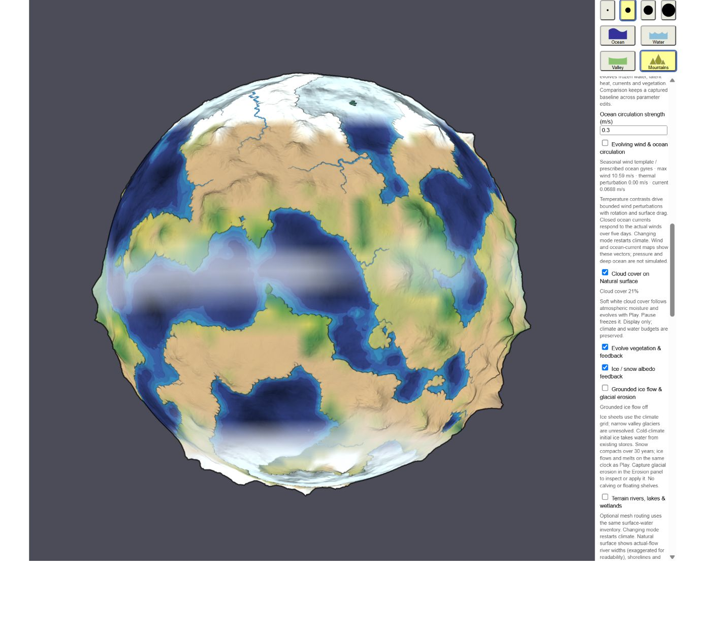

# Cloud cover

Generate climate, open **Ice, ocean & vegetation**, enable **Cloud cover on Natural surface**, and choose Natural surface. The globe shows only soft cloud shading. Rain streaks, rain mist, snow symbols and decorative precipitation animation are omitted. Rainfall and snowfall remain part of the water simulation and are available in numerical readouts and the precipitation layer.

Cloud shading is an illustrative column-saturation proxy. `saturation = atmosphereKgM2 / moistureCapacity(temperatureK)` uses the water solver's existing temperature-dependent column capacity. A smooth transition over saturation 0.70–1.00 maps to 0–100% displayed cloud, composited at at most 66% opacity. Cloud opacity depends only on moisture saturation; precipitation intensity, phase and wind do not add marks or tint. Geographic interpolation wraps longitude and gives each pole one scalar limit.

Play evolves clouds with the physical moisture fields; Pause freezes them. There is no separate animation clock. Turning the overlay off restores the underlying globe exactly. Other map layers, terrain painting and Original remain available. The switch is a view preference, so it does not regenerate climate or change budgets.

Complete saves retain the existing weather view switch, physical fields and snowfall diagnostic. Cloud pixels are regenerated deterministically. Older saves default the overlay off and can display clouds without a recorded precipitation phase. Invalid switches or physical fields are rejected before replacement.

Inspect labels total precipitation separately from the liquid remainder and recorded land snowfall. Rates are mm water equivalent/day per whole cell, from the latest simulated step; the water panel's mean land snowfall uses whole-globe area. Initial fluxes are generated estimates, not occurred rain. Before the first step or when an older save lacks phase, rain/snow phase is **unavailable**, rather than inferred as zero. Column saturation uses the current temperature and water; precipitation records the preceding step's actual transfer, which may have changed temperature through latent heating. The ocean remainder enters the liquid reservoir even in cold cells; it is not a solved ocean snowfall phase.

This is a surface visualization on the coarse climate grid. It does not solve cloud height, droplets, aerosols, convection, atmospheric optics, storm systems or cloud radiation feedback. It is not measured relative humidity or cloud liquid water.

The production GPU fixture in `tests/weather-render.ts` checks dry restoration, visible humid clouds, and identical cloud pixels across different precipitation amounts, snow phases, wind directions and timestamps. Numerical tests cover moisture transport, conserved budgets, phase diagnostics, polar continuity and save compatibility. The full browser acceptance script is `scripts/weather-browser-check.mjs`.

The initial weather release passed five browser groups, including all physical systems enabled together. Its [measured report](evidence/weather-report.json) and older evidence images describe that release, which included precipitation glyphs. The current cloud-only display replaces those glyphs.

The [stage-five recheck](weather-stage5-recheck.md) records the current cloud-only production screenshots, exact pause/off/diagnostic-layer checks, complete-world continuation, source fingerprints and retained failures. **Occasional 1/255 GPU pixel differences remain unresolved**: this recheck reproduced one with identical complete documents. Passing later runs do not establish a fix. The new boundary observer uses validated floating-point framebuffer readback; older RED/FLOAT land/depth probe results cannot exclude differences in those textures.
